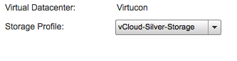
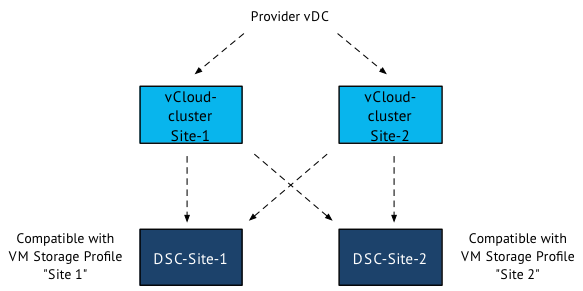

vCloud director 5.1 supports the use of both storage profiles and Storage DRS. One of the coolest features and unfortunately relatively unknown is the ability to live migrate virtual machines between datastore clusters by changing the storage profile in the vCloud director portal. In my lab I’ve set up a provider vDC that contains two compute clusters. Each compute cluster connects to two datastore clusters. Datastore Cluster “vCloud-SDC-Gold” is compatible with the VM storage profile “vCloud-Gold-Storage”, while Datastore Cluster “vCloud-SDC-Silver” is compatible with the VM storage profile “vCloud-Silver-Storage”.  When creating a vApp the default storage profile of the organization vDC is applied to the vApp and all its virtual machines. In this case, the VM storage profile Gold is applied to all the virtual machines in the vApp. You can determine which VM Storage Profile is associated with the virtual machine by selecting the properties of the virtual machine in the “My Cloud” tab. Please note that vCloud Director does not show the VM Storage Profile at the vApp level!  By selecting the drop-down box, all storage profiles that are associated with the organization vCD are displayed.  By selecting the Storage Profile “vCloud-Silver-Storage” vCloud Director determines that the virtual machine is stored on a datastore that is not compatible with the associated storage profile. In other words the current configuration is violating the storage level policy. To correct this violation, vCloud director instructs vSphere to migrate the virtual machine via Storage vMotion to a datastore that is compatible with the VM storage Profile. In this case the datastore cluster “vCloud-DSC-Silver” is selected as the destination. Storage DRS determines the most suitable datastore by using its initial placement algorithm and selects the datastore that has the most amount of free space and the lowest I/O load. To demonstrate the feature, I selected the virtual machine “W2K8\_R2-SP1”. The VM storage profile “vCloud-Gold-Storage” is applied and Storage DRS determined that the datastore “nfs-f-vcloud03” of the datastore cluster “vCloud-DSC-Gold” was the most suitable location.  By changing the Storage Profile to “vCloud-Silver-Storage” vCloud director instructed vSphere to migrate it to the datastore cluster that is compatible with the newly associated VM storage profile.  When logging into the vCenter server managing the ESXi hosts the following task is running:  After the task is complete, vCenter shows that the virtual machine is now stored on datastore "nfs-f-vcloud06" in the datastore cluster “vCloud-DSC-Silver”.  **The power of abstraction** The abstraction layer of vCloud Director makes this possible. When changing the storage profile directly on the vSphere layer, nothing happens. vSphere will not migrate the virtual machine to the appropriate datastore cluster that is compatible with the selected VM storage profile. **Useful for stretched clusters?** The reason why I was looking into this feature in my lab is due to an conversation with my esteemed colleagues [Lee Dilworth](https://twitter.com/leedilworth "Lee Dilworth on Twitter") and [Aidan Dalgleish](https://twitter.com/AidersD "Aidan Dalgleish on Twitter"). We were looking to an alternative scenario for a stretched cluster. By leveraging the [elastic vDC feature of vCloud director](http://frankdenneman.nl/2013/03/29/elastic-vdc-and-how-to-span-a-provider-vdc-across-multiple-drs-clusters/ "Elastic vDC and how to span a provider vDC across multiple DRS clusters"), a seperate DRS cluster is created in each site. Due to the automatic initial placement engine on the compute level, we needed to find a construct that can provide us a more deterministic method of virtual machine placement. We immediately thought of the VM profile storage feature. Create two datastore clusters, one per site and associate a profile storage based on site name to the respective datastore clusters.  When creating the vApp, just select the site-related Storage Profile to place the virtual machine in a specific site. Due to the compatibility check, vCloud Director determines that in order to be compliant with the storage profile it places the virtual machine on the compute cluster in the same site. For example, if you want to place a virtual machine in site 1, select the VM storage Profile “site 1”. vCloud director determines that the virtual machine needs to be stored in datastore cluster “DSC-Site-1”. The compute cluster Site-1 is the only compute cluster connected to the datastore cluster, therefor both the compute and storage configuration of the virtual machine is stored in Site 1. This configuration works perfect if you want to simplify initial placement if you have multiple sites/locations and you always want to keep the virtual machine in the same site. However this solution might not be optimal for a Stretched cluster configuration where failover to another site is necessary. **Connectivity to all datastores necessary** As this feature uses storage vMotion instead of cross-host/datastore vMotion, means that the cluster needs to be connected to both datastore clusters.  When selecting the different storage profile, the storage state is migrated to another datastore cluster. However it doesn’t move the compute state of the virtual machine. This means that storage is moved to site B, while the compute state is still in Site A. vCloud director does not provide an option to migrate the virtual machine to a different compute cluster within the provider vDC. You can either solve it by logging into the vCenter server that manages the ESXi hosts and manually vMotion the virtual machines to cluster in Site B, or power-off the virtual machine in vCloud Director, then change the storage profile and power-on the virtual machine. Both “solutions” are not very enterprise-level scenario’s therefor I think this is not yet suitable as a stretched cluster configuration
