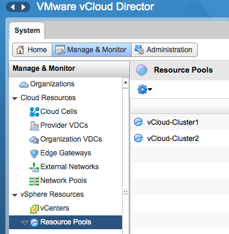
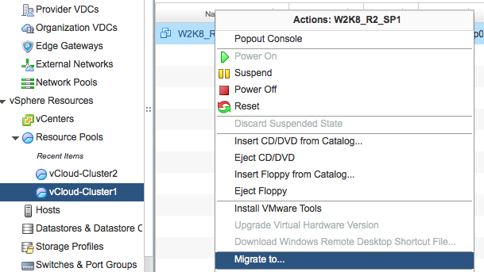
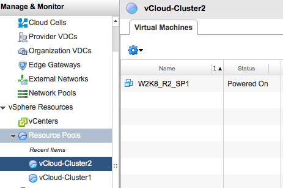

In the article “[Migrating datastore clusters by changing storage profiles in a vCloud](http://frankdenneman.nl/2013/04/12/migrating-datastore-clusters-by-changing-storage-profiles-in-a-vcloud/ "Migrating datastore clusters by changing storage profiles in a vCloud")“ I closed with the remark that vCD is not providing an option to migrate virtual machines between compute clusters that are part of an elastic vDC. Fortunately my statement was not correct. [Tomas Fojta](https://twitter.com/fojta) pointed out that vCD does provide this functionality. Unfortunately this feature is not exposed in the vCloud organization portal but in the system portal of the vCloud infrastructure itself. In other words, to be able to use this functionality you need to have system administrator privileges. In the previous article, I created the scenario where you want to move virtual machines between two sites. Site 1 contains compute cluster “vCloud-Cluster1” and datastore cluster “ DSC-Site-1”. Site 2 contains “vCloud-Cluster2” and datastore cluster “DSC-Site-2” . By changing the VM storage profile from Site-1 to Site-2, we have vCD instruct vSphere to storage vMotion the virtual machine disk files from one datastore cluster to another. Now at this point we need to migrate the compute state of the virtual machine.  **Migrate virtual machine between clusters** Please note that vCD refers to clusters as resource pools. To migrate the virtual machine between clusters, log into the vCloud director and select the system tab. Go to the vSphere resources and select Resource Pools menu option.  The UI displays the clusters that are a part of the Provide vDC. Select the cluster a.k.a. resource pool in which the virtual machine resides. Select the virtual machine to migrate, right click the virtual machine to have vCD display the submenu and select the option “Migrate to…”  The user interface allows you to choose how you want to select the destination resource pool for the virtual machine: Either automatic and let vCD select the resource pool for you, or select the appropriate resource pool manually. When selecting automatic vCD selects the cluster with the most unreserved resources available. If the virtual machine happens to be in the cluster with the most unreserved resources available vCD might not move the virtual machine. In this case we want to place the virtual machine in site 2 so that means we need to select the appropriate cluster. We select vCloud-Cluster2 and click on OK to start the migration process.  vCD instructs vSphere to migrate the virtual machine between clusters with the use of vMotion. In order to use vMotion, both clusters need to have access to the datastore on which the virtual machine files reside. vCD does not use “enhanced’ vMotion where it can live migrate between host without being connected shared storage. Hopefully we see this enhancement in the future. When we log into vSphere we can verify if the life migration of the virtual machine was completed. Select the destination cluster, in this case that would be vCloud-Cluster2, go to menu option Monitor, select tasks and click on the entry “Migrate virtual machine”  In the lower part of the screen, you get more detailed information of the Migrate-virtua-machine entry. As you can seem the virtual machine W2K8\_RS\_SP1 is migrated between servers 10.27.51.155 and 10.27.51.152. As we do not change anything to the storage configuration, the virtual machine files remains untouched and stay on the same datastore. To determine if vCD has updated the current location of the virtual machine, log into vCD again, go to the menu option “Resource Pools” and select the cluster chosen as destination as the previously org cluster. 
