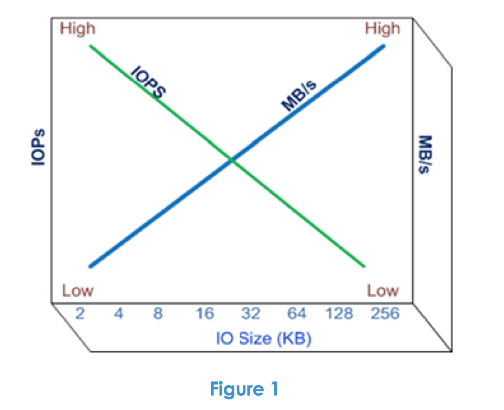

The last couple of days I’ve been reading up on EMC VPLEX technology as I’m testing VPLEX metro with SIOC and Storage DRS. Yesterday I discovered a technical paper called “[EMC VPLEX: Elements Of Performance And Testing Best Practices Defined](https://community.emc.com/docs/DOC-20661)” and I think this paper should be read by anyone who is interested in testing storage or even wanting to understand the difference between workloads. Even if you do not plan to use EMC VPLEX the paper delivers some great insights about IOPS versus MB/s. What to expect when testing for transactional-based workloads and throughput-based workload? Here’s a little snippet: “Let’s begin our discussion of VPLEX performance by considering performance in general terms. What is good performance anyway? Performance can be considered to be a measure of the amount of work that is being accomplished in a specific time period. Storage resource performance is frequently quoted in terms of IOPS (IO per second) and/or throughput (MB/s). While IOPS and throughput are both measures of performance, they are not synonymous and are actually inversely related – meaning if you want high IOPS, you typically get low MB/s. This is driven in large part by the size of the IO buffers used by each storage product and the time it takes to load and unload each of them. This produces a relationship between IOPS and throughput as shown in Figure 1 below.”  Although it’s primarily focused on VPLEX, the paper helps you understand the different layers of a storage solution and how each layer affects performance. Another useful section is the overview of good benchmark software which describes the basic operation of each listed benchmark program. The paper is very well written and I bet even a joy to read for both the beginner as well as the the most hardened storage geek. [Download the paper here.](https://community.emc.com/docs/DOC-20661)
