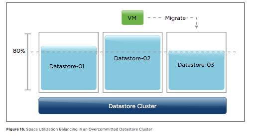

Last Friday my last and latest whitepaper about Storage DRS was published on VMware.com. Go to [http://www.vmware.com/resources/techresources/10363](http://www.vmware.com/resources/techresources/10363 "http://www.vmware.com/resources/techresources/10363") and download the whitepaper: "[Understanding vSphere 5.1 Storage DRS](http://www.vmware.com/files/pdf/vmw-vsphr-5-1-stor-drs-uslet-101-web.pdf "http://www.vmware.com/files/pdf/vmw-vsphr-5-1-stor-drs-uslet-101-web.pdf")". Download and read this whitepaper if you want to learn more about the five key elements of Storage DRS. Here's a little snippet from the whitepaper: **Step 1. Determine Whether Datastores Are Violating the Space-Utilization Threshold** If the space utilization of a datastore exceeds 80 percent, the datastore violates the threshold and the vSphere Storage DRS load-balancing algorithm is invoked. vSphere Storage DRS attempts to avoid an out-of-space situation and therefore runs a load-balancing operation as soon as the datastore exceeds its space-utilization threshold. This operation can be outside of the normal load-balancing interval of every 8 hours. The space-utilization threshold is a soft limit, enabling vSphere Storage DRS to place virtual machines in the datastore cluster even if all datastores exceed the space-utilization threshold. vSphere Storage DRS attempts to generate prerequisite migrations before virtual machine placement. If this fails, the virtual machine is placed on the datastore that provides the best overall cluster balance.  This performance applies to space-utilization load-balancing operations as well, even if all datastores violate the space-utilization threshold. vSphere Storage DRS tries to keep space utilization near the threshold across all datastores. **Download:** [http://www.vmware.com/files/pdf/vmw-vsphr-5-1-stor-drs-uslet-101-web.pdf](http://www.vmware.com/files/pdf/vmw-vsphr-5-1-stor-drs-uslet-101-web.pdf "http://www.vmware.com/files/pdf/vmw-vsphr-5-1-stor-drs-uslet-101-web.pdf")
