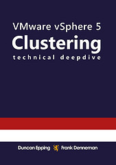

Do you want a free Kindle copy of the vSphere 4.1 HA and DRS Deepdive or the vSphere 5.0 Clustering Deepdive? Today and tommorow, Thursday June the 6th, you can download the Kindle (US Kindle Store) copy of both these books for free!   So make sure you pick it up either today or tomorrow, it might be the only time this year it is on promo.
