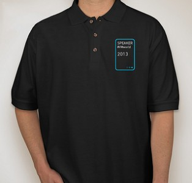

During our advisory call with [CloudPhysics](http://www.cloudphysics.com/ "CloudPhysics home"), a great idea was born. Why not provide all the speakers at VMworld a cool speaker shirt? Unfortunately in 2011 VMworld made the decision to stop providing speaker shirts to the people on stage, so most people started wearing older speaker shirt or even RUN DRS shirts ☺. For most speakers this move by VMworld was disappointing as the speaker shirts made them more recognizable but it also served as a cool badge of honor.  I think CloudPhysics stepped up big time and gave us back that cool badge of honor. If you are a speaker this year, [go register here](https://docs.google.com/forms/d/1KNi9bQZHFPEOuC73eaAaIya1bWD3hhKRg4RpwmNoDTY/viewform "Register to receive your speaker shirt") before tomorrow evening as the deadline is **Tuesday August 13th end of day(pst)**.
