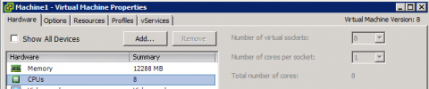
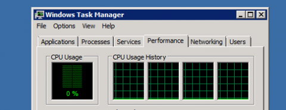
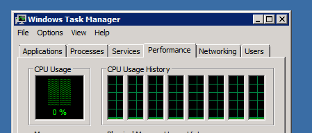
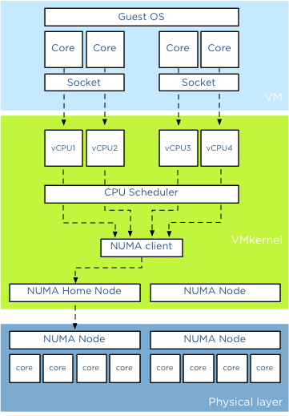
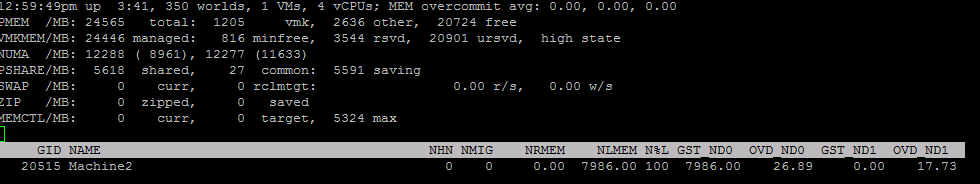
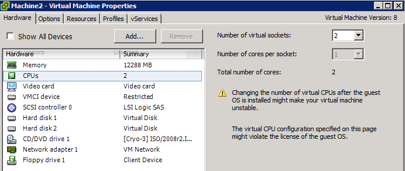

A question that I frequently receive is if there is a difference in virtual machine performance if the virtual machine is created with multiple cores instead of selecting multiple sockets?

**Single core CPU** VMware introduced multi core virtual CPU in vSphere 4.1 to avoid socket restrictions used by operating systems. In vSphere a vCPU is presented to the operating system as a single core cpu in a single socket, this limits the number of vCPUs that can be operating system. Typically the OS-vendor only restricts the number of physical CPU and not the number of logical CPU (better know as cores).

For example, Windows 2008 standard is limited to 4 physical CPUs, and it will not utilize any additional vCPUs if you configure the virtual machine with more than 4 vCPUs. To solve the limitation of physical, VMware introduced the vCPU configuration options “virtual sockets” and “cores per socket”. With this change you can for example configure the virtual machine with 1 virtual sockets and 8 cores per socket allowing the operating system to use 8 vCPUs.

Just to show it works, I initially equipped the VM running Windows 2008 standard with 8 vCPU each presented as a single core.

 When reviewing the cpu configuration inside the Guest OS, the task manager shows 4 CPUs:

 A final check by opening windows task manager verified it only uses 4 vCPUs.

 I reconfigured the virtual machine to present 8 vCPU using a single socket and 8 number of cores per socket.

 I proceeded to power-on the virtual machine:  **Performance impact** Ok so it worked, now the big question, will it make a difference to use multiple sockets or one socket? How will the Vmkernel utilize the physical cores? Might it impact any NUMA configuration. And it can be a very short answer. No! There is no performance impact between using virtual cores or virtual sockets. (Other than the number of usuable vCPU of course).

**Abstraction layer** And its because of the power of the abstraction layer. Virtual socket and virtual socket are “constructs” presented upstream to the tightly isolated software container which we call a virtual machine. When you run a operating system it detects the hardware (layout) within the virtual machine. The VMkernel schedules a Virtual Machine Monitor (VMM) for every vCPU. The virtual machine vCPU configuration is the sum of number of cores x number of sockets. Lets use the example of 2 virtual socket 2 virtual core configuration.

 The light blue box shows the configuration the virtual machine presents to the guest OS. When a CPU instruction leaves the virtual machine it get picked up the Vmkernel. For each vCPU the VMkernel schedules a VMM world. When a CPU instruction leaves the virtual machine it gets picked up by a vCPU VMM world. Socket configurations are transparent for the VMkernel

**NUMA** When a virtual machine powers on in a NUMA system, it is assigned a home node where memory is preferentially allocated. The vCPUs of a virtual machine are grouped in a NUMA client and this NUMA client is scheduled on a physical NUMA node. For more information about NUMA please read the article: “[Sizing VMs and NUMA nodes](http://frankdenneman.nl/2010/02/03/sizing-vms-and-numa-nodes/ "Sizing VMs and NUMA nodes")” Although it’s a not covering the most current vSphere release, the basics remain the same.

To verify that the sockets have no impact on the NUMA scheduler I powered up a new virtual machine and configured it with two sockets with each 2 cores. The host running the virtual machine is a dual socket quad core machine with HT enabled. Providing 4 vCPUs to the virtual machine ensures me that it will fit inside a single NUMA node.

 When reviewing the memory configuration of the virtual machine in ESXTOP we can deduct that its running on a single physical CPU using 4 cores on that die. Open the console, run ESXTOP, press M for memory view. Use V (capital v) to display on VM worlds only. Press F and select G for NUMA stats. You might want to disable other fields to reduce the amount of information on your screen.

 The column, NHN identifies the current Numa Home Node, which in Machine2 case is Numa node 0. N%L indicates how much memory is accessed by the NUMA client and it shows 100%, indicating that all vCPUs access local memory. The column GST\_ND0 indicates how much memory is provided by Node0 to the Guest. This number is equal to the NLMEM counter, which indicated the current amount of local memory being accessed by VM on that home node.

**vNUMA** What if you have a virtual machine with more than 8 CPU (for clarity, life of a Wide NUMA starts at a vCPU count of 9). Then the VMkernel presents the NUMA client home nodes to the Guest OS. Similar to the normal scheduling, the socket configuration are also transparent in this case.

**Why differentiate between sockets and cores?** Well there is a difference and it has to do with the Hot-Add CPU feature. When enabling the option CPU Hot Plug you can only increase the virtual socket count.

 In short using virtual sockets or virtual cores does not impact the performance of the virtual machine. It only effects the initial configuration and the ability to assign more vCPU when your Operating System restricts the maximum number of physical CPUs. Always check if your VM configuration is in compliance with the vendor licensing rules before increasing the vCPU count!
