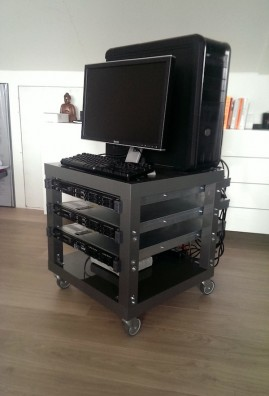

Currently, topics about labs are hot, and when meeting people at the VMUGs or other tech conferences, I get asked a lot about my lab configuration. I'm a big fan of labs, and I think everybody who works in IT needs a lab, whether it's at home or in a centralized location.

At [PernixData](http://www.PernixData.com), we have two major labs. One on the east coast and one on the west coast of the U.S. Both these labs are shared, so you cannot do everything you like. However, sometimes you want to break stuff. You want to pull cables and disks and kill an entire server or array. To see what happens. For these reasons having a lab that is 4000 miles away doesn't work. Enough reasons to build a small lab at home.

Currently topic about labs are hot and when meeting people at the VMUGs or other tech conferences, I get asked a lot about my lab configuration. I’m a big fan of labs and I think everybody who works in IT needs a lab, whether it’s at home or in a centralised location.  
At [PernixData](http://www.PernixData.com) we have two major labs. One at the east coast and one at the west coast of the U.S of A. Both these labs are shared, that means you cannot do everything you like. However sometimes you want to break stuff, you want to pull cables, disks, kill an entire server or array. Just to see what happens. For these reasons having a lab that is 4000 miles away doesn’t really work, enough reasons to build a small lab at home.

**Nested or physical hardware?**  
To nest or not to nest, that's not even the question. Nesting is amazing, and VMware spends a lot of energy and time on nested environments (think [HOL](http://labs.hol.vmware.com/)). Recently the fling [VMware tools for Nested ESXi](http://labs.vmware.com/flings/vmware-tools-for-nested-esxi) was released, and I assume more nested ESXi flings will follow after seeing the attention it received from the community.

But to run nested ESXi, you need to have physical hardware. Thanks to a generous donation, I received 6 Dell r610s, which covered my compute level requirements. But sometimes, you only want to test the software, and in those cases, you do not need to fire up an incredibly loud semi-datacenter rig. For those situations, I created an ESXi host that is near silent when running full speed. This ESXi server also hosts a nested ESXi environment and is just a white box with a simple ASUS mobo, 24GB, and the Intel 1GB Ethernet port. Once this machine is due for renewal, a white box following the [baby dragon design](http://wahlnetwork.com/2012/03/13/building-esxi-5-whitebox-home-lab-servers/) will replace it.

To test the software at the enterprise level, you require multiple levels of bandwidth, sometimes the bare minimum and sometimes copious amounts of it. The R610 sports 4 x 1GB Ethernet connections, allowing me to test scenarios that can happen in a bandwidth-constrained environment. Usually, compelling cases happen when you have a lot of restrictions to deal with, and these 1GB NICs are perfect for this. 10GB connections are on my wish list, but to have a nice setup, you still need to invest more than 1000 bucks in testing it adequately.

A little bit over the top for my home lab, but the community came to the rescue and provided me with a solution; the Infiniband hack. A special thanks go out to [Raphael Schitz](https://twitter.com/hypervisor_fr) and [Eric Bussink](https://twitter.com/ErikBussink) for providing me the software and the information to run my lab at 10Gbps and being able to provide incredibly low latencies to my virtual machines. With the InfiniBand setup, I can test scenarios where bandwidth is not a restriction and investigate specific setups and configurations. For more info, listen to the vBrownbag tech talk where Erik Bussink dives into the topic "[InfiniBand in the Lab](http://www.bussink.ch/?p=1300)"

The storage layer is provided by some virtual storage appliances, each backed by a collection of different SSD disks and WD Black Caviar 750GB disks. Multiple solutions allow me to test various scenarios such as all-flash arrays, hybrid, and all magnetic disk arrays. If I need to understand the specific dynamics of an array, I log in to one of the two US-based labs.

**Home office**  
My home office is designed to be an office and not a data center. So where do you place 19" rack servers without ruining the esthetics of your minimalistic designed home office ;). Well, you create a 19" rack on wheels so you can roll it out of sight and place it wherever you want it. Introducing the portable Ikea lack 19" datacenter rack.  
  
Regular readers of my blog or Twitter followers know I'm a big fan of hacking IKEA furniture. I created a [whiteboard desk](http://frankdenneman.nl/2012/05/03/whiteboard-desk/) that got the attention of multiple sites and [ikeahackers.net](http://www.ikeahackers.net/) provided me with a lot of ideas on how to hack the famous lack table side table.

I bought two lack tables, a couple of L-shaped brackets, four wheels, nuts, and bolts. The first lack table provides the base platform. Only the tabletop is used. The legs are discarded and act as a backup if I make a mistake during the drilling.

I didn't test the center of the tabletop, but the corners of the tabletop are solid and can be used to install wheels. I used heavy-duty ball-bearing wheels with an offset swivel caster design that permits ease of directional movement. Simple 5mm nuts and bots keep the L shape brackets in place, but beware, the table legs are not made of solid wood. They are hollow! Only a few centimeters of the top of the leg is solid. This to hold the screw that connects the table and leg. To avoid having the server pull the screw through the leg due to its weight, I used washers to keep them in place

**What’s next?**  
From a hardware perspective, 10GbE is still high on my wishlist. When looking at the software layer, I want to create a more automated way of deploying and testing PernixData FVP software. One of the things I'm looking into is using and incorporating Auto Deploy in the lab. But that's another blog post.t.
