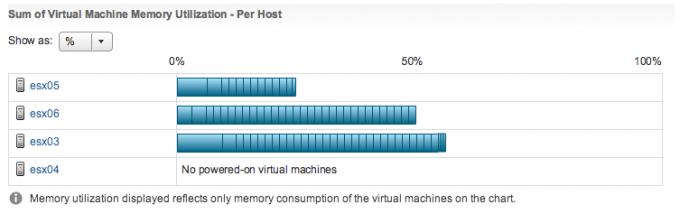

Unfortunately I still see this cry for help appearing on the VMTN forums and on twitter. And they usually are accompanied by screenshots like this:  This screen doesn’t really show you if your DRS cluster is balanced or not. It just shows if the virtual machine receives the resources they are entitled to. The reason why I don’t use the word demand is that DRS calculates priority based on virtual machine and resource pool resource settings and resource availability. To understand if the virtual machine received the resources it requires, hover over the bar and find the virtual machine. A new window is displayed with the metric “Entitled Resources Delivered”  DRS attempts providing the resources requested by the virtual machine. If the current host is not able to provide the resources, DRS move it to another host that is able to provide the resources. If the virtual machine is receiving the resources it requires then there is no need to move the virtual machine to another hosts. Moves by DRS consume resources as well and you don’t want to waste resources on unnecessary migrations. To avoid wasting resources, DRS calculates two metrics, the current host load standard deviation and the target host load standard deviation. These metrics indicate how far the current load of the host is removed from the ideal load. The migration threshold determines how far these two metrics can lie apart before indicating that the distribution of virtual machines needs to be reviewed. The web client contains this cool water level image that indicates the overall cluster balance. It can be found at the cluster summary page and should be used as a default indicator of the cluster resource status.  One of main arguments is that a host contain more than CPU and memory resources alone. Multiple virtual machines located on one host, can stress or saturate the network and storage paths extensively, whereas a better distribution of virtual machine across the hosts would also result in a better distribution of resources at the storage and network path layer. And this is a very valid argument, however DRS is designed to take care of CPU and Memory resource distribution and is therefor unable to take these other resource consumption constraints into account. In reality DRS takes a lot of metrics into account during its load balance task. For more in-depth information I would recommend to read the article: “[DRS and memory balancing in non-overcommitted clusters](http://frankdenneman.nl/2012/08/10/drs-and-memory-balancing-in-non-overcomitted-clusters/ "DRS and memory balancing in non-overcommitted clusters")” and “[Disabling mingoodness and costbenefit](http://frankdenneman.nl/2012/07/09/disabling-mingoodness-and-costbenefit/ "Disabling MinGoodness and CostBenefit")”.
