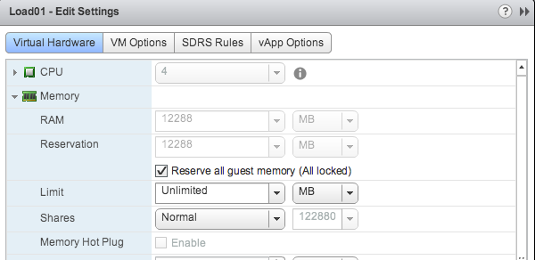
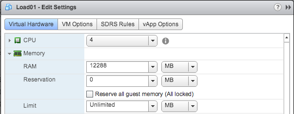
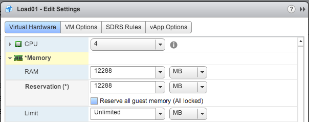

A while ago I wrote about the nice feature [Reserve all guest memory](http://frankdenneman.nl/2013/02/21/reserve-all-guest-memory-all-locked/ "Reserve all guest memory (all locked)") available in vSphere 5.1 and 5.5. The feature automatically adjusts the memory reservation when the memory configuration changes. Increase the memory size and the memory reservation is automatically increased as well. Reduce the memory size of a virtual machine, and the reservation is immediately reduced.  This week I received an email from someone who used the settings temporarily and when disabling this setting he was surprised that the reservation was not set to 0, reverting back to the default. \[caption id="attachment\_4377" align="aligncenter" width="603"\] Expected behavior\[/caption\] \[caption id="attachment\_4379" align="aligncenter" width="604"\] Real product behavior\[/caption\] Although I understand his point of view, the reality is that when you enabled the feature your intent was to apply a memory reservation to the virtual machine. The primary function of this setting is to take away the responsibility of adjusting the reservation when you change the memory reservation. If your goal is to remove the memory reservation, disable the setting Reserve all guest memory and then change the memory reservation to 0.
