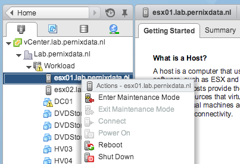

This question pops up regularly on the VMTN forums and reddit. It’s a viable question but the admins who request this feature usually don’t want Maintenance mode to break or any other feature that helps them to manage large scale environments. When you drill down, you discover that they only want to limit the option of a manual vMotion triggered by an administrator. Instead of configuring complex DRS rules, connect the VM to an unique portgroup or use bus sharing configurations, you just have to add an extra permission to the VM. The key is all about context and permission structures. When executing Maintenance mode the move of a virtual machine is done under a different context (System) then when the VM is manually migrated by the administrator. As vCenter honors the most restrictive rule you can still execute a Maintenance mode operation of a host, while being unable to migrate a specific VM. Here is how you disable vMotion for a single VM via the Webclient: **Step 1: Add another Role let’s call it _No-vMotion_**

1. Log in as a vCenter administrator
2. Go to the home screen
3. Select Roles in the Administration screen
4. Select Create Role Action (Green plus icon)
5. Add Role name (No-vMotion)
6. Select All Priveleges
7. Scroll down to Resource
8. Deselect the following Privileges:

- **Migrate powered off virtual machine**
- **Migrate powered on virtual machine**
- **Query vMotion**

 **Step 2: Restrict User privilege on VM.**

1. Select “Host and Clusters” or “VMs and Templates” view, the one you feel comfortable with.
2. Select the VM and click on the Manage tab
3. Select Permissions
4. Click on “Add Permissions” (Green plus icon)
5. Click on Add and select the User or Group who you want to restrict.
6. In my example I selected the user **FrankD** and clicks on Add on OK
7. On the right side of the screen in the pulldown menu select the role **“No-vMotion"** and click on OK.

 Ensure that the role is applied to **This object**.  FrankD is a member of the vCenterAdmins group which has Administrator privileges propagated through the virtual datacenter and all its children. However FrankD has an additional role on this object “No-vMotion”. Let’s check if it works. Log in with the user id you restricted and right-click the VM. As shown, the option Migrate is greyed out. The VM is running on Host ESX01  The option Mainentance Mode is still valid for Host ESX01.  Click on the option “More Tasks” in the Recent Task window, here you can verify that FrankD is the initiator of the operation Maintenance mode, and System migrated the virtual machine. 
