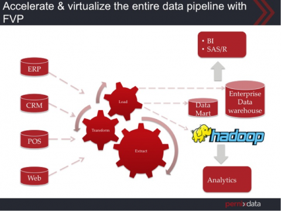

Welcome to part 2 of the [Database workload characteristics series](http://frankdenneman.nl/2014/09/23/database-workload-characteristics-impact-storage-architecture-design-part-1/ "Database workload characteristics and their impact on storage architecture design – part 1"). Databases are considered to be one of the biggest I/O consumers in the virtual infrastructure. Database operations and database design are a study upon themselves, but I thought it might be interested to take a small peak underneath the surface of database design land. I turned to our resident Database expert [Bala Narasimhan](https://twitter.com/BalaNarasimhan "Bala on twitter"), PernixData’s director of products to provide some insights about the database designs and their I/O preferences.

###### Question 2: You mentioned data pipelines in your previous podcast, what do you mean by this?

What I meant by data pipeline is the process by which this data flows in the enterprise. Data is not a static entity in the enterprise; it flows through the enterprise continuously and at various points is used for different things. As mentioned in [part 1 of this series](http://frankdenneman.nl/2014/09/23/database-workload-characteristics-impact-storage-architecture-design-part-1/ "Database workload characteristics and their impact on storage architecture design – part 1"), data usually enters the pipeline via OLTP databases and this can be from numerous sources. For example, retailers may have Point of Sale (POS) databases that record all transactions (purchases, returns etc.). Similarly, manufacturers may have sensors that are continuously sending data about health of the machines to an OLTP database. It is very important that this data enter the system as fast as possible. In addition, these databases must be highly available, have support for high concurrency and have consistent performance. Low latency transactions are the name of the game in this part of the pipeline. At some point, the business may be interested in analyzing this data to make better decisions. For example, a product manager at the retailer may want to analyze the Point of Sale data to better understand what products are selling at each store and why. In order to do this, he will need to run reports and analytics on the data. But as we discussed earlier, these reports and analytics are usually throughput bound and ad-hoc in nature. If we run these reports and analytics on the same OLTP database that is ingesting the low latency Point of Sale transactions then this will impact the performance of the OLTP database. Since OLTP databases are usually customer facing and interactive, a performance impact can have severe negative outcomes for the business. As a result what enterprises usually do is Extract the data from the OLTP database, Transform the data into a new shape and Load it into another database, usually a data warehouse. This is known as the ETL process. In order to do the ETL, customers use a solution such as Informatica (ETL) (3) or Hadoop (4) between your OLTP database and data warehouse. Some times customers will simply suck in all the data of the OLTP database (Read intensive, larger block size, throughput sensitive query) and than do the ETL inside the data warehouse itself. Transforming the data into a different shape requires reading the data, modifying it, and writing the data into new tables. You’ve most probably heard of nightly loads that happen into the data warehouse. This process is what is being referring to! As we discussed before, OLTP databases may have a normalized schema and the data warehouse may have a more denormalized schema such as a Star schema. As a result, you can’t simply do a nightly load of the data directly from the OLTP database into the data warehouse as is. Instead you have to Extract the data from the OLTP database, Transform it from a normalized schema to a Star schema and then Load it into the data warehouse. This is the data pipeline. Here is an image that explains this:  In addition, there can also be continuous small feeds of data into the data warehouse by trickle loading small subsets of data, such as most recent or freshest data. By using the freshest data in your data warehouse you make sure that the reports you run or the analytics you do is not stale and is up to date and therefore enables the most accurate decisions. As mentioned earlier, the ETL process and the data warehouse are typically throughput bound. Server side flash and RAM can play a huge role here because the ETL process and the data warehouse can now leverage the throughput capabilities of these server side resources.

###### Using PernixData FVP

Some specific, key benefits of using FVP with the data pipeline include:

- OLTP databases can leverage the low latency characteristics of server side flash & RAM. This means more transactions per second and higher levels of concurrency all while providing protection against data loss via FVP’s write back replication capabilities.
- Trickle loads of data into the data warehouse will get tremendously faster in Write Back mode because the new rows will be added to the table as soon as it touches the server side flash or RAM.
- The reports and analytics may execute joins, aggregations, sorts etc. These require rapid access to large volumes of data and can also generate large intermediate results. High read and write throughput are therefore beneficial and having this done on the server right next to the database will help performance tremendously. Again, Write Back is a huge win.
- Analytics can be ad-hoc and any tuning that the DBA have done may not help. Having the base tables on flash via FVP can help performance tremendously for ad-hoc queries.
- Analytics workloads tend to create and leverage temporary tables within the database. Using server side resources for read enhances performance on these temporary tables and write accesses to them.
- In addition, there is also a huge operational benefit. We can now virtualize the entire data pipeline (OLTP databases, ETL, data warehouse, data marts etc.) because we are able to provide high performance and consistent performance via server side resources and FVP. This brings together the best of both workloads. Leverage the operational benefits of a virtualization platform, such as vSphere HA, DRS and vMotion, and standardize the entire data pipeline on it without sacrificing performance at all.

Other parts of this series:

1. [Part 1 - Database Structures](http://frankdenneman.nl/2014/09/23/database-workload-characteristics-impact-storage-architecture-design-part-1/ "Database workload characteristics and their impact on storage architecture design – part 1")
2. [Part 3 – Ancillary structures for tuning databases](http://frankdenneman.nl/2014/09/29/database-workload-characteristics-impact-storage-architecture-design-part-3-ancillary-structures-tuning-databases/ "Database workload characteristics and their impact on storage architecture design – part 3 – Ancillary structures for tuning databases")
