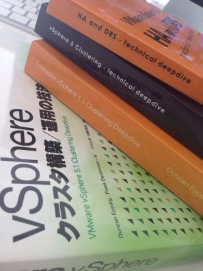

This week Duncan was looking at the sales numbers of the vSphere Clustering Deep Dive series and he noticed that we hit a major milestone in September. In September 2014 we passed the 45000 copies distributed of the vSphere Clustering Deep Dive. Duncan and I never ever expected this or even dared to dream to hit this milestone. When we first started writing the 4.1 book we had discussions around what to expect from a sales point of view and we placed a bet, I was happy if we sold 100 books, Duncan was more ambitious with 400 books. Needless to say we reset our expectations many times since then... We didn't really follow it closely in the last 12-18 months, and as today we were discussing a potentially update of the book we figured it was time to look at the numbers again just to get an idea. 45000 copies distributed (ebook + printed) is just remarkable. We've noticed that the ebook is still very popular, and decided to do a promo. As of Monday the 13th of October the 5.1 e-book will be available for only $ 0.99 for 72 hours, then after 72 hours the price will go up to $ 3.99 and then after 72 hours it will be back to the normal price. So make sure to get it while it is low priced! Pick it up here on [Amazon.com](http://www.amazon.com/gp/product/1478183411/ref=as_li_qf_sp_asin_tl?ie=UTF8&camp=1789&creative=9325&creativeASIN=1478183411&linkCode=as2&tag=frankdenneman-20 "VMware vSphere 5.1 Clustering Deepdive on Amazon")! The only other kindle store we could open the promotion up for was amazon.co.uk, so that is also an option!
