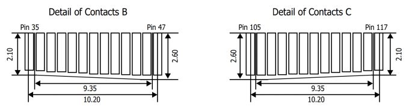
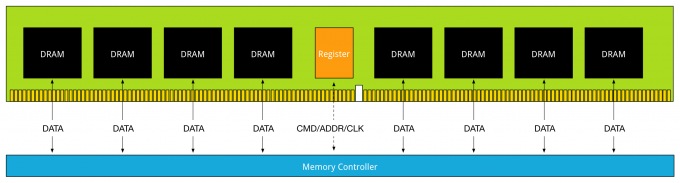
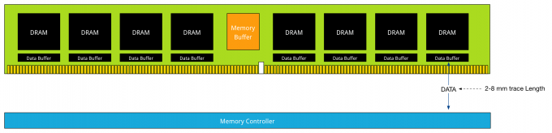
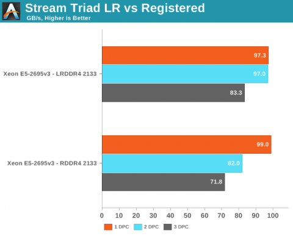

This is part 5 of the memory deep dive. This is a series of articles that I wrote to share what I learned while documenting memory internals for large memory server configurations. This topic amongst others will be covered in the upcoming FVP book. The memory deep dive series: Part 1: [Memory Deep Dive Intro](http://frankdenneman.nl/2015/02/18/memory-configuration-scalability-blog-series/ "Memory configuration scalability blog series") Part 2: [Memory subsystem Organisation](http://frankdenneman.nl/2015/02/18/memory-tech-primer-memory-subsystem-organization/ "Memory deep dive: Memory subsystem organisation") Part 3: [Memory Subsystem Bandwidth](http://frankdenneman.nl/2015/02/19/memory-deep-dive-memory-subsystem-bandwidth/ "Memory Deep Dive: Memory Subsystem Bandwidth") Part 4: [Optimizing for Performance](http://frankdenneman.nl/2015/02/20/memory-deep-dive/ "Memory Deep Dive - Optimizing for Performance") Part 5: [DDR4 Memory](http://frankdenneman.nl/2015/02/25/memory-deep-dive-ddr4/ "Memory Deep Dive - DDR4 Memory") Part 6: [NUMA Architecture and Data Locality](http://frankdenneman.nl/2015/02/27/memory-deep-dive-numa-data-locality/ "Memory Deep Dive: NUMA and Data Locality") Part 7: [Memory Deep Dive Summary](http://frankdenneman.nl/2015/03/02/memory-deep-dive-summary/) **DDR4** Released mid-2014, DDR4 is the latest variant of DDR memory. JEDEC is the semiconductor standardization body and published the DDR4 specs ([JESD79-4](http://www.jedec.org/standards-documents/results/jesd79-4%20ddr4 "JEDEC DDR4 Spec")) in September 2012. The standard describes that the per-pin data rate ranges from 1.6 gigatransfers per second to an initial maximum objective of 3.2 gigatransfers per second. However it states that it’s likely that higher performance speed grades will be added in the future.

| DIMM Type | Data Rate | Module Name | Peak Transfer Rate |
| --- | --- | --- | --- |
| DDR3-800 | 800 MT/s | PC-6400 | 6400 MB/s |
| DDR3-1066 | 1066 MT/s | PC-8500 | 8533 MB/s |
| DDR3-1333 | 1333 MT/s | PC-10600 | 10600 MB/s |
| DDR3-1600 | 1600 MT/s | PC-12800 | 12800 MB/s |
| DDR3-1866 | 1866 MT/s | PC-14900 | 14933 MB/s |
| DDR3-2133 | 2133 MT/s | PC-17000 | 17064 MB/s |
|  |  |  |  |
| DDR4-2133 | 2133 MT/s | PC-17000 | 17064 MB/s |
| DDR4-2400 | 2400 MT/s | PC-19200 | 19200 MB/s |
| DDR4-2666 | 2600 MT/s | PC-20800 | 20800 MB/s |
| DDR4-2800 | 2800 MT/s | PC-22400 | 22400 MB/s |
| DDR4-3000 | 3000 MT/s | PC-24000 | 17066 MB/s |
| DDR4-3200 | 3200 MT/s | PC-25600 | 25600 MB/s |

We are now two years further and DDR4 is the quickly becoming the standard of generic server hardware due to the use of the new Intel Xeon E5 v3 processor with the Haswell-E micro-architecture. This micro-architecture uses DDR4 exclusively. AMD’s upcoming Zen micro-architecture is expected to support DDR4. Zen is expected to appear on the market late 2016. Note that the pin-layout of DDR4 is different from DDR3. Not only is the key notch at a different location on the PCB, the pin size and arrangement is different as well. Towards the middle of the PCB, there is a change gradient, making some pins longer: \[caption id="attachment\_5066" align="aligncenter" width="680"\] Source: Anandtech.com\[/caption\] Besides the higher data rate transfer speeds, DDR4 offers higher module density. While DDR3 DRAM chip contains 8 internal banks, DDR4 can contain up to 16 internal banks. The DDR4 standard allows up to 128GB per DIMM, allowing extreme high-density memory configurations. Another major improvements is memory power consumption. DDR4 memory operates at a lower voltage than DDR3. DDR4 modules typically require 1.2 volts with a frequency between 2133MHz and 4266MHz. As a comparison; DDR3 operates between 800 and 2400 MHz with a voltage requirement between 1.5 and 1.65V. DDR3 Low voltage can operates at 800 MHz while requiring 1.35V. DDR4 performance better at a lower voltage, low voltage DDR4 is not yet announced but it’s estimated to operate at 1.05 volts. **Latency** As mentioned in [part 4](http://frankdenneman.nl/2015/02/20/memory-deep-dive/ "Memory Deep Dive - Optimizing for Performance"), the two primary measurements for performance in storage and memory are latency and throughput. Interestingly enough, memory bandwidth increases with every generation, however latency does not always improve immediately. Actually every generation of memory moves the performance dial backwards when comparing latency with its predecessor. Why does latency lag behind bandwidth? Moore’s law is a big factor. Moore’s law helps bandwidth more than latency as transistors become faster and smaller. This allows the memory vendor to place more transistors on the board. More transistors means more pins, means more bandwidth, but it also means that the communication traverses longer lines. The size of the DRAM chip increases as well, resulting in longer bit and word lines. It basically comes down to distance and as you are all well aware of, distance is a big factor when it comes to latency. The interesting part is that memory bandwidth is a factor of latency. Latency is a generic term, when reviewing the latency and bandwidth relationship, one has to review unloaded and loaded latencies. Memory latency is measured from the moment the CPU issues a read request to the moment the memory supplies it to the core. This is referred to as load to use. However the load to use latencies differ when the memory system is idle or when it’s saturated. Unloaded latency is a measurement of an idle system and it represents the lowest latency that the system can achieve. A well-known indicator of memory latency is the CAS timings (Column Address Strobe) and it represents the unloaded latency. Basically it demonstrates the most optimal scenario. CAS timings is a good way to understand the relative latency between two memory DIMMS, however it does not always indicate the real world performance of a system. Loaded latency is the latency when the memory subsystem is saturated with memory request and that’s where bandwidth has a positive impact on real world latency. Under loaded conditions memory requests spend time in the queue, the more bandwidth speed the memory has, the more quickly the memory controller can process the queued commands. For example, memory running at 1600 MHz has about 20% lower loaded latency than memory running at 1333 MHz. Loaded latency is the real world measurement of performance applications will experience, having bandwidth speed to reduce loaded latency is important when reviewing the DPC configuration ([part 4](http://frankdenneman.nl/2015/02/20/memory-deep-dive/ "Memory Deep Dive - Optimizing for Performance")) of your server configuration. Ranks will also have a positive impact on the loaded latency (lower latency). Having more ranks allows the memory controller to empty out its queue’s by parallelize the process of memory requests. Parallelization is covered in [part 4](http://frankdenneman.nl/2015/02/20/memory-deep-dive/ "Memory Deep Dive - Optimizing for Performance") of this series. **Bandwidth and CAS Timings** The memory area of a memory bank inside a DRAM chip is made up of rows and columns. To access the data, the chip needs to be selected, then the row is selected, and after activating the row the column can be accessed. At this time the actual read command is issued. From that moment onwards to the moment the data is ready at the pin of the module, that is the CAS latency. Its not the same as load to use as that is the round trip time measured from a CPU perspective. CAS latencies (CL) increase with each new generation of memory, but as mentioned before latency is a factor of clock speed as well as the CAS latency. Generally a lower CL will be better, however they are only better when using the same base clock. If you have faster memory, higher CL could end up better. When DDR3 was released it offered two speeds, 1066MHz CL7 and 1333 MHz CL8. Today servers are equipped with 1600 MHz CL9 memory.DDR4 was released with 2133 MHz CL13. However 2133 MHz CL15 is available at the major server vendors. To work out the unloaded latency is: (CL/Frequency) \* 2000. This means that 1600 MHz CL9 provides an unloaded latency of 11.25ns, while 2133 MHz CL15 provides an unloaded latency of 14.06ns. A drop of 24.9%. However DDR4 latency will drop when bandwidth increases faster then the increase of CAS latency. At the time of writing “prosumer” DDR4 memory is available at higher speeds than the server vendors offer, but it’s just a matter of time before those modules become available for server hardware. Many memory vendors offer DDR4 2800 MHz CL14 to CL 16. When using the same calculation, 2800 MHz CL16 provides an unloaded latency of (16/2800) \* 2000 = 11.42ns. Almost the same latency at DDR3 1600 MHz CL9! 2800 MHZ CL14 provides an unloaded latency of 10ns, meaning that CL14 beating CL9 with a lower latency while providing more than 75% bandwidth. **LRDIMMs** When LRDIMMs were introduced, they delivered higher capacity at the expense of lower bandwidth and higher latency. With the introduction of the new memory controller of Intel Xeon v2, the bandwidth drop was reduced and latency was slightly improved. However still not up to the standards of registered DIMMs. The screenshot below, originating from the [IDT DDR4 LRDIMM white paper](https://www.google.nl/url?sa=t&rct=j&q=&esrc=s&source=web&cd=3&cad=rja&uact=8&ved=0CDAQFjAC&url=https%3A%2F%2Fwww.idt.com%2Fdocument%2Fwhp%2Fddr4-lrdimms-both-memory-capacity-and-speed&ei=Ir3tVLLvDcb0PNiBgZgG&usg=AFQjCNFilzee8MREV7ImPWLLxOHLdCF_NQ&sig2=4S44uViVU9T1rygB26p6Nw&bvm=bv.86956481,d.ZWU "IDT DDR4 LRDIMM whitepaper"), shows the bandwidth drops of LRDIMM and RDIMMs in the three Intel Xeon architectures. On the far right the Intel Xeon v1 (Sandy Bridge) is shown, the middle graph shows the Intel Xeon v2 (Ivy Bridge) and the left is the Intel Xeon v3 (Haswell-E microachitecture). \[caption id="attachment\_5076" align="aligncenter" width="680"\] Source: IDT DDR4 LRDIMM whitepaper\[/caption\] The reason why latency is higher in LRDIMM architecture is due to the use of the memory buffer. The fastest way is always a direct line, with unbuffered DIMMs, the memory controller communicates directly with the DRAM chip. The drawback of this architecture is described in part 2. With registered DIMMs, the memory controller sends control and management messaging to the register but still fetches data straight from the DRAM chip.  DDR3 Load Reduced DIMMs, use a memory buffer for all communication, including data. That means that the distance of data travel, typically referred to as trace lengths is much longer.  Distance is the enemy of latency; therefore DDR4 LRDIMMs leverage data buffers close to the DRAM chips to reduce the I/O trace lengths. With DDR3 LRDIMMs, a trace length is up to 77 millimeter. DDR4 LRDIMM trace lengths are claimed to be between 2 and 8 millimeter.  This reduces the added latency tremendously. DDR4 LRDIMMs trace lengths are comparable to DDR4 RDIMM trace lengths. Where in DDR3 the added component latency of the memory buffer is approximately 2.5 ns when compared to an RDIMM, the component delay of DDR4 LRDIMM is approximately 1.2 ns. DDR4 uses smaller memory buffers with an improved buffering scheme to decrease the latency even further. The reduction of trace lengths decreases the impact on signal integrity, which in turn allows DDR4 DIMMs to operate at a higher bandwidth when using 3DPC configuration. Anandtech.com compared the memory bandwidth of RDIMMs against LRDIMM in various DPC configurations  Anandtech.com noted the following: _Registered DIMMs are slightly faster at 1 DPC, but LRDIMMs are clearly faster when you insert more than one DIMM per channel. We measured a 16% to 18% difference in performance. It's interesting to note that LRDIMMs are supposed to run at 1600 at 3DPC according to Intel's documentation, but our bandwidth measurement points to 1866. The command "dmidecode -type 17" that reads out the BIOS confirmed this._ Article: [Intel Xeon E5 Version 3: Up to 18 Haswell EP Cores by Johan De Gelas](http://www.anandtech.com/show/8423/intel-xeon-e5-version-3-up-to-18-haswell-ep-cores- ": Intel Xeon E5 Version 3: Up to 18 Haswell EP Cores by Johan De Gelas") By using a buffer for each DRAM chip the latency overhead is thus significantly lower on DDR4 LRDIMMs. Compared to RDIIMMs at the same speed with 1 DPC the latency overhead will be small, but as soon as more DIMMS per channel are used, the LRDIMMs actually offer lower latency as they run at higher bus speeds. **DDR4 in the real world** Although DDR4 has to fight the perception of much slower memory, real world use need to prove this otherwise. I hope this article proved that just looking as CAS Latency numbers is a futile exercise. Memory speed is a factor in determining latency, and loaded latency (saturated system) is something enteprise applications will experience more than an idle fully unloaded system. High density, high bandwidth configurations that sustain their bandwidth is the real benefit of DDR4. DDR4 memory in general can cope with multi-DPC much better than their counterparts of the previous generation. As more DIMMs are populated the speed typically falls due to previous described electrical load on the memory controller. Multi-DPC frequency fall-off is less steep. Unfortunately at the time of writing DDR4 is still in a premium price range, however its expected to see a decline in price at the end of 2015 making it an interesting choice as a resource for both virtual machine memory and storage acceleration. Up next, part 6: [NUMA Architecture and Data Locality](http://frankdenneman.nl/2015/02/27/memory-deep-dive-numa-data-locality/ "Memory Deep Dive: NUMA and Data Locality") The memory deep dive series: Part 1: [Memory Deep Dive Intro](http://frankdenneman.nl/2015/02/18/memory-configuration-scalability-blog-series/ "Memory configuration scalability blog series") Part 2: [Memory subsystem Organisation](http://frankdenneman.nl/2015/02/18/memory-tech-primer-memory-subsystem-organization/ "Memory deep dive: Memory subsystem organisation") Part 3: [Memory Subsystem Bandwidth](http://frankdenneman.nl/2015/02/19/memory-deep-dive-memory-subsystem-bandwidth/ "Memory Deep Dive: Memory Subsystem Bandwidth") Part 4: [Optimizing for Performance](http://frankdenneman.nl/2015/02/20/memory-deep-dive/ "Memory Deep Dive - Optimizing for Performance") Part 5: [DDR4 Memory](http://frankdenneman.nl/2015/02/25/memory-deep-dive-ddr4/ "Memory Deep Dive - DDR4 Memory") Part 6: [NUMA Architecture and Data Locality](http://frankdenneman.nl/2015/02/27/memory-deep-dive-numa-data-locality/ "Memory Deep Dive: NUMA and Data Locality") Part 7: [Memory Deep Dive Summary](http://frankdenneman.nl/2015/03/02/memory-deep-dive-summary/)
