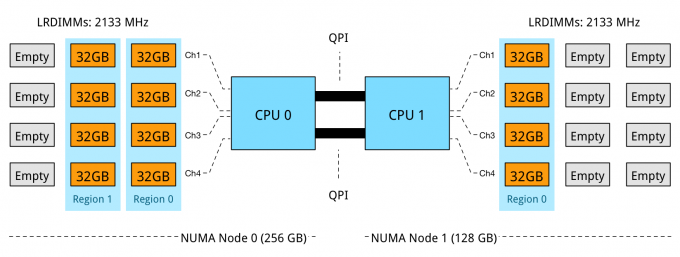
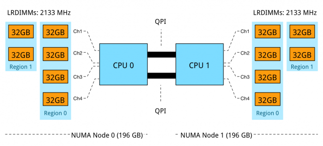
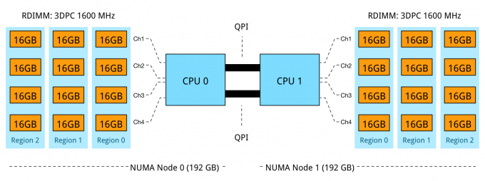

This is part 6 of the memory deep dive. This is a series of articles that I wrote to share what I learned while documenting memory internals for large memory server configurations. This topic amongst others will be covered in the upcoming FVP book. The memory deep dive series:

Part 1: [Memory Deep Dive Intro](http://frankdenneman.nl/2015/02/18/memory-configuration-scalability-blog-series/ "Memory configuration scalability blog series") Part 2: [Memory subsystem Organisation](http://frankdenneman.nl/2015/02/18/memory-tech-primer-memory-subsystem-organization/ "Memory deep dive: Memory subsystem organisation") Part 3: [Memory Subsystem Bandwidth](http://frankdenneman.nl/2015/02/19/memory-deep-dive-memory-subsystem-bandwidth/ "Memory Deep Dive: Memory Subsystem Bandwidth") Part 4: [Optimizing for Performance](http://frankdenneman.nl/2015/02/20/memory-deep-dive/ "Memory Deep Dive - Optimizing for Performance") Part 5: [DDR4 Memory](http://frankdenneman.nl/2015/02/25/memory-deep-dive-ddr4/ "Memory Deep Dive - DDR4 Memory") Part 6: [NUMA Architecture and Data Locality](http://frankdenneman.nl/2015/02/27/memory-deep-dive-numa-data-locality/ "Memory Deep Dive: NUMA and Data Locality") Part 7: [Memory Deep Dive Summary](http://frankdenneman.nl/2015/03/02/memory-deep-dive-summary/)

**Background of multiprocessor architectures** Moore’s law is often misquoted, linking the increase of transistor count to the increase of speed. According to [Wikipedia](http://en.wikipedia.org/wiki/Moore%27s_law "Moore's law") Moore’s law is:

_An observation made by Intel co-founder Gordon Moore in 1965. He noticed that the number of transistors per square inch on integrated circuits had doubled every year since their invention. Moore's law predicts that this trend will continue into the foreseeable future._

The interesting thing is that Moore’s law is still applicable to this day. The transistor count has been increasing every year, however the speed increase was barely doubled in the last decade. From 2000 to 2009, the CPU speed went from 1.3 GHz to 2.8 GHz. Transistor-count on the other hand increased from 37.5 million in 2000 to 904 million in 2009. This means that translator count does not automatically translate in raw CPU speed increase. For that we have to get back to 2004 where the heat build-up in the chips cause Intel to abandon the consistent speed improvement and move towards a design with multiple processor (cores) on the same CPU chip. The industry followed soon after.

\[caption id="attachment\_5100" align="aligncenter" width="844"\] Source: Computer Architecture, A quantitative Approach by Hennessy and Patterson\[/caption\]

This fundamental shift in hardware design had a profound impact on software performance. Previously, faster CPU speeds translated directly into faster application performance. When switching to multi-core design, only software that could take advantage of multiple processors would get this benefit.

**Importance of memory architecture** The importance of memory architecture has increased with the advances in performance and architecture in CPU. The shows the gap in performance, measured as the difference in the time between processor memory requests (for a single processor or core) and the latency of a DRAM access, is plotted over time.

\[caption id="attachment\_5099" align="aligncenter" width="563"\] Source: Computer Architecture, A quantitative Approach by Hennessy and Patterson\[/caption\]

The interesting thing is the plateauing performance of CPU from 2004 and onwards. This due to the increase of core count instead of CPU clock speed. This development increases the bandwidth requirements even more. The aggregate peak bandwidth essentially grows as the number of cores grows. Simply put, we can process data faster than ever, but we can’t get that data faster. To battle this, CPU design has been focusing on parallel memory architectures, and specifically the attempt to keep the data as close to the executing core as possible.

**Parallel Memory Architecture** Two major parallel memory architectures exist Distributed Memory Architecture and Shared Memory Architecture. Shared Memory Architecture is split up in two types: Uniform Memory Access (UMA), and Non-Uniform Memory Access (NUMA). Distributed Memory Architecture is an architecture used in clusters, with different hosts connected over the network typically without cache coherency. Shared Memory Architecture is a layout of processors and memory inside a server. With UMA memory is shared across all CPUs. To access memory, the CPUs have to access a Memory Controller Hub (MCH). This type of architecture is limited to scalability, bandwidth, and latency. The MCH is connected to an I/O controller across a bus, this bus has finite speed and for any communication, the CPUs need to take control of the bus, which leads to contention problems. UMA does not scale after a certain number of processors.

To solve latency, bandwidth, and scalability NUMA was introduced. NUMA moves away from a centralized pool of memory and introduces topological properties. By classifying location bases on signal path length from the processor to the memory, latency and bandwidth bottlenecks can be avoided. NUMA memory is directly attached to the CPU and this is considered to be local. Memory connected to another CPU socket is considered to be remote. Remote memory access has additional latency overhead to local memory access, as it has to traverse the interconnect and connect to the remote memory controller. As a result of the different locations memory can exist, this system experiences “non-uniform” memory access time.

Keeping the memory access local or maximizing memory locality provides the best performance. However, due to CPU load balancing in the hypervisor layer it can happen that local memory becomes a remote memory. Designing the server that retains the highest bandwidth while offering the highest capacity is key with NUMA configurations.

**NUMA scheduling** ESXi is NUMA aware and has its own NUMA scheduling. When you think about it, how would you characterize NUMA? You want to keep the memory as close to the CPU instruction as possible, so it would make sense to consider it a memory scheduler. Within ESXi, it’s a part of the CPU scheduler and this explains the focus of the NUMA scheduler. As CPU load balancing across the NUMA nodes is crucial to performance, the emphasis of the NUMA scheduler is to achieve a more balanced CPU load.

When a virtual machine is powered on, the NUMA schedule assigns a home node. A home node, typically referred to as NUMA node, is the set of CPU and its local memory. In an ideal situation, the NUMA node provides the CPU and memory resources the virtual machine requires. The NUMA scheduler tries to load balance all virtual machines across the NUMA nodes in the server. The administrator can help the NUMA scheduler by right-sizing the virtual machine, attempt to keep the memory footprint within the capacity of a single NUMA node.

However, when multiple virtual machines run on a server, it can happen that no optimal distribution of virtual machines can be obtained where each virtual machine working set can fit into their local NUMA node. When a virtual machine has a certain amount of memory located remote, the NUMA scheduler migrates it to another NUMA node to improve locality. It’s not documented what threshold must be exceeded to trigger the migration, but its considered poor memory locality when a virtual machine has less than 80% mapped locally. My “educated” guess is that it will be migrated when it’s below 80%. ESXTOP memory NUMA statistics show the memory location of each virtual machine. Start ESXTOP, press m for memory view, press f for customizing ESXTOP and press f to select the NUMA Statistics.

 Memory locality rate can be input for sizing the memory capacity of the server. DIMM type, capacity and DPC configuration need to be taken into account to maintain high throughput values.

**Importance of Interconnect Bandwidth** CPU load varies dynamically and can cause CPU load imbalance between the NUMA nodes. This can trigger the NUMA scheduler to rebalance every couple of seconds (I believe the NUMA scheduler checks every 4 seconds). However, unlike vCPUs, memory migrates very slowly because of the cost involved of bandwidth consumption and address mappings updates. VCPUs are nimble and can bounce around the NUMA nodes quite frequently, the last thing you want to do is to migrate memory after every vCPU migration.

To solve this, the NUMA scheduler initiates memory migration at a slow pace until the vCPU stops migration and stays on a NUMA node for a long period of time. Once determined the vCPU is settled, the memory migration is accelerated to achieve locality again. This behavior increases the importance of the interconnect bandwidth of a CPU when designing the server platform. With Intel the interconnect is called [Intel QuickPath Interconnect](http://en.wikipedia.org/wiki/Intel_QuickPath_Interconnect "Intel QuickPath Interconnect"), [HyperTransport](http://en.wikipedia.org/wiki/HyperTransport "AMD HyperTransport") is the name of AMD interconnect technology ([HTX 3.1 spec](http://www.hypertransport.org/news/pr/HTCPR_D491D3FB-112F-2FB0-6DE3F143373EBFD0.pdf "HTX 3.1 spec")) Intel categorizes their CPU into roughly five segments: Basic, Standard, Advanced, Segmented Optimized and Low Power. 

| Processor Model | QPI Bandwidth | Max Memory Frequency | Max Memory Bandwidth |
| --- | --- | --- | --- |
| E5-2603 v3 | **6.4 GT/s** | 1600 MHz | 51 GB/s |
| E5-2620 v3 | **8 GT/s** | 1866 MHz | 59 GB/s |
| E5-2637 v3 | **9.6 GT/s** | 2133 MHz | 68 GB/s |

The QPI is configured as a link pair, two unidirectional paths exists between the CPU’s. As the links can be simultaneously active, it doubles the bandwidth spec. A clock rate of 4.0 GHz yields a data rate of 32 GB/s.

| QPI Transfer Speed | Clock Rate | Unidirectional Bandwidth | Total Bandwidth |
| --- | --- | --- | --- |
| 6.4 GT/s | 3.20 GHz | 12.8 GB/s | 25.6 GB/s |
| 8 GT/s | 4.0 GHz | 16.0 GB/s | 32.0 GB/s |
| 9.6 GT/s | 4.80 GHz | 19.2 GB/s | 38.4 GB/s |

Although QPI bandwidth is increased with every new CPU generation, it lags in comparison with local memory bandwidth. Increasing memory capacity and CPU count should help to reduce remote memory access. This of course with right-sizing the virtual machine to the application work set however as experience taught me, sometimes the political forces are stronger than financial constraints.

**Local memory optimization** Optimization is done across different axes. Care must be taken when configuring capacity, previous parts of this memory deep dive covered bandwidth reduction of DIMMs Per Channel Configuration. Intel Xeon v3 follows the following spec:

| DIMM Type | 1 DPC | 2 DPC | 3 DPC |
| --- | --- | --- | --- |
| 1R RDIMM | 2133 MHz | 1866 MHz | 1600 MHz |
| 2R RDIMM | 2133 MHz | 1866 MHz | 1600 MHz |
| 4R RDIMM | 2133 MHz | 1866 MHz | N/A |
| 4R LRDIMM | 2133 MHz | 2133 MHz | 1600 MHz |

Sustaining high levels of bandwidth while providing large amounts of capacity is the key benefit of DDR4 LRDIMMs. [Part 5](http://frankdenneman.nl/2015/02/25/memory-deep-dive-ddr4/ "Memory Deep Dive - DDR4 Memory") covered the advancements made with LRDIMM technology of DDR4 and especially the reduction of latency compared to its predecessors.

**Importance of balanced memory population** When designing a server system with NUMA architecture, memory population is very important. Design for an even population of DIMMs across sockets and channels. NUMA configurations are extremely sensitive to unbalanced configurations. After the required total capacity is calculated ensure that this capacity can be distributed equally across the sockets (NUMA nodes) and the channels. A balanced memory configuration for a 2 socket Intel Xeon v3 system means that 8, 16 or 24 DIMMs are populated, and where the DIMMs are evenly distributed across all 8-memory channels (4 memory channels per CPU). Resulting in a 1 DPC, 2 DPC or 3DPC across all channels. Capacity and Bandwidth requirements impact whether RDIMMs or LRDIMMs are required.

**Scenario:** In this scenario, the server contains 24 DIMM slots and contains two Intel E5-2637 v3 CPUs. The QPI bandwidth is 38.4 GB/s while the total amount of local memory bandwidth per CPU is 68 GB/s. DDR4-2133 provides 17 GB/s allowing quad-channel use. Tests demonstrated that using 2 DPC has a minimal impact on bandwidth when using LRDIMMs. When using RDIMM configuration in 2DPC a 16% drop was recorded. Unfortunately, some capacities are not ideal that results in NUMA balance, Channel usage and optimized bandwidth. Take for example the popular memory configuration of 384GB. 12 x 32 GB LRDIMMs can be used or 24 RDIMMs. When using 12 x 32 GB DIMMs problems occur as there are 12 DIMM slot per server managed by 4 channels.

**Problem 1: Unbalanced NUMA configuration:**  NUMA Node 0 has 256 GB, while NUMA node 1 contains 128 GB. In this configuration DPC is used to its full extent, leveraging parallelism and memory interleaving. However, the optimization of local bandwidth would not help the virtual machines who are scheduled to run in NUMA node 1, less memory available means it is required to fetch it remotely, experiencing the extra latency of multi-hops and the bandwidth constraint of the QPI compared to local memory.

**P****roblem 2: Unbalanced DPC Regions:**  The memory capacity is equally distributed across the NUMA Nodes, however, a mixed DPC configuration exists of 1 DPC and 2 DPC. This configuration does not provide a consistent memory performance. Data access is done across 4 channels, 2 channels, and across the QPI to the other memory controller than might fetch the data across two or four channels. As described in part 4 - Optimizing Performance, unbalanced DPC configurations can lead to a 30% performance decrease and this is without the impact of access data remotely.

**Problem 3: RDIMM 3 DPC Bandwidth reduction:**  Using 16GB RDIMMs results in a balanced NUMA configuration while leveraging 4 channels to its full potential. 3 DIMMs per channel per processor results in a decrease of memory bandwidth, dropping from 2133 MHz to 1600 MHz. While 2133 MHz provides up to 17 GB/s per DIMM, 1600 MHz provides a maximum bandwidth up to 12.8 GB/s per DIMM. A drop of 25%. Unfortunately, latency will also be impacted by running at a lower clock cycle. Future scalability is ruled out by using all DIMM slots. Requirements and the constraints will impact memory configurations, depending on the budget or future requirements it makes sense to increase or decrease the memory configuration or accept that future scale-out capabilities are unavailable after populating all slots. Up next, part 7: [Memory Deep Dive Summary](http://frankdenneman.nl/2015/03/02/memory-deep-dive-summary/)

The memory deep dive series: Part 1: [Memory Deep Dive Intro](http://frankdenneman.nl/2015/02/18/memory-configuration-scalability-blog-series/ "Memory configuration scalability blog series") Part 2: [Memory subsystem Organisation](http://frankdenneman.nl/2015/02/18/memory-tech-primer-memory-subsystem-organization/ "Memory deep dive: Memory subsystem organisation") Part 3: [Memory Subsystem Bandwidth](http://frankdenneman.nl/2015/02/19/memory-deep-dive-memory-subsystem-bandwidth/ "Memory Deep Dive: Memory Subsystem Bandwidth") Part 4: [Optimizing for Performance](http://frankdenneman.nl/2015/02/20/memory-deep-dive/ "Memory Deep Dive - Optimizing for Performance") Part 5: [DDR4 Memory](http://frankdenneman.nl/2015/02/25/memory-deep-dive-ddr4/ "Memory Deep Dive - DDR4 Memory") Part 6: [NUMA Architecture and Data Locality](http://frankdenneman.nl/2015/02/27/memory-deep-dive-numa-data-locality/ "Memory Deep Dive: NUMA and Data Locality") Part 7: [Memory Deep Dive Summary](http://frankdenneman.nl/2015/03/02/memory-deep-dive-summary/)
