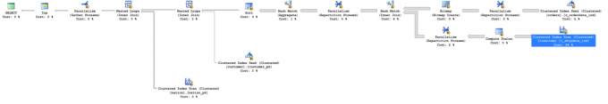

Welcome to part 5 of the Database workload characteristics series. Databases are considered to be one of the biggest I/O consumers in the virtual infrastructure. Database operations and database design are a study upon themselves, but I thought it might be interested to take a small peak underneath the surface of database design land. I turned to our resident Database expert Bala Narasimhan, PernixData’s VP of products to provide some insights about the database designs and their I/O preferences. Previous instalments of the series: Part 1 - [Database Structures](http://frankdenneman.nl/2014/09/23/database-workload-characteristics-impact-storage-architecture-design-part-1/ "Database workload characteristics and their impact on storage architecture design - part 1") Part 2 – [Data pipelines](http://frankdenneman.nl/2014/09/24/database-workload-characteristics-impact-storage-architecture-design-part-2-data-pipelines/ "Database workload characteristics and their impact on storage architecture design – part 2 - Data pipelines") Part 3 - [Ancillary structures for tuning databases](http://frankdenneman.nl/2014/09/29/database-workload-characteristics-impact-storage-architecture-design-part-3-ancillary-structures-tuning-databases/ "Database workload characteristics and their impact on storage architecture design – part 3 - Ancillary structures for tuning databases") Part 4 - [NoSQL platforms](http://frankdenneman.nl/2014/11/06/database-workload-characteristics-impact-storage-architecture-design-part-4-nosql-platforms/ "Database workload characteristics and their impact on storage architecture design – part 4 - NoSQL platforms") Databases are a critical application for the enterprise and usually have demanding storage performance requirements. In this blog post I will describe how to understand the storage performance requirements of a database at the query level using database tools. I’ll then explain why PernixData FVP helps not only to solve the database storage performance problem but also the database manageability problem that manifests itself when storage performance becomes a bottleneck. Throughout the discussion I will use SQL Server as an example database although the principles apply across the board. **Query Execution Plans** When writing code in a language such as C++ one describes the algorithm one wants to execute. For example, implementing a sorting algorithm in C++ means describing the control flow involved in that particular implementation of sorting. This will be different in a bubble sort implementation versus a merge sort implementation and the onus is on the programmer to implement the control flow for each sort algorithm correctly. In contrast, SQL is a declarative language. SQL statements simply describe what the end user wants to do. The control flow is something the database decides. For example, when joining two tables the database decides whether to execute a hash join, a merge join or a nested loop join. The user doesn’t decide this. The user simply executes a SQL statement that performs a join of two tables without any mention of the actual join algorithm to use. The component within the database that comes up with the plan on how to execute the SQL statement is usually called the query optimizer. The query optimizer searches the entire space of possible execution plans for a given SQL statement and tries to pick the optimal one. As you can imagine this problem of picking the most optimal plan out of all possible plans can be computationally intensive. SQL’s declarative nature can be sub-optimal for query performance because the query optimizer might not always pick the best possible query plan. This is usually because it doesn’t have full information regarding a number of critical components such as the kind of infrastructure in place, the load on the system when the SQL statement is run or the properties of the data. . One example of where this can manifest is called Join Ordering. Suppose you run a SQL query that joins three tables T1, T2, and T3. What order will you join these tables in? Will you join T1 and T2 first or will you join T1 and T3 first? Maybe you should join T2 and T3 first instead. Picking the wrong order can be hugely detrimental for query performance. This means that database users and DBAs usually end up tuning databases extensively. In turn this adds both an operational and a cost overhead. **Query Optimization in Action** Let’s take a concrete example to better understand query optimization. Below is a SQL statement from a TPC-H like benchmark. `select top 20 c_custkey, c_name, sum(l_extendedprice * (1 - l_discount)) as revenue, c_acctbal, n_name, c_address, c_phone, c_comment from customer, orders, lineitem, nation where c_custkey = o_custkey and l_orderkey = o_orderkey and o_orderdate >= ':1' and o_orderdate < dateadd(mm,3,cast(':1'as datetime)) and l_returnflag = 'R' and c_nationkey = n_nationkey group by c_custkey, c_name, c_acctbal, c_phone, n_name, c_address, c_comment order by revenue;` The SQL statement finds the top 20 customers, in terms of their effect on lost revenue for a given quarter, who have returned parts they bought. Before you run this query against your database you can find out what query plan the optimizer is going to choose and how much it is going to cost you. Figure 1 depicts the query plan for this SQL statement from SQL Server 2014 \[You can learn how to generate a query plan for any SQL statement on SQL Server at h[ttps://msdn.microsoft.com/en-us/library/ms191194.aspx](ttps://msdn.microsoft.com/en-us/library/ms191194.aspx).  You should read the query plan from right to left. The direction of the arrow depicts the flow of control as the query executes. Each node in the plan is an operation that the database will perform in order to execute the query. You’ll notice how this query starts off with two Scans. These are I/O operations (scans) from the tables involved in the query. These scans are I/O intensive and are usually throughput bound. In data warehousing environments block sizes could be pretty large as well. A SAN will have serious performance problems with these scans. If the data is not laid out properly on disk, you may end up with a large number of random I/O. You will also get inconsistent performance depending on what else is going on in the SAN when these scans are happening. The controller will also limit overall performance. The query begins by performing scans on the lineitem table and the orders table. Note that the database is telling what percentage of time it thinks it will spend in each operation within the statement. In our example, the database thinks that it will spend about 84% of the total execution time on the Clustered Index Scan on lineitem and 5% on the other. In other words, 89% of the execution time of this SQL statement is spent in I/O operations! It is no wonder then that users are wary of virtualizing databases such as these. You can get even more granular information from the query optimizer. In SQL Server Management Studio, if you hover your mouse over a particular operation a yellow pop up box will appear showing very interesting statistics. Below is an example of data I got from SQL Server 2014 when I hovered over the Clustered Index Scan on the lineitem able that is highlighted in Figure 1.  Notice how Estimated I/O cost dominates over Estimated CPU cost. This again is an indication of how I/O bound this SQL statement is. You can learn more about the fields in the figure above here. **An Operational Overhead** There is a lot one can learn about one’s infrastructure needs by understanding the query execution plans that a database generates. A typical next step after understanding the query execution plans is to tune the query or database for better performance. For example, one may build new indexes or completely rewrite a query for better performance. One may decide that certain tables are frequently hit and should be stored on faster storage or pinned in RAM. Or, one may decide to simply do a complete infrastructure rehaul. All of these result in operational overheads for the enterprise. For starters, this model assumes someone is constantly evaluating queries, tuning the database and making sure performance isn’t impacted. Secondly, this model assumes a static environment. It assumes that the database schema is fixed, it assumes that all the queries that will be run are known before hand and that someone is always at hand to study the query and tune the database. That’s a lot of rigidity in this day and age where flexibility and agility are key requirements for the business to stay ahead. **A solution to database performance needs without the operational overhead** What if we could build out a storage performance platform that satisfies the performance requirements of the database irrespective of whether query plans are optimal, whether the schema design is appropriate or whether queries are ad-hoc or not? One imagines such a storage performance platform will completely take away the sometimes excessive tuning required to achieve acceptable query performance. The platform results in an environment where SQL is executed as needed by the business and the storage performance platform provides the required performance to meet the business SLA irrespective of query plans. This is exactly what PernixData FVP is designed to do. PernixData FVP decouples storage performance from storage capacity by building a server side performance tier using server side flash or RAM. What this means is that all the active I/O coming from the database, both reads and writes, whether sequential or random, and irrespective of block size is satisfied at the server layer by FVP right next to the database. You are longer limited by how data is laid out on the SAN, or the controller within the SAN or what else is running on the SAN when the SQL is executed. This means that even if the query optimizer generates a sub optimal query plan resulting in excessive I/O we are still okay because all of that I/O will be served from server side RAM or flash instead of network attached storage. In a future blog post we will look at a query that generates large intermediate results and explain why a server side performance platform such as FVP can make a huge difference. _Post originally appeared on [ToddMace.io](http://www.toddmace.io/blog/2015/4/1/how-can-database-users-benefit-from-pernixdata-fvp)_
