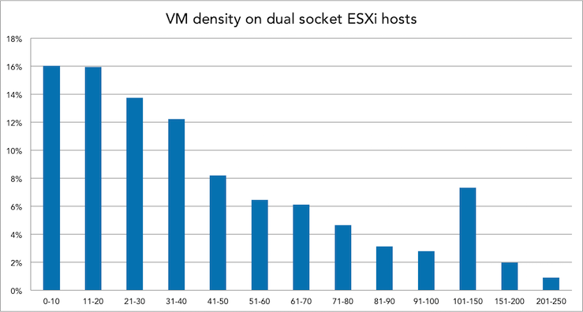
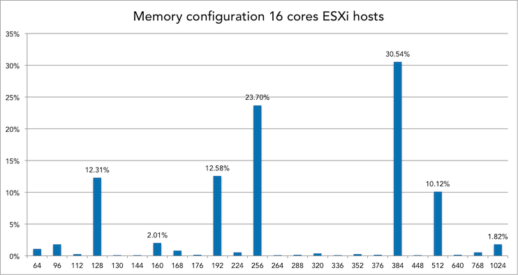
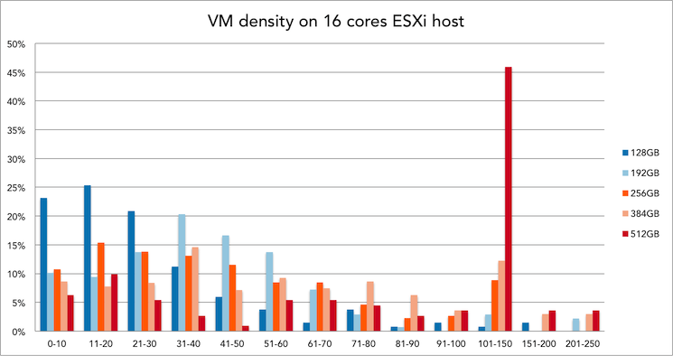
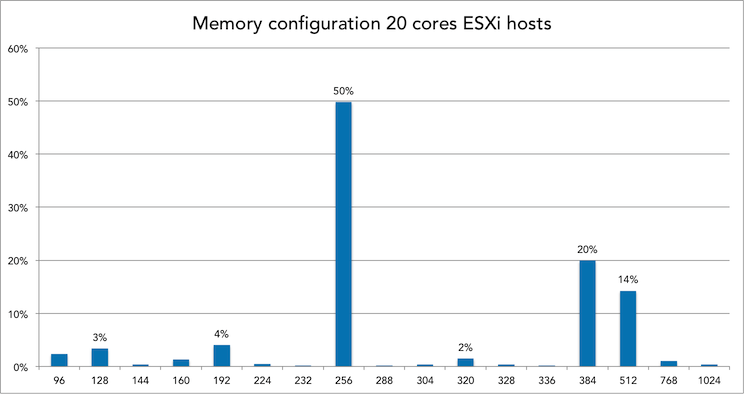
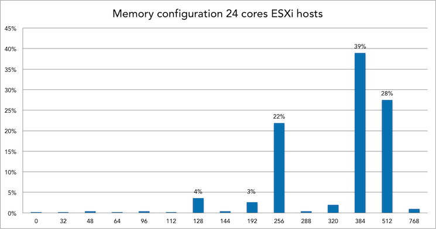

For the last 3 months my main focus within PernixData has been (and still is) the PernixCloud program. In short PernixData Cloud is the next logical progression of PernixData Architect and provides visibility into and analytics of virtual datacenters, it’s infrastructure, and it’s applications. By providing facts on the various elements of the virtual infrastructure, architects and administrators can design their environment in a data-driven way. The previous article “[Insights into CPU and Memory configurations of ESXi hosts](http://frankdenneman.nl/2015/12/23/insights-into-cpu-and-memory-configuration-of-esxi-hosts/)” zoomed in to the compute configuration of 8000 ESXi hosts and helped us understand which is the most popular system in today's datacenter running VMware vSphere. The obvious next step was to determine the average number of virtual machines on these systems. Since that time the dataset has expanded and it now contains data of more than 25.000 ESXi hosts. An incredible dataset to explore I can tell you and it’s growing each day. Learning how to deal with these vast quantities of data is incredibly interesting. Extracting various metrics from a dataset this big is challenging. Most commercial tools are not designed to cope with this amount of data, thus you have to custom build everything. And with the dataset growing at a rapid pace, you are constantly exploring the boundaries of what’s possible with software and hardware. **VM Density** After learning what system configurations are popular, you immediately wonder how many virtual machines are running on that system. But what level of detail do you want to know? Will this info be useable for architects and administrators to compare their systems and practical to help them design their new datacenter? One of the most sought after question is the virtual CPU to physical CPU ratio. A very interesting one, but unfortunately to get a result that is actually meaningful you have to take multiple metrics into account. Sure you can map out the vCPU to pCPU ratio, but how do you deal with the fact of oversizing of virtual machines that has been happing since the birth of virtualization? What about all these countless discussions whether the system only needs a single or double CPU because it’s running a single threaded program? How many times have you heard the remark that the vendor explicitly states that the software requires at least 8 CPU’s? Therefor you need to add utilization of CPU to get an accurate view, which in turn leads to the question what timeframe you need to use to understand whether the VM is accurately sized or whether the vCPUs are just idling most of the time? You are now mixing static data (inventory) and transient data (utilization). Same story applies for memory. In consequence I focused just on the density of virtual machines per host. The whole premise of virtualization is to exploit the variation of activity of applications, combined with distribution mechanisms as DRS and VMturbo you can argue that virtual and physical compute configurations will be matched properly. Therefor it’s interesting to see how far datacenters stretch their systems and understand the consolidation ratio of virtual machines. Can we determine a sweet spot of the number of virtual machines per host? **The numbers** Discovered earlier, dual socket systems are the most popular system configuration in the virtual datacenters, therefor I focused on these systems only. With the dataset now containing more than 25.000 ESXi hosts, it’s interesting to see what the popular CPU types are.  The popular systems contained in total 12, 16, 20 and 24 cores. Therefor the popular CPU’s of today are 6, 8, 10 and 12 cores. But since we typically see a host as a “closed” system and trust on the host local CPU scheduler to distribute the vCPUs amongst the available pCPUs, all charts use the total cores per system instead of on a per-CPU basis. For example a 16 cores system is ESXi host containing two 8 cores CPUs. Before selecting a subset of CPU configurations let’s determine the overall distribution of VM density.  Interesting to see that it's all across the board, VM density ranging from 0-10 VM's per host up to more than 250. There were some outliers, but I haven't included them. One system runs over 580 VM's, this system contains 16 cores and 192 GB. Let's dissect the VM density per CPU config. **Dissecting it per CPU configuration**  Instead of focusing on all dual socket CPU configurations, I narrowed it down to three popular configurations. The 16 core config as it’s the most popular today, and the 20 to 24 core as I expect this to be the configuration as the default choice for new systems this year. This allows us to compare the current systems in today’s datacenter to the average number and help you to understand what VM density possible future systems run. **Memory** Since host memory is an integral part of providing performance to virtual machines, it’s only logical to determine VM density based on CPU and Memory configurations. What is the distribution of memory configuration of dual socket systems in today's virtual datacenters?  **Memory config and VM density of 16 cores systems** 30% of all 16 cores ESXi hosts is equipped with 384GB of memory. Within this configuration, 21 to 30 VMs is the most popular VM density.   **Memory config and VM density of 20 cores systems** 50% of all 20 cores ESXi hosts is equipped with 256GB of memory. Within this configuration, 31 to 40 VMs is the most popular VM density.   Interesting to see that these systems, on average, have to cope with less memory per core than the 16 cores system (24GB per core versus 12,8GB per core) **Memory config and VM density of 24 cores systems** 39% of all 24 cores ESXi hosts is equipped with 384GB of memory. Within this configuration, 101 to 150 VMs is the most popular VM density.   101 to 150 VM's sound like a VDI platform usage. Are these systems the sweetspot for virtual desktop environments? **Conclusion** Not only do we have an actual data on VM density now, other interesting facts were discovered as well. When I was crunching these numbers one thing that stood out to me was memory configurations used. Most architects I speak with tend to configure the hosts with as much memory as possible and swap out the systems when their financial lifespan has ended. However I seen some interesting facts, for example memory configurations such as 104 GB or 136 GB per system. How do you even get 104GB of memory in such a system, did someone actually found a 4GB DIMM laying around and decided to stick it in th system? More memory = better performance right? Please ready my [memory deepdive](http://frankdenneman.nl/2015/03/02/memory-deep-dive-summary/) series on how this hurts your overall performance. But I digress. Another interesting fact is that 4% of all 24 cores systems in our database are equipped with 128GB of memory. That is an average of 5,3 GB per core, 64GB per NUMA node. Which immediately raises questions such as average host memory per VM or VM density per NUMA node. The more we look at data, the more questions arise. Please let me know what questions you have!
