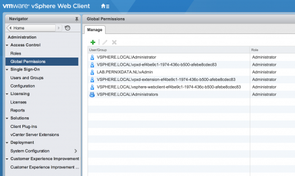
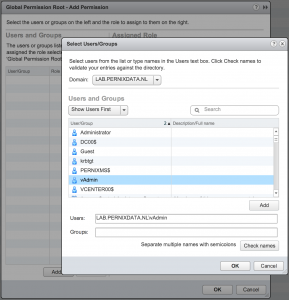
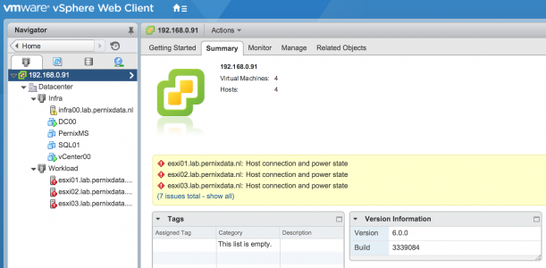

Today I've updated my vCenter Server Appliance with the VC-6.0.0U1b-Appliance.ISO in my lab. After rebooting I was surprised to see the error "You do not have permissions to view this object" on almost every object in the inventory screen.  Unfortunately a reboot of the DC (home lab, I do not run an elaborate AD here)Time to google and it seems that a lot of other people have hit this bug. After googling some more I found the the VMware KB article: [KB 2125229](https://kb.vmware.com/selfservice/microsites/search.do?language=en_US&cmd=displayKC&externalId=2125229). Problem is, this is solely focused on the windows version of vCenter and not focussed on solving the problem occurring on the VCSA. Although I can log in and see the inventory when using my admin account (Lab\\vAdmin) I can't access the objects. Maybe a permission problem? When checking the global permissions the (vAdmin) user is still listed as an administrator.  However administrators should be able to access all objects, as I found out a refresh is required. Here is how I solved it: 1. Log out of vC and login with the default admin account "administrator@vsphere.local" 2. In the Home view, select "Administration" from the menu 3. Go to Global Permissions, remove the user (In my case vAdmin) 4. Click on "Add Permission" 5. Select your AD domain and select the correct user  6. Click on Ok 7. Check the list to see whether your user is added with the correct role (administrator). 8. Logout and login with the correct AD user. 9. Back to work.  Time for me to power on these servers again. Follow Frank on twitter [@frankdenneman](https://twitter.com/frankdenneman)
