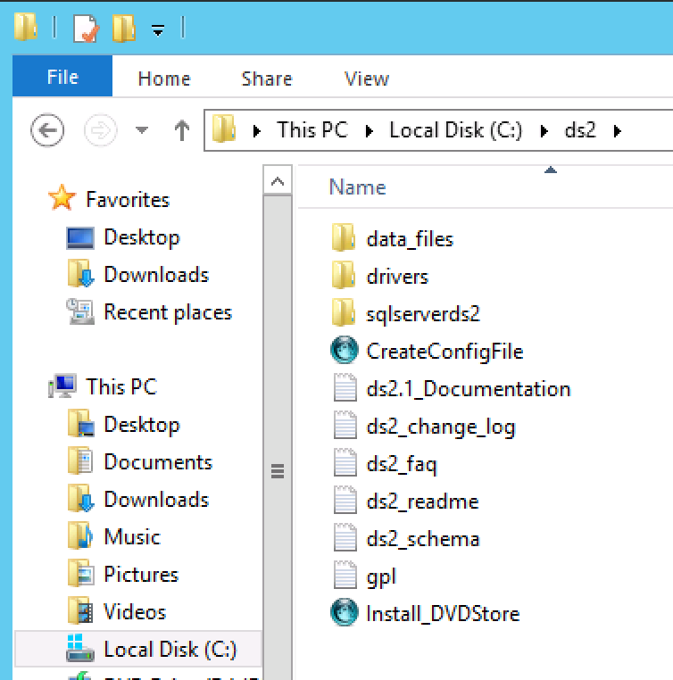
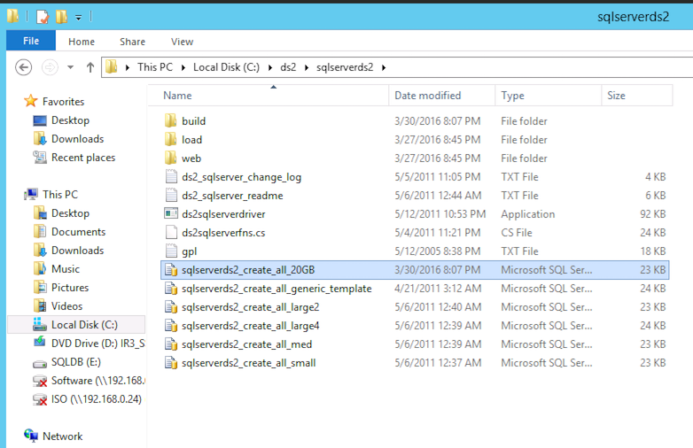
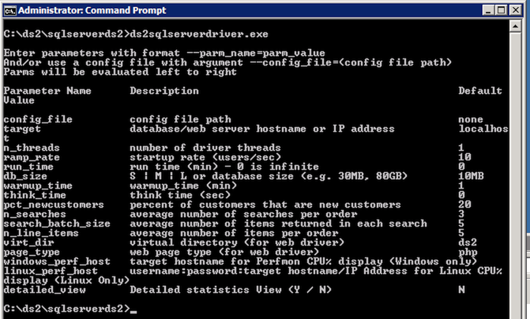

DVD Store 2.1, a magnificent tool for all aspiring VCP/VCAP candidates. A great tool for home lab enthousiasts to understand performance metrics, a fantastic tool to understand the behavior of an application stack in a virtual datacenter. **WHAT IS DVD STORE?** According to the official site the DVD Store Version 2.1 (DS2) is a complete open source online e-commerce test application, with a backend database component, a web application layer, and driver programs. The goal in designing the database component as well as the midtier application was to utilize many advanced database features (transactions, stored procedures, triggers, referential integrity) while keeping the database easy to install and understand. The DS2 workload may be used to test databases or as a stress tool for any purpose. Thanks [Todd Muirhead](https://twitter.com/virtualtodd) and [Dave Jaffe](https://www.linkedin.com/in/dave-jaffe-9739619) for creating this! However there is a slight challenge in installing it properly. You can install it on windows or on Linux and use many different database programs. I like to use windows for this. Unfortunately I tried to follow the instruction video on youtube and it was lacking some crucial details to get it deployed successfully. Therefor I started to document the steps involved to get it deployed on a Windows 2012 system using SQL 2014 SP1. Please note that you can run DVD store on Linux as well, and it might be even better (more lean and mean than a windows install) for homelabs. If you have a detailed write-up (100% reproducible) of a working deployment DVD store on Linux, please share the link to your article in the comments.

* * *

**DVDSTORE ARCHITECTURE** As described above the DVD Store is an application stack that can run on a single or multiple virtual machines. By using multiple virtual machines, you can test various components and layers in your virtual datacenter. As this is my goal I’m creating a VM that will run the database and another VM that generates the workload.  **Requirements** I’m listing the software I’ve used in order to create a working environment. Many variations are possible. If you can create a lightweight version of this build, or a complete community edition (license free) please share URL of your article in the comments.

- Two virtual machines
- Windows 2008 R2 and Windows 2012
- Windows 2008 R2 SP1
- DVD Store 2.1 ds21.tar.gz
- DVD Store 2.1 ds21\_sqlserver.tar.gz
- Winzip
- SQL 2014 SP1\*
- ActiveState ActivePerl Community Edition

* * *

**DATABASE VM** In this exercise I'm going to install and configure a 20GB database on a Windows 2012 VM. If you are using templates, check if you have enough space for the DVD store on your C-drive. During the first stage the temporary files will be stored on the C: drive, provide enough space which is at least equal to the DB size. The database hard disk needs to be twice the size of the DB in order to successfully import the data. Post configuration optimizations can reduce the consumed space of the database, but don't be too frugal when configuring the hard disks. Play around with the compute settings depending on your lab equipment. I noticed that Windows 2012 uses 5.4 GB of memory to run its OS and SQL Express when idling, but during installation it consumed close to 11GB. **Windows 2012 configuration** Update Windows 2012 with all the latest patches and update VMtools, enable remote desktop if you don’t want to use the VM console. Disable the firewall, as this I run an air-gapped lab I don’t want to spend too much time on firewall rules. SQL requires to Enable Microsoft .Net Framework 3.5 SP1. and Download and install Microsoft .Net Framework 4.0. .Net Framework 4.0 is already a part of the Windows 2012 OS, therefore you only have to enable 3.5. by executing the following steps:

1. Go to Server Manager
2. Add roles and features
3. Next
4. Role-based or feature-based installation
5. Click Next until you reach Features
6. Select .Net Framework 3.5 Features
7. Click Install

**Extracting DVD Store** The DVD Store kit is available at [linux.dell.com/dvdstore](http://linux.dell.com/dvdstore/). Download the file [ds21.tar.gz](http://linux.dell.com/dvdstore/ds21.tar.gz) and [ds21\_sqlserver.tar.gz](http://linux.dell.com/dvdstore/ds21_sqlserver.tar.gz). Both include scripts that are made on a unix based machine, missing the proper CR/LF format for a windows system. Winzip converts files to proper windows format while extracting, therefor I recommend using Winzip. Alternatively you can use a tool such as Unix2Dos to convert the files if you don’t want to use Winzip. Extract both files to the C:\\ Drive creating a directory structure as follows:  **Install ActivePerl** The installation of DVD Store is done via a Perl script, Windows 2012 doesn’t contain a Perl utility. One of the recommended Perl Utility is ActiveState ActivePerl Community Edition. You can download it [here](http://www.activestate.com/activeperl/downloads). As I’m using Windows 2012, I need to download the [x64 MSI version](http://www.activestate.com/activeperl/downloads/thank-you?dl=http://downloads.activestate.com/ActivePerl/releases/5.22.1.2201/ActivePerl-5.22.1.2201-MSWin32-x64-299574.msi). The install is straightforward, no specific options need to be selected, basically a next next finish install.

* * *

**SQL 2014** DVD store can leverage both the full version or the Express version of SQL. Microsoft allows you to evaluate their products 180 days. If you do maintain a VM configuration for more than 180 days you can use the free version of SQL 2014 express. Please be aware that you need SQL Server Express with Advanced Services as it includes the full version of SQL Server 2014 Management Studio and Full Text Search and Reporting Service. Both features are required to run DVD Store. For more info on SQL 2014 versions go here: [https://www.microsoft.com/en-us/download/details.aspx?id=42299](https://www.microsoft.com/en-us/download/details.aspx?id=42299). Download SQL 2014 Express ADV SP1 here: [https://www.microsoft.com/en-us/download/details.aspx?id=46697](https://www.microsoft.com/en-us/download/details.aspx?id=46697) If you are going to use the express version, adjust your VM configuration. Unfortunately SQL Express has some CPU limitations for the database engine (Limited to lesser of 1 Socket or 4 cores) and a 10 GB DB limitation. Therefore a 4 vCPU configuration would be 1 virtual sockets: 1 and 4 cores per socket. For more info about virtual sockets and cores please read this article: [http://frankdenneman.nl/2013/09/18/vcpu-configuration-performance-impact-between-virtual-sockets-and-virtual-cores/](http://frankdenneman.nl/2013/09/18/vcpu-configuration-performance-impact-between-virtual-sockets-and-virtual-cores/) **Install SQL 2014 Express ADV SP1** Run Install and select the following options:

1. New SQL Server stand-alone instalation
2. Accept the license terms
3. Check "Use MS Update to check for updates"
4. Database Engine Configuration: Mixed Mode (SQL Server Authentication and Windows Authentication) (provide password)
5. Reporting Services Native Mode: Install and Configure

**Install SQL 2014 SP1** Download the eval version of SQL 2014 SP1 here: [http://technet.microsoft.com/evalcenter/dn205290.aspx](http://technet.microsoft.com/evalcenter/dn205290.aspx) Run Install and select the following options:

1. New SQL Server stand-alone instalation
2. Select Evaluation
3. Accept the license terms
4. Setup Role: Select All Features using default values for service accounts\*
5. Database Engine Configuration: Mixed Mode (SQL Server Authentication and Windows Authentication) (provide password)
6. Analysis Services Configuration: Add current User
7. Reporting Services Configuration: Install and Configure
8. Distributed Replay Controller: Add Current User
9. Install

During the install it can happen that the install process freezes when on a step called “_Install\_WatsonX86\_Cpu32\_Action_”. To solve this state, open up task manager and end all “extra” processes called "Windows Installer (32 bit) ” leaving only a single Windows Installer process. I’m sure you can improve and optimise the SQL installation, but I haven’t really looked into this. For more information I recommend David Klee’s blog ([http://www.davidklee.net/](http://www.davidklee.net/)) and the book of Michael Webster “Virtualising SQL Server with VMware" ([http://longwhiteclouds.com/](http://longwhiteclouds.com/))

* * *

**INSTALLING DVD STORE** Once SQL is installed you can begin installing DVD Store.The process of installing DVD store consists of executing two scripts, the Install\_DVDStore.pl script and the SQL script. **Install\_DVDStore.pl script** The Install\_DVDStore.pl script generates the database content (such as users and products) by creating CSV files and it generates a SQL script that allows MSSQL to create the DB2user, the databases and importing the CSV content files. In order to correctly generate these files, you must create the directories where the MSSQL Database files will be stored. I’m using a single drive for all databases, therefore I create a directory SQL\\DBfiles on the E: drive (E:\\SQL\\DBfiles). Please note that the workload CSV files are generated in the C:\\DS2 folder! That means that if you are going to generate a 20GB database, you need at least 20GB of free space on your C:\\ drive as well to temporarily store the CSV files. Once installed SQL you can run the Install\_DVDStore script in the C:\\DS2 folder. I prefer to open up a command prompt to run the script. The window remains open after the script has completed successfully, allowing me to do other stuff in the mean time. If you have more trust in scripts than me, go right ahead and click on the perl script from the windows explorer. C:\\ds2\\Install\_DVDStore.pl. In order to create a 20GB DB in the directory E:\\SQL\\DBfiles, I’m going to answer the questions as follows:

- Database size: 20
- Database size is in MB or GB: GB
- Database type: MSSQL
- System type: WIN
- Path where Database files will be stored: E:\\SQL\\DBFiles\\ \*

\* Please note the trailing \\ in E:\\SQL\\DBFiles\\, this is required otherwise the script will fail.  Creating the custom CSV and the sql script files took my system roughly 20 minutes. The CSV files are stored in the directory structure of the C:\\DS2\\Data\_files. The SQL script is stored in the directory C:\\DS2\\sqlserverds2\\. The Install\_DVDStore script generated the following script: sqlserverds2\_create\_all\_20GB. Thats the script we want to run in order to get the DB loaded with the records.  **Edit the SQL script** David Klee ([@kleegeek](https://twitter.com/kleegeek)), the SQL MVP, discovered there was a slight error in the script. In order to fix this, edit the script in notepad or SQL management studio. Go to line 91 (or use find) and change (1) of GENDER VARCHAR(1) into (2) resulting in GENDER VARCHAR(2). Save and exit.  It seems the DS2 scripts use the SA account with an blank password. You can do two thing, go through all the scripts or change the SA password on your SQL server. If someone knows the location of the SA user in the scripts, please leave a comment. In order to change the SA password, open up the SQL 2014 management studio. (Go to start, apps, SQL Server 2014 Management Studio). Select “SQL Server Authentication” and use the SA user with the password you entered during the installation process of SQL. Go to Security \\ Logins and select the SA account, go to properties and deselect the option “Enforce password policy”. Now remove the password and click on OK. Yes you are sure you want to continue so click on Yes ;) Exit the management studio. **Execute the SQL script** Go to the C:\\DS2\\sqlserverds2 directory and click on the sqlserverds2\_create\_all\_20GB script. This opens SQL2014 management Studio and you need to authenticate again. A good time to check to see if the SA account is using a blank password, use the SA user account and click on connect. Management Studio shows the script, press F5 to execute or go to the Query menu and click on Execute. In the bottom left corner, it will show executing query. Select the Message tab to monitor the progress of the script. It took [my system](http://frankdenneman.nl/2015/06/04/when-your-home-lab-turns-into-a-home-dc/) 1 hour and 5 minutes to complete the script, it might be a good time to start working on the “workload” VM that’s going to generate the queries in the mean time. After the script finishes, it's time to run a SQL maintenance task. Although the script creates a 20GB database, 37GBs of space is consumed on the hard disk.  **SQL2014 Maintenance Plan** In the DVD Store documentation it's recommended to run the maintenance plan to optimize performance. The SQL Agent service is turned off by default in SQL 2014. Start this service by opening a command prompt and type in the command: `net start sqlserveragent` otherwise the follow error will be presented when attempting to create a maintenance plan in SQL Management Studio:  Open the SQL Server 2014 Management Studio(GUI), follow following steps:

1. Go to Object Explorer and click and expand database server tree.
2. Under server tree, expand management and right click on maintenance plans.
3. Left Click on "Maintenance Plan Wizard Option".
4. In the wizard opened, click next and enter name of plan as "ds2".
5. Click next and check "Update Statistics" checkbox and again click next.
6. Click next and then choose database as DS2 and click OK.
7. Ensure "All existing statistics" and "Sample By" checkbox are set along with value "18" "percent".
8. Once above step is done click next twice to create a task under "Maintenance Plans" under "Management" object under SQL Server tree.
9. Now right click on this task "ds2" created from above steps and it will show a menu option for right click.
10. Click execute to update statistics on all tables in DS2 database using task created due to above steps.

Visit the sites of the SQL experts to learn more about optimizing SQL DB's if you want to get more performance out of this database. At this point, the Database VM configuration is complete and we can start generating some workload by running the ds2sqlserverdriver program on the worload VMs.

* * *

**DS2 WORKLOAD VM** Unfortunately the DS2webdriver kept on crashing on a Windows 2012 system, complaining about invalid registry settings. Therefor I’m using a Windows 2008 system. The configuration of the VM is straightforward. Ensure that the workload VM can connect to the database VM across the network and run the ds2sqlserverdriver program. **Database VM configuration**

- OS: Windows 2008
- CPU config:
- Number of virtual sockets: 2
- Number of cores per socket: 1
- Memory 12GB
- Harddisk 1: 40 GB
- SCSI controller 0: LSI Logic SAS
- Network Adapter: VMXNET 3

**Windows 2008 configuration**

- Update Windows 2008 with all the latest patches, service packs and update VMtools.
- Download SP1 here: [https://www.microsoft.com/en-us/download/details.aspx?id=5842](https://www.microsoft.com/en-us/download/details.aspx?id=5842)
- Disable the firewall. \*
- Enable remote desktop if you don’t want to use the VM console
- Enable .Net 3.5 if you want to install SQL management studio

\* As this I run an air gapped lab I don’t want to spend too much time on firewall rules) **DS2SQLSERVERDRIVER** Extract the ds2.tar.gz and ds2\_sqlserver.tar.gz on the C:\\. Open command prompt and go to c:\\ds2\\sqlserverds2\\ and run ds2sqlserverdriver.exe. This will show the options:  An example script (by David Klee): `c:\ds2\sqlserverds2\ds2sqlserverdriver.exe --target=192.168.0.132 --run_time=60 --db_size=20GB --n_threads=4 --ramp_rate=10 --pct_newcustomers=0 --warmup_time=0 --think_time=0.085`  This program allows you to customize every workload possible. The command that I like the most is the think time. This is the amount of time that a simulated user would ‘think’ before clicking again. This command allows you to create a more realistic workload that differs from any synthetic benchmark tool out there. You can run spawn multiple virtual machines running different configured workloads against a single database. Adjust the think time, adjust the average number of search order per customer. The application stack allows you to investigate the complete stack. You can run multiple workload VMs and the DB VM on a single host, allowing to understand CPU or memory contention. It allows to distribute the workload across multiple hosts, allowing you do dive into the impact of networking and possibly DRS. Moving VMs onto a single datastore and monitor the storage path and the impact of SIOC. The possibilities are endless. Genuinely a tool that can help anyone at any level understand virtualization and IT infrastructures better.
