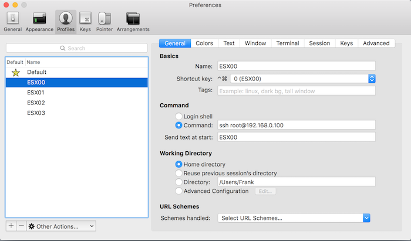
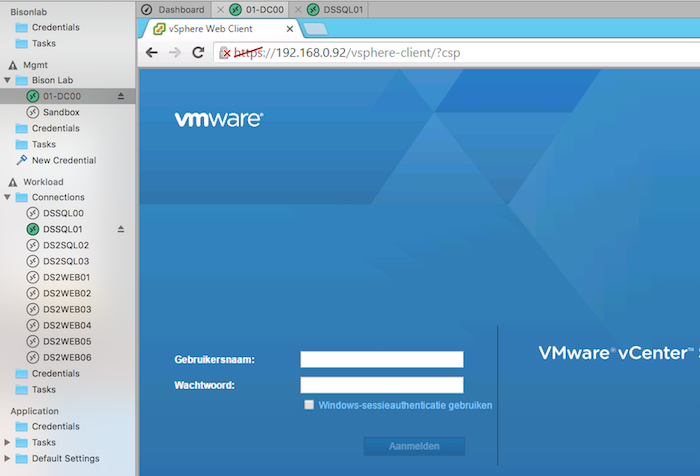
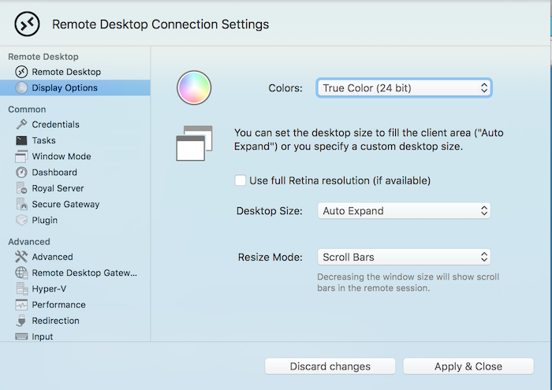
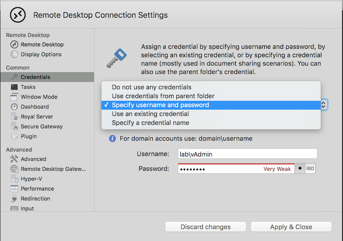
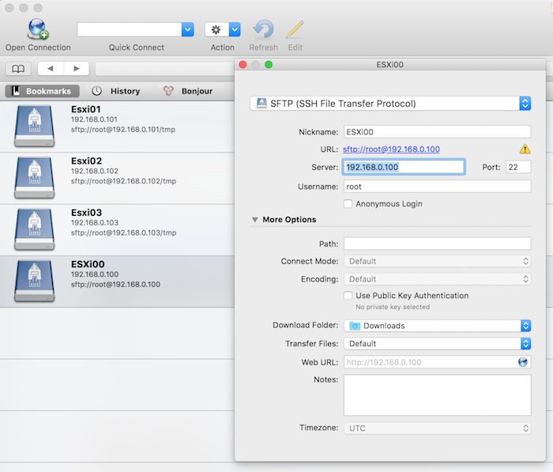
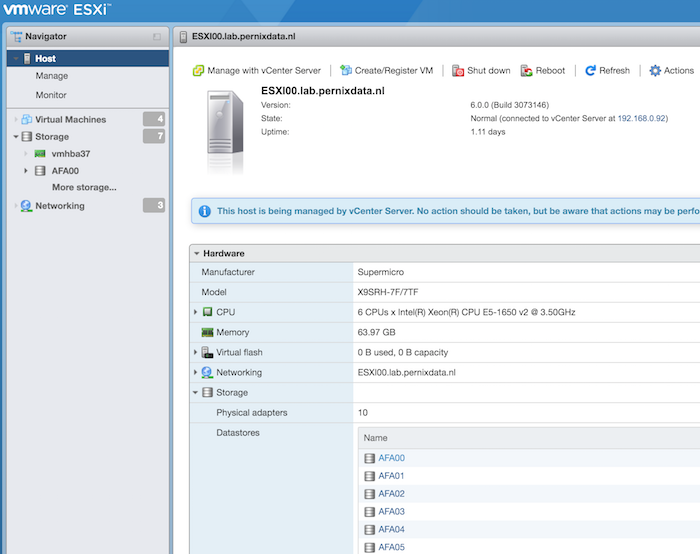
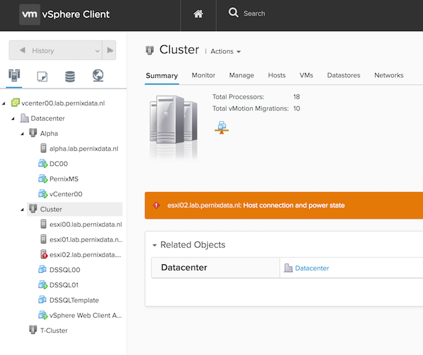

The majority of virtual datacenters are managed from Windows systems. When I started with virtualization I also used a windows system, however when I joined VMware I received a MacBook and this was the beginning of the end. Soon ever window device was replaced with an Apple device in my home. The problem was that I still needed to manage by home lab. To circumvent this, I created a Windows admin VM and installed all my trusted Windows apps, such as Putty, vSphere client and WinSCP. Works great! Until you want to rebuild your lab or restructure the environment. It always felt as a burden and on top of that I didn’t want to spend CPU cycles and waste memory of my home lab on admin VM. Throughout the years I discovered tools for Mac OS that replaced their trusted Windows equivalent and with the new release of the HMTL 5 Web client fling it removed dependency on the Client Integration Plugin (CIP). Here is the list of program and tips and tricks I use on my Mac to manage my Home lab. **Putty > iTerm2** [PuTTY](http://www.chiark.greenend.org.uk/~sgtatham/putty/download.html) is an SSH and telnet client for the Windows Platform allowing you to have access to the command line of the ESXi server. For the Mac platform I recommend iTerm2. Although Mac OS has a native terminal application, iTerm2 has a couple of cool features that I absolutely love. It can run multiple sessions, each in its own tab.  With profiles you can configure the connection settings to your ESX host and with a simple shortcut key combination (for example, Control-command-1, you open a tab to the ESXi host.  Download [iTerm2 here](https://www.iterm2.com/downloads.html). **Remote Desktop > Royal TSX** MS Remote Desktop is available for Mac OS, but the one remote desktop application you want to get is Royal TSX. The free version allows up for ten remote desktop connections, typically more than enough for the majority of home labs. I bought a licensed version as I’m using more than ten profiles and like to separate the workload part of the lab in a separate configuration document from the management part of the lab. One of the cool features is the tabbed layout, allowing you to switch between remote desktops quite easily.  The screens at home have a minimum resolution 2560 x 1440 resolution, Royal TSX allows for any resolution, even native Retina resolution. I like to use the smart zoom and the resolution set by the virtual machine allowing you to have a proper environment to work in without hitting the time-consuming scroll bars.  If security isn’t a big concern for you, you can specify the user and password for the connection at multiple levels. Either on the remote desktop connection profile itself or specify it on the ‘connection document’ for the entire environment. A nice time saver!  If you are the complete opposite and you need higher levels of security, such as [Network Level Authentication (NLA)](https://en.wikipedia.org/wiki/Network_Level_Authentication) Royal TSX is the application to get. NLA is enabled by default and you can configure to use [Transport Layer Security (TLS)](https://en.wikipedia.org/wiki/Transport_Layer_Security) as well.  Download [Royal TSX here](https://www.royalapplications.com/ts/osx/download). **WinSCP > CyberDuck** [WinSCP](https://winscp.net/eng/index.php) and [Veeam Backup Free Edition](https://www.veeam.com/vmware-esxi-fastscp.html) (previously Veeam FastSCP) are the most popular Secure FTP applications that allows you to copy files directly onto the ESXi host. Unfortunately the once announced port to MacOS of WinSCP never came into fruition and therefor I looked for alternatives. There are plenty SFTP clients, the one I use and like is Cyberduck  It allows for creating connection profiles called bookmarks, allowing you to connect to the correct folder directly. It also supports various encryption ciphers and authentication algorithms if you operate in a secure environment. Cyberduck is like all the other listed tools free but the occasionally ask for a donation. Download [Cyberduck here](https://cyberduck.io/). **VMware ESXi Embedded Host Client fling** The ESXi embedded host client fling allows you to manage the ESXi host directly through a web client. Its fast, it’s easy to install and it provides most of the functionality you need when you are building your lab before deploying the vCenter Appliance. One of the great assets to this tool is the integrated VM console. It’s directly accessible within the browser and does not require any addiotnal plugins or installers. Solving the annoying Client Integration Plugin problem most Mac users faced when connecting to the vCenter via the web client.  The Fling currently only supports ESXi 6.0, however William published a workaround for ESXi 5.x. found here: [http://www.virtuallyghetto.com/2015/08/new-html5-embedded-host-client-for-esxi.html](http://www.virtuallyghetto.com/2015/08/new-html5-embedded-host-client-for-esxi.html) Download the [VMware ESXi Embedded Host Client fling here](https://labs.vmware.com/flings/esxi-embedded-host-client). **vSphere HTML5 Web Client Fling v1.2 (h5client)** This fling got released this week and it allows you to connect with an HTML5 based web client to the vCenter server. Be aware that this client is designed for managing vCenter only! This release focuses on removing the dependency of the client integration plugin allowing administrators to connect with the VM console via the web client and do the basic stuff. Combine that with the normal web client and you execute the majority of operations to setup and deploy your home lab / virtual datacenter.  The client is deployed as a vib on one of the ESXi host. For detailed install instructions visit the [VMware vSphere blog](http://blogs.vmware.com/vsphere/2016/03/vsphere-html5-web-client-fling-getting-started.html). Download the [HTML5 Web Client Fling v1.2 here](https://labs.vmware.com/flings/vsphere-html5-web-client). **Function keys** Not a tool, but sometimes you are required to press a function key, such as F11 when installing ESXi. No problem when installing physical boxes, a challenge when installing a nested ESXi system using a remote (VM) console. In order to send the correct key, press FN-CMD-F11. This works on most function keys and other non-alphanumeric keys Please leave a comment if you want to share your favorite tool or handy tips and tricks to save time.
