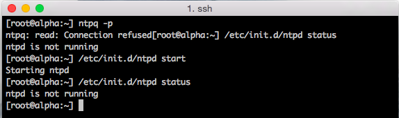
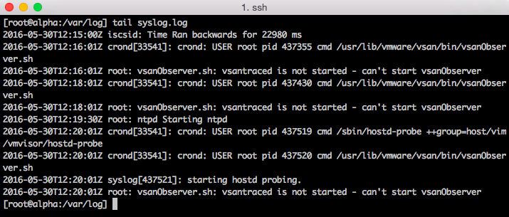

Sometimes a small misconfiguration can cause havoc in a complex distributed system. It becomes really annoying when no proper output is provided by log files and status report. While investigating time issues in my lab I ran into the following error message while executing the `ntpq -p` command:  **TL;DR** NTP client is disabled, enable it via the GUI The standard NTP query program (ntpq) is one of the quickest way to verify that the Network Time Protocol Daemon (ntpd) is up and running. The command `ntpq -p` prints a list of peers known to the ESXi host as well as a summary of their state. Running the command on another ESXi host provided the following output.  Requesting the status of the NTPD status on the host with weird time issues, shows it's not running. No proper feedback is provided by the command line other than it's starting, no failure code is returned.  Management service initialisation, such as ntpd starts are logged in the file /var/log/syslog.log in ESXi 5.1 and up. Unfortunately, nothing useful is logged in this logfile as well.  I couldn't find a command that provides accurate output whether the NTP client was enabled or not. Time to open up the web client. Host time configuration can be found when selecting the ESXi host, Manage, Time Configuration. Apparently NTP was not enabled.  Simple problem to fix, unfortunately there is no simple command line function that allows to verify while NTP client is enabled (sans PowerCli)
