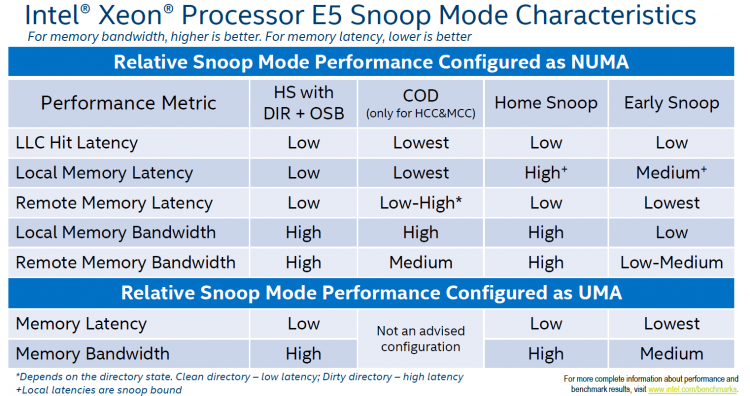

When people talk about NUMA, most talk about the RAM and the core count of the physical CPU. Unfortunately, the importance of cache coherency in this architecture is mostly ignored. Locating memory close to CPUs increases scalability and reduces latency if data locality occurs. However, a great deal of the efficiency of a NUMA system depends on the scalability and efficiency of the cache coherence protocol! When researching the older material of NUMA, today's architecture is primarily labeled as ccNUMA, Cache Coherent NUMA.

[hpcresearch.nl](http://www.hpcresearch.nl/euroben/Overview/web12/ccnuma.php):

> The term "Cache Coherent" refers to the fact that for all CPUs any variable that is to be used must have a consistent value. Therefore, it must be assured that the caches that provide these variables are also consistent in this respect.

This means that a memory system of a multi-CPU system is coherent if CPU 1 writes to a memory address (X) and later on CPU2 reads X, and no other writes happened to X in between, CPU 2 read operation returns the value written by CPU 1 write operation. To ensure that the local cache is up to date, the snoopy bus protocol was invented, which allowed caches to listen in on the transport of these "variables" to any of the CPU and update their own copies of these variables if they have them. The interesting thing is that with today's multicore CPU architecture, cache coherency manifest itself within the CPU package as well as cache coherency between CPU packages. A great deal of memory performance (bandwidth and latency) depends on the snoop protocol.

#### Caching Architecture

Sandy Bridge (v1) introduced a new cache architecture. The hierarchy exists of an L1, L2 and a distributed LLC accessed via the on-die scalable ring architecture. Although they are all located on the CPU die, there are differences in latency between L1, L2 and LLC. L1 is the fastest cache and it typically takes the CPU 4 cycles to load data from the L1 cache, 12 cycles to load data from the L2 cache and between 26 and 31 cycles to load the data from L3 cache. In comparison, it takes roughly 190 cycles to get the data from local memory while it could take the CPU a whopping 310 cycles to load the data from remote memory.

Each core has a dedicated L1 and L2 cache, this is referred to as private cache as no other core can overwrite the cache lines, the LLC is shared between cores. The L1 cache is split into two separate elements, the Instruction cache (32KB) and the data cache (L1D) (32KB). The L2 cache (256KB) is shared by instructions and data (Unified) and is considered to be an exclusive cache. That means that it does not have to contain all the bits that is present in the L1 cache (instructions and data). However, it's likely to have the same data and instructions as it's bigger (less evictions). When data is fetched from memory it fills all cache levels on the way to the core (LCC->L2->L1). The reason why it's also in the LCC is because the LCC is designed as an inclusive cache. It must have all the data contained in the L2 or L1 cache. More about LLC in a later paragraph.

**Data Prefetching** In order to improve performance, data can be speculatively loaded into the L1 and L2 cache, this is called [prefetching](https://software.intel.com/en-us/articles/optimizing-application-performance-on-intel-coret-microarchitecture-using-hardware-implemented-prefetchers). It’s the job of the prefetcher to load data into the cache before the core needs it. Performance improvements up to 30% have been quoted by Intel. The Xeon microarchitecture can make use of both hardware and software prefetching. A well-known software prefetching technology is SSE (Streaming SIMD Extension; SIMD: Single Instruction Multiple Data) SSE provides hints to the CPU which data to prefetch for an instruction. The hardware prefetchers are split between L1 and L2 cache. The component that actual stores the data in the L1D is called the data cache unit (DCU) and is 32KB in size. The L1D manages all the loads and stores of the data. The DCU prefetcher fetches next cache lines from the memory hierarchy when a particular access pattern is detected. The DCU IP prefetcher attempts to load the next instruction before the core actually request it. L2 prefetchers also interact with the LLC. When the L2 contains too many outstanding requests, the L2 prefetchers stores the data in the LLC to avoid eviction of useful cache lines.

**Note** In storage, the unit of transportation is a block, in memory its called a line. The Intel Xeon microarchitecture uses a cache line size of 64 bytes. Two L2 prefetchers exists Spatial Prefetcher and Streamer. The spatial prefetcher attempts to complete every cache line fetched to the L2 cache with another cache line in order to fill a 128-byte aligned chunk. The streamer monitors read requests from the L1D cache and fetch the appropriate data and instructions. Server vendors might use their own designation for L1 and L2 prefetchers

| Intel | Server Vendors |
| --- | --- |
| DCU Prefetcher | DCU Streamer Prefetcher |
| DCU IP-based stride prefetcher | DCU IP Prefetcher |
| Spatial prefetcher | Adjacent Cache Line Prefetch |
| Streamer | Hardware Prefetcher |

All four prefetchers are extremely important for performance. There are some use cases known where prefetchers consume more bandwidth and CPU cycles than actually benefit performance, but these cases are extremely rare. Testing prefetcher effectiveness is extremely difficult as synthetic test are usually focused on measuring best case scenario bandwidth and latency using sequential access patterns. And you guess it, they workload pattern where prefetchers shine. My recommendation is to have the prefetchers set to enabled.

#### Last Level Cache

The L1 and L2 cache are private to the core and stores data it reads, writes or modifies. The LLC cache is shared amongst the cores. Sandy Bridge (v1) moved away from a single unified cache entity in the Uncore to a distributed and partitioned cache structure. The total LLC is carved up into 2.5 MB slices and can be fully accessed and utilized by all cores in the system. It’s mentioned in many articles that a core is associated with a core, but the association is just a physical construct. A core cannot control the placement of data in the LCC and has no ability to access anything but the entire LLC. The LCC is accessed through the scalable on-die ring and latency depends on the number of hops to access the data.

#### Scalable on-die ring

The cache is an inclusive cache, meaning that it includes all of the data that is stored in the lower level caches. The memory addresses are hashed and distributed amongst the slices. This approach leverages the incredible bandwidth of the scalable on-die interconnect while reducing hot spots and contention for the cache addresses. It also helps coherency. The L3 slices are connected to the scalable on-die interconnect, that connects the cores and the Uncore containing the R3QPI (Ring to QPI interconnect) and the home agent servicing the Integrated Memory Controller. There are two tag arrays, one for data accesses and one for coherency requests and prefetching. The rings run in a clockwise direction as well as a counter-clockwise direction in order to provide the shortest path between core and cache slice. Intel stated the bandwidth of the ring was ~ 844GB/s in the Sandy Bridge Architecture. Since Haswell (v3) the rings are connected by buffered interconnects to allow the rings to operate independently, coinciding with the introduction of Cluster-on-Die cache snoop mode.

The core scalability of the Xeon family results in different die designs. There are three core-count configurations, Low core count (LCC), medium core count (MCC) and high core count (HCC). With every new generation Xeon, the classification of the various configurations change. For example in Haswell (v3) 8 core CPUs were labeled as LCC, in the Broadwell (v4) architecture, 10 core CPUs are labeled as LCC.

| Max core count | Die Design | Core Columns | Memory Controllers |
| --- | --- | --- | --- |
| 10 | Low Core Count | 2 | 1 |
| 16\* | Medium Core Count | 3 | 2 |
| 22 | High Core Count | 4 | 2 |

The Xeon E5-2690 v4 is considered to be a medium core count configuration, while the E5-2683 and E5-2697A are classified as a high core count configuration. Both MCC and HCC configuration have two integrated memory controllers and no performance difference should occur. This configuration outlier should be treated as an academic curiosity. The availability of multiple rings and home agents allows for a specific NUMA optimized cache snoop algorithm. This will become evident in a later section.

#### Cache Snooping

Data from the LCC slice can be read by any core in the system, once the data is in the private cache it can be modified. When a cache operation occurs that can affect coherence the cache broadcast this to all other caches. Each cache listens (Snoops) for these messages and react accordingly. Cache coherency protocols keep track of these changes and the most popular invalidation-based-protocol is MESI. Within the MESI Protocol data in cache can be in four states, Modified (M), Exclusive (E), Shared (S), Invalid (I).

| L2 Cache State | Definition | State Definition | Cache line exists in |
| --- | --- | --- | --- |
| M | Modified | The cache line is updated relative to memory | Single core |
| E | Exclusive | The cache line is consistent with memory | Single cores |
| S | Shared | The cache line is shared with other cores, the cache line is consistent with other cores, but may not be consistent with memory | Multiple cores |
| I | Invalid | The cache line is not present in this core L1 or L2 | Multiple cores |

A simple example, a 2 vCPU VM consuming on core 1 and 2 runs SQL server. The VM runs on a 4 core ESXi host.

1: A SQL query requests memory at address X. The query runs on vCPU1 and core 1 detects it does not have this data in it's L1 and L2 cache. A snoop request is made to the caching agents. Both the L1 and L2 cache of core 1 do not contain this data and a request is made to the caching agent, this could be the caching agent of the LCC slice or the home agent depending on the snoop algorithm. The agent will send out a snoop request to all the cache agents (or the home agent) to determine if they have the cache line. At this point, no cache has this data and MESI protocol states that data is in an invalid state for all four cores.

2: The data is retrieved from memory and stores it into the LLC and the private cache of the core 1. The MESI state of this cache line changes and is Exclusive for core 1 and invalid for the remaining cores.

3; Core1 updates the data which transitions the state of the cache line from Exclusive to Modified.

4: At this point, another query that runs on core 2 wants X as well. The core checks L1 and L2 and both miss, the request is forwarded to the LCC and determines X is present. It might not be consistent anymore, therefore a snoop is sent to core 1 to determine whether the data is modified. It is and retrieves the data and sends it over to core 2, the MESI state of the cache line is changed and now it's in an shared state.

The example provided was based on the traditional MESI protocol, however, Intel applies the MESIF protocol. With the introduction of forwarding, it changed the role of the S state. With MESI when data is in a shared state, each cache owning that cache line can respond to the inquiry. In a 20 core count system this can create a lot of traffic, and as a NUMA system shares its memory address space, it can produce many redundant responses between the CPU, often with varying (high) latency. To solve this problem, one cache line is promoted to the F state. This cache line is the only one that can respond and forward data, all the other cache lines containing the data are placed in the shared mode, which now is silent. The F state transitions to the newest version of the data, solving temporal locality problems of the cache, as this cache is the least likely to evict the cache line. The forwarding state reduces interconnect traffic, as in MESI, all caches in S states responds.

Although I would love to go in-depth on this theory, a detailed explanation of the MESIF protocol is out of the scope of this article. I tried to keep it as simple as possible, losing some interesting details, such as Cache Valid Bits (CVB) For more information see the manuscript of J.R. Goodman and H.H.J HUM - MESIF: [A Two-Hop Cache Coherency Protocol for Point-to-Point Interconnects](https://researchspace.auckland.ac.nz/bitstream/handle/2292/11594/MESIF-2009.pdf?sequence=6)

#### Snoop Modes

A Snoop mode determine which agent will management snoop operations issues by the cores. Snoops can be sent by the caching agent (Cbox) of each LLC slice or by the home agent. Until now, with every new generation micro-architecture, a new Snoop Mode is introduced. These modes are configurable through BIOS settings and have an effect on cache latency and bandwidth consumption, impact overall performance. Although Intel recommends a default Snoop Mode to the server vendors, not every BIOS conforms to that recommendation. My recommendation is to include QPI Snoop Modes in your documentation as a configuration item. If the system is configured with the default option recommended by Intel do not change this without any data-driven reason. Today four snoop modes are available, one snoop mode (Cluster-on-Die) is available only if two home nodes are available in the package (MCC and HCC die designs).

**Early Snoop** This snoop mode was introduced by Sandy Bridge (v1) and is available on all newer generations. Within early snoop the caching agent generates the snoop probe or the snoop request, using the scalable on-die ring it can directly send that snoop to other cache agents or broadcast it to all the other agents in the system. This model provides a low latency response time, although the amounts broadcast (especially in HCC die designs) can eat up the bandwidth between the NUMA nodes. Typically this snoop mode is not recommended when using NUMA optimized workload. Some vendors did not optimize the BIOS defaults and use this snoop mode even for their newest models. Please check your BIOS.

**Home Snoop** This snoop mode was introduced by Ivy Bridge (v2) and is available on all newer generations. Instead of each caching agent generating snoop messages, it’s the home agent tied to the memory controller that generates the snoop request. Since the snoop request has to go to the home agent and travel the on-die scalable ring, it has a higher latency than early snoop. By leveraging a more centralized entity such as the home agent, it does reduce the bandwidth consumption. Home Snoop mode is geared towards workloads which are bandwidth sensitive.

**Home Snoop with Directory and Opportunistic Snoop Broadcast (OSB)** This mode uses the home agent but it can also speculatively snoop the remote CPU in parallel with the directory read on the home agent. The home agent contains an "in-memory snoop directory" to determine the state of the various cache lines, this reduces snoop traffic primarily on reads. The home agent snoops in parallel with the directory lookup when it thinks there is available system bandwidth to support the snoop traffic…When the system gets more heavily loaded, the snoops are delayed and only sent to the agents the directory information indicates need to be snoop. That way the snoop overhead is kept low in heavily loaded systems and it will focus the available bandwidth on the data instead.

This snoop mode was introduced by Ivy Bridge (v2) and was removed in Haswell (v3). It has been reintroduced by Broadwell (v4) and is the recommended default snoop mode by Intel for the Broadwell generation. Please check your BIOS settings as not every vendor follows Intel recommendations.

**Cluster-on-Die** Although the Home Snoop with DIR + OSB has the overall best performance, when running a highly optimized NUMA workload you might want to consider the Cluster-on-Die snoop mode. This mode provides the best performance for local operations. It provides the lowest LLC hit latency and a low local memory latency. Remote memory performance depends on the write activity of the workloads.

 If you have your workload correctly sized and are able to fit workloads within NUMA nodes, Cluster-on-Die can improve performance. If the virtual data center is designed to run a high consolidation ratio, forcing the ESXi CPU scheduler to span small footprint VMs across NUMA nodes, Home Snoop with Directory and OSB might be a better fit.

#### Cluster-on-Die architecture

Cluster-on-Die (COD) is only available on MCC and HCC die design packages. When enabling COD, it logically divides the CPU into two equal NUMA node, incorporating a part of the scalable ring on-die Interconnect that services the home agent & integrated memory controller. In the MCC and HCC die design, there are two active memory controllers, each servicing two channels. The NUMA nodes are associated with the respective controllers.

 Please note that there will be two NUMA nodes in one CPU package! That means there will be four NUMA nodes in a dual socket system. Marc Lang ([@marcandreaslang](https://twitter.com/marcandreaslang)) demonstrated COD on a 512GB system. Before COD, the system created two NUMA nodes, each addressing 256 GB per NUMA node.  After enabling COD the system created four NUMA nodes, each addressing 128 GB per NUMA node.  COD segments the LLC and the RAM. By segmenting the LLC, it decreases the latency by reducing the number of slices in the NUMA node. For example, the E5-2699 v4 contains 22 cores, with COD enabled, it creates two affinity domains of 11 slices. Data will be distributed in only 11 LLC slices inside each affinity domain instead of 22 slices, thereby decreasing hop count. In addition, the COD in Broadwell (v4) microarchitecture eliminates cross buffered interconnect traffic, reducing ring collisions and other overhead that reduces the available bandwidth.

If there is a cache miss in the LLC within the affinity domain, it will contact the home agent responsible for the memory directly. Each home agent tracks the memory lines it is responsible for. Therefore the LLC can contain cache lines of "remote memory" and traffic will occur across the buffered interconnect if the NUMA scheduler cannot "affinitize" the process and the memory properly.

ESXi 5.5 update 3 and ESXi 6.0 supports COD, check [https://kb.vmware.com/kb/2142499](https://kb.vmware.com/kb/2142499). As mentioned in part 2, ESXi does not use SLIT information to understand topological distance between the physical CPUs. Instead, ESXi determines the inter-domain latencies by probing the CPUs at boot-time and use this information for initial placement and migration decisions.  Since COD is a boot-time configuration, ESXi has a good view of the latencies of the NUMA domains. Having multiple NUMA nodes presented by a single CPU package is not a new thing. In 2011 AMD released the Magny-Cours architecture, which combined 2 6 core Bulldozer CPUs in one package. Unfortunately, a lot of negative performance results were reported by VMware community members due to the ESXi NUMA round-robin scheduling decisions. The cache architecture of the AMD didn't help as well.

#### Snoop mode recommendation

If the VMs are right-sized to fit into a single NUMA node, COD could deliver a stellar performance, when operating a large collection of Wide VMs I would recommend to select the snoop mode "Home Snoop with Directory and Opportunistic Snoop Broadcast (OSB)" as COD is all about reducing latency through affinity Up next, [Part 4: Local Memory Optimization](http://frankdenneman.nl/2016/07/13/numa-deep-dive-4-local-memory-optimization/) The 2016 NUMA Deep Dive Series: Part 0: [Introduction NUMA Deep Dive Series](http://frankdenneman.nl/2016/07/06/introduction-2016-numa-deep-dive-series/) Part 1: [From UMA to NUMA](http://frankdenneman.nl/2016/07/07/numa-deep-dive-part-1-uma-numa/) Part 2: [System Architecture](http://frankdenneman.nl/2016/07/08/numa-deep-dive-part-2-system-architecture/) Part 3: [Cache Coherency](http://frankdenneman.nl/2016/07/11/numa-deep-dive-part-3-cache-coherency/) Part 4: [Local Memory Optimization](http://frankdenneman.nl/2016/07/13/numa-deep-dive-4-local-memory-optimization/) Part 5: [ESXi VMkernel NUMA Constructs](http://frankdenneman.nl/2016/08/22/numa-deep-dive-part-5-esxi-vmkernel-numa-constructs/) Part 6: NUMA Initial Placement and Load Balancing Operations Part 7: From NUMA to UMA
