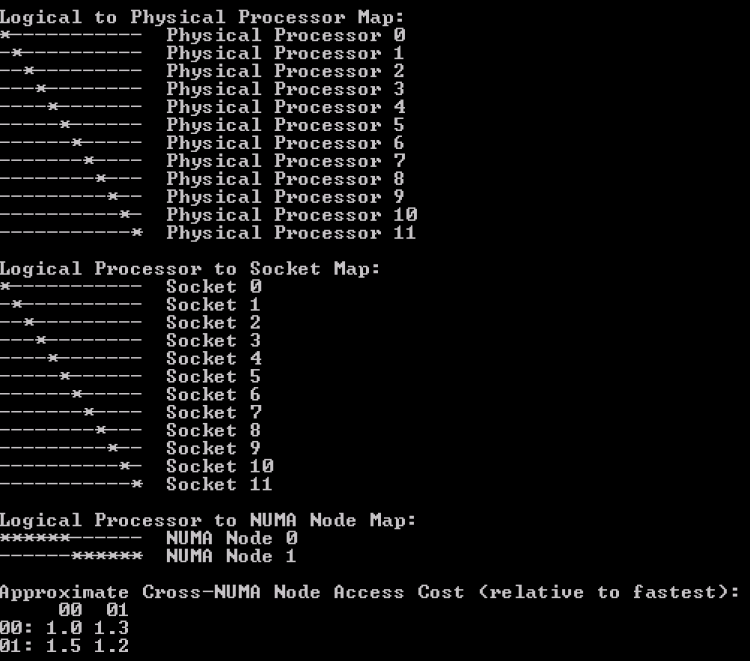
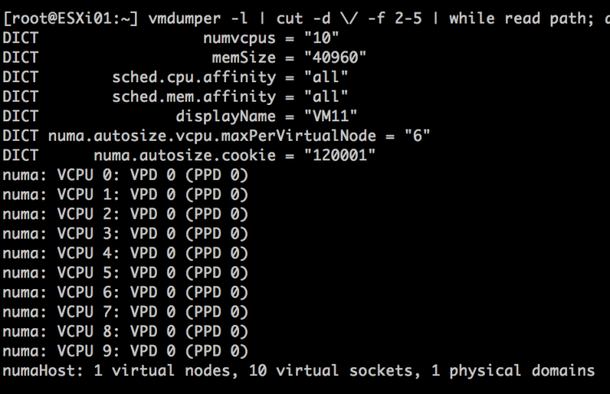
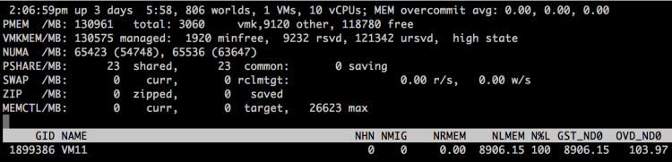
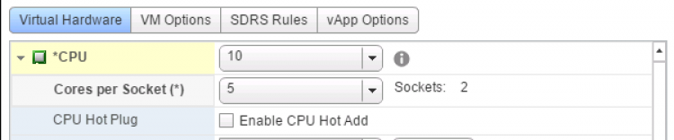
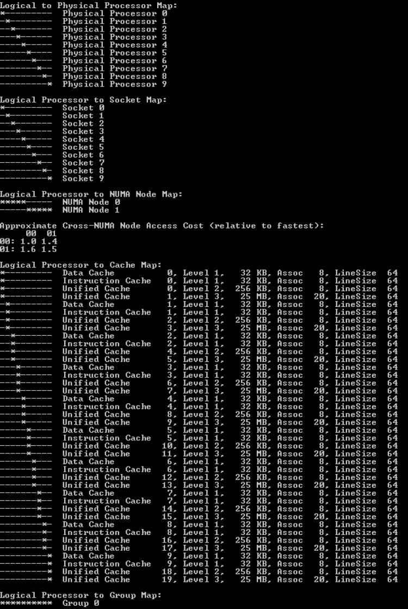
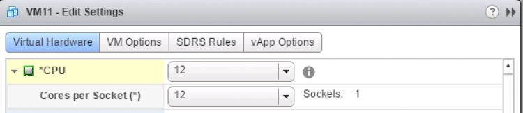
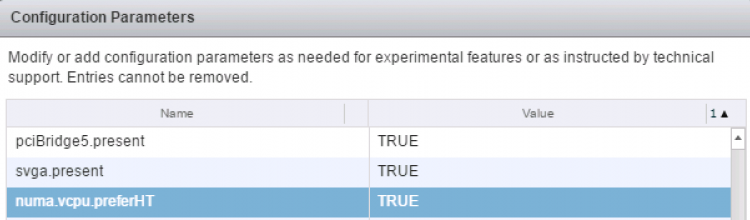
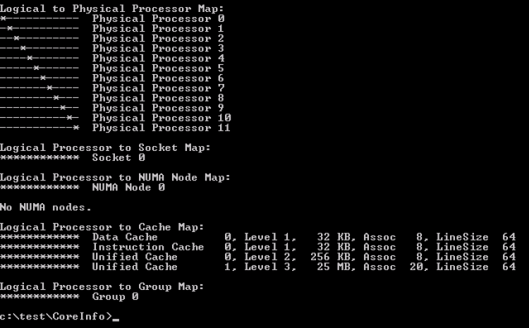

ESXi Server is optimized for NUMA systems and contains a NUMA scheduler and a CPU scheduler. When ESXi runs on a NUMA platform, the VMkernel activates the NUMA scheduler. The primary role of the NUMA scheduler is to optimize the CPU and memory allocation of virtual machines by managing the initial placement and load balance virtual machine workloads dynamically across the NUMA nodes. Allocation of physical CPU resources to virtual machines is carried out by the CPU scheduler.

It is crucial to understand that the NUMA scheduler is responsible for the placement of the virtual machine, but it’s the CPU scheduler that is ultimately responsible for allocating physical CPU resources and scheduling of vCPUs of the virtual machine. The main reason to emphasize this is to understand how hyper-threading fits into CPU and NUMA scheduling. Before diving into the specifics of NUMA optimizations, let's calibrate the understanding of the various components used at the physical layer, the ESXi kernel layer, and the virtual machine layer.

 A host consist of a CPU Package, that is the physical CPU piece with the pins, this is inserted in a socket (pSocket). Together with the local memory, they form a NUMA node.

Within the CPU package, cores exist. In this example, the CPU package contains four cores and each core has hyper-threading (HT) enabled. All cores (and thus HT) share the same [cache architecture](http://frankdenneman.nl/2016/07/11/numa-deep-dive-part-3-cache-coherency/).

At the ESXi layer, the PCPU exist. A PCPU is an abstraction layer inside the ESXi kernel and can consume a full core or it can leverage HT. At the VM layer, a virtual socket, and a vCPU exists. A virtual socket can map to a single PCPU or span multiple PCPUs. This depends on the number of vCPUs and the settings cores per socket inside the UI (_cpuid.CoresPerSocket_). The vCPU is the logical representation of the PCPU inside the virtual machine. The configuration vCPU and cores per socket impact the ability of applications (and operating systems) to optimize for cache usage.

### ESXi VMkernel NUMA Constructs

In order to apply initial placement and load balancing operations, the NUMA scheduler creates two logical constructs, the NUMA home node (NHN) and the NUMA client.

 **NUMA Home Node** The NUMA home node is a logical representation of a physical CPU package and its local memory. In this example, the NUMA home node consists of 4 cores and its local memory. By default the NUMA Home Node allows the NUMA client to count the physical cores in the CPU package. This count impacts the default NUMA client size.

This NUMA home node size is important to understand for virtual machine sizing. If the number of VCPUs of a VM exceeds the physical core count of one CPU package it is distributed across multiple nodes. If necessary, due to workload characteristics, distribution can be avoided by reducing the number of the vCPUs, or have the NUMA scheduler consider HTs. By default NUMA optimization does not count the HTs when determining if the virtual machine could fit inside the NUMA home node. For particular workload that benefits from sharing cache and memory, it might be preferable to have the NUMA scheduler count the available HTs during the power-on operation. This setting, preferHT, is expanded upon in a paragraph below.

Similar consideration should be applied when sizing memory for the virtual machine. If the virtual memory configuration exceeds the NUMA home node configuration, then the memory scheduler is forced to consume memory from that is attached to another NUMA node. Please note that the NUMA scheduler is focused on consuming as much local memory as possible, it tries to avoid consuming remote memory.

Typically a CPU Package and its local memory are synonymous with a NUMA home node, exceptions are Intel Cluster-on-Die technology and AMD Opteron ([Magny Cours](http://frankdenneman.nl/2011/01/05/amd-magny-cours-and-esx/) and newer). When [Cluster-on-Die](http://frankdenneman.nl/2016/07/11/numa-deep-dive-part-3-cache-coherency/) is enabled on an Intel Xeon CPU, the CPU package is split up into two NUMA nodes optimizing the local cache structures.

If Cluster-on-Die is enabled on a dual Intel Xeon system , there are two CPU packages but four NUMA nodes. Marc Lang ([@marcandreaslang](https://twitter.com/marcandreaslang)) demonstrated COD on a 512GB system. Before COD, the system created two NUMA nodes, each addressing 256 GB per NUMA node. 3rd line from above NUMA/MB, two nodes are listed both containing ~262000 MB.

 After enabling COD the system created four NUMA nodes, each addressing 128 GB per NUMA node.

**Transparent Page Sharing and NUMA Home Node** Traditionally, the NUMA home node is the boundary for Transparent Page Sharing (TPS). That means that only memory is shared between VMs within a NUMA node and not across NUMA nodes. However, due to multiple modifications to memory management, benefits of TPS during normal operations have been reduced increasingly.

First, large pages sharing index small pages inside the large page, but won't allow to share and collapse until memory pressure occurs. (Duncan wrote an must read [in-depth article](http://www.yellow-bricks.com/2015/02/17/vsphere-60-breaking-large-pages/) about the thresholds of breaking large pages in 6.0) With the introduction of a security patch, described in [KB 2080735](https://kb.vmware.com/selfservice/search.do?cmd=displayKC&docType=kc&docTypeID=DT_KB_1_1&externalId=2080735), salting was introduced. I described salting in detail [here](http://frankdenneman.nl/2015/02/02/new-tps-management-capabilities/), but in short, salting restricts TPS to share only memory within the VM itself. Inter-VM TPS is no longer enabled by default.

Please remember that salting did not increase the memory footprint directly, it just impacts savings when memory pressure occurs and large pages are collapsed. Instead of mapping many VMs to the same memory page, each VM will still have its own memory page.

Although it makes sense to consider TPS, to reduce memory footprint and get more cache hits by referring to memory that is already local, but the overall benefit of large pages is overwhelming due to fewer TLB misses and faster page table look-up time. Up to 30% performance improvements are claimed by VMware.

If you want to use TPS as much as possible during memory pressure, please follow the instructions listed in [KB 2080735](https://kb.vmware.com/selfservice/search.do?cmd=displayKC&docType=kc&docTypeID=DT_KB_1_1&externalId=2080735). Verify is you operating system is using [ASLR](https://technet.microsoft.com/en-us/magazine/2007.04.vistakernel.aspx) (Address Space Layout Randomization) for security purposes or [SuperFetch](https://technet.microsoft.com/en-us/magazine/cc162480.aspx) (proactive caching), if you run a Windows VDI environment, as both technologies can prevents sharing of memory pages.

**NUMA Client** A NUMA client is the collection of vCPU and memory configuration of a virtual machine. The NUMA client is the atomic unit of the NUMA scheduler that is subject to initial placement and load balancing operations.

By default, the maximum number of vCPUs grouped with a NUMA client cannot exceed the physical core count of a CPU package. During power-on operations, the number of vCPUs are counted and are compared to the number of physical cores available inside the CPU Package. If the vCPU count does not exceed the physical core count a single NUMA client is created. These VCPUs will consume PCPUs from a single CPU package.

If the number of vCPUs exceeds the number of physical cores inside a single CPU package, multiple NUMA clients are created. For example, if a VM is configured with 12 vCPUs and the CPU package contains 10 cores, two NUMA clients are created for that virtual machine and the vCPUs are equally distributed across the two NUMA clients.

 Please note that there is no affinity set between a PCPU and a NUMA client. The CPU scheduler can migrate vCPUs between any PCPU provided by the CPU package! This allows the CPU scheduler to balance the workload optimally.

**vNUMA Node** If multiple NUMA clients are created for a single virtual machine, then this configuration is considered to be a Wide-VM. The NUMA scheduler provides an extra optimization called vNUMA. vNUMA exposes the NUMA structure of the virtual machine, not the entire NUMA topology of the host, to the Guest OS running in the virtual machine. This means in the case of the 12 vCPU VM, vNUMA exposes two NUMA nodes with each 6 CPUs to the guest operating system. This allows the operating system itself to apply NUMA optimizations.

### **NUMA client in-depth**

Now that the basics are covered, let's dive into the NUMA client construct a little deeper and determine why proper sizing and sockets per core count can be beneficial to virtual machine performance.

During power-on, the NUMA scheduler creates a NUMA client, the internal name for a NUMA client is a _Physical Proximity Domain (PPD)_. The vCPUs grouped into a single NUMA client are placed in its entirety on a NUMA node. During load-balancing operations, the group of vCPUs is migrated together. vCPUs remain inside a NUMA client and cannot be migrated between NUMA nodes or NUMA clients individually.

Memory load balancing operations is determined by reviewing the NUMA client configuration and the current overall activity within the system. The NUMA scheduler has different load-balancing types to solve imbalance or improve performance. For example, if a virtual machine has local and remote memory, NUMA determines whether it makes sense to migrate the group of vCPUs or to migrate the memory to the NUMA home node if possible. Initial placement and load balancing operations are covered in more detail in the next article of this series.

A _Virtual Proximity Domain (VPD)_ is presented to the guest as the NUMA node. The size of the VPD is determined by the number of vCPUs and the _cpuid.CoresPerSocket_ configuration or the number of vCPUs and the preferHT setting (PCPU count / Logical CPU count).

By default, the VPD aligns with the PPD, unless the vCPU count exceeds the physical core count and _cpuid.CoresPerSocket_ is more than 1. For example, a virtual machine with 40 vCPUs and _cpuid.CoresPerSocket_ of 20, creates a topology of 2 VPD's containing 20 vCPUs spanning 4 PPDs containing each 10 PCPUs.  Spanning VPDs across PPDs is something that should be avoided at all times. This configuration can create cache pollution and render most CPU optimizations inside the guest OS and application completely useless. It's recommended to configure the VMs Cores Per Socket to align with the physical boundaries of the CPU package.

**Auto sizing vNUMA clients** If multiple vNUMA clients are created, the NUMA scheduler auto-sizes the vNUMA clients. By default, it equally balances the number of vCPUs across the least amount of NUMA clients. Autosizing is done on the first boot of the virtual machine. It sizes the NUMA client as optimally as possible regarding the host it boots. During the initial boot, the VMkernel adds two advanced settings to the virtual machine:

_numa.autosize.vcpu.maxPerVirtualNode=X numa.autosize.cookie = "XXXXXX"_

The autosize setting reflects the number of vCPUs inside the NUMA node. This setting is not changed, unless the number of vCPUs of the VM changes. This is particularly of interest for clusters that contain heterogeneous host configurations. If your cluster contains hosts with different core counts, you could end up with a NUMA misalignment. In this scenario, the following advanced settings can be used:

[numa.autosize.once = FALSE](https://pubs.vmware.com/vsphere-60/index.jsp?topic=%2Fcom.vmware.vsphere.resm gmt.oc%2FGUID-3E956FB5-8ACB-42C3-B068-664989C3FF44.html) [numa.autosize = TRUE](https://pubs.vmware.com/vsphere-60/index.jsp?topic=%2Fcom.vmware.vsphere.resm gmt.oc%2FGUID-3E956FB5-8ACB-42C3-B068-664989C3FF44.html)

This forces the NUMA scheduler to reconfigure the NUMA clients on every power-cycle. Be aware that some workloads that can be negatively impacted when NUMA topology changes. Be careful using this setting.

**Determining the vNUMA layout** VMware.log of the virtual machine contains information about the VPD and PPD configuration. Instead of downloading the VMware.log file you can use the command-line tool vmdumper to display the information:

`vmdumper -l | cut -d \/ -f 2-5 | while read path; do egrep -oi "DICT.*(displayname.*|numa.*|cores.*|vcpu.*|memsize.*|affinity.*)= .*|numa:.*|numaHost:.*" "/$path/vmware.log"; echo -e; done`

Courtesy of Valentin Bondzio of VMware. Let's use the scenario of a 12 vCPUs VM on the 10 core system. The VCPU count exceeds the physical core count, therefore two NUMA clients are expected:

 The output shows that the virtual machine is backed by two Physical Proximity Domain (PPD0 and PPD1) and that two Virtual Proximity Domain exists (VPD0 and VPD1). Both VPDs are backed by a single PPD. The vCPUs are equally distributed across the proximity domains, vCPU0 - vCPU5 are running on PPD0, vCP6-vCPU11 are running on PPD1.

ESXTOP shows that the VM is running on two NUMA home nodes (ESXTOP, press M for memory, F to adjust fields, G to enable NUMA stats, SHIFT-V to display VMs only). NHM stands for NUMA home node and in this case, the VM has two NUMA home nodes, NHN0 and NHN1.

 When running Windows 2012 R2 inside the virtual machine,  the CPU Performance Monitor displays NUMA nodes and displays the NUMA node the CPU belongs to. Another great tool to use to expose the NUMA topology witnessed by the Windows guest OS is the Sysinternals tools [CoreInfo](https://technet.microsoft.com/en-us/sysinternals/cc835722.aspx). Linux machines contain the command `[numactl](http://linux.die.net/man/8/numactl)`

 But what if the virtual machine contains 10 vCPUs instead of 12?

 The VM is backed by a single vNUMA client (VPD0) running on a single NUMA home node, NHN0.

 Although there is one vNUMA node present, it is not exposed to Windows. Thus windows only detect 10 CPUS. Any reference to NUMA is lacking inside the CPU performance monitor.

### Increasing NUMA client size, by counting threads, not cores (preferHT)

The advanced parameter _numa.vcpu.preferHT=TRUE_ is an interesting one as it is the source of confusion whether a NUMA system utilizes HT or not. In essence, it impacts the sizing of the NUMA client and therefore subsequent scheduling and load balancing behavior.

By default the NUMA scheduler places the virtual machines into as few NUMA nodes as possible, trying spread the workload over the fewest cache structures it can. During placement, it only considers full physical cores for scheduling opportunity, as it wants to live up to the true potential of the core performance. Therefore, the NUMA client size is limited to the number of physical cores per CPU package.

Some applications share lots of memory between its threads (cache intensive footprint) and would benefit from having as much as memory local as possible. And usually benefitting from using a single local cache structure as well. For these workloads, it could make sense to prefer using HTs with local memory, instead of spreading the vCPUs across full cores of multiple NUMA home nodes.

The preferHT setting allows the NUMA scheduler to create a NUMA client that goes beyond the physical core count, by counting the present threads. For example, when running a 12 vCPU virtual machine on a 10 core system, the vCPUs are distributed equally across two NUMA clients (6-6)C. When using _numa.vcpu.preferHT=TRUE_ the NUMA scheduler counts 20 scheduling possibilities and thus a single VPD is created of 12, which allows the NUMA scheduler to place all the vCPU's into a single CPU package.

Please note that this setting does not force the CPU scheduler to only run vCPUs on HTs. It can still (and possible attempt to) schedule a vCPU on a full physical core. The scheduling decisions are up to the CPU scheduler discretion and typically depends on the over-commitment ratio and utilization of the system.  For more information about this behavior please review the article [Reservations and CPU scheduling](http://frankdenneman.nl/2010/06/reservations-and-cpu-scheduling/).

Because logical processors share resources within a physical core, it results in lower CPU progression than running a vCPU on a dedicated physical core.  Therefore, it is imperative to understand whether your application has a cache intensive footprint or whether it relies more on CPU cycles.  When using the _numa.vcpu.preferHT=TRUE_ setting, it instructs the CPU scheduler to prioritize on memory access over CPU resources. As always, test thoroughly and make a data-driven decision before moving away from the default!

I'm maybe overstating the obvious, but in this scenario, make absolutely sure that the memory sizing of the VM fits within a NUMA home node.  The NUMA scheduler attempts to keep the memory local, but if the amount of memory does not fit a single NUMA node it has to place it in a remote node, reducing the optimization of preferHT.

_numa.vcpu.preferHT=TRUE_ is a per-vm setting, if necessary this setting can be applied at host level. KB article [2003582](https://kb.vmware.com/selfservice/microsites/search.do?language=en_US&cmd=displayKC&externalId=2003582) contains the instructions to apply the setting at VM and host level.

Keep in mind that when you set preferHT on a virtual machine that has already been powered-on once the NUMA client auto size is still active. Adjust the auto size setting in the advanced configuration of the virtual machine or adjust the Cores Per Socket. More about this combination of settings are covered in a paragraph below.

### Reducing NUMA client size

Sometimes it's necessary to reduce the NUMA client size for application memory bandwidth requirements or for smaller systems. These advanced parameters can help you change the default behavior. As always make a data-driven-decision before you apply advanced parameters in your environment.

**Advanced parameter numa.vcpu.min** Interesting to note is the size of 10 vCPUs in relationship to the vNUMA setting. One of the most documented settings is the advanced setting _numa.vcpu.min_. Many sites and articles will tell you that vNUMA is enabled by default on VMs with 8 vCPUs or more. This is not entirely true. vNUMA is enabled by default once the vCPU count is 9 or more AND the vCPU count exceeds the number of physical core count. You can use the _numa.vcpu.min_ setting when your NUMA nodes and VM vCPU configurations are smaller than 8 and you want to expose vNUMA topology to the guest OS.

**Advanced parameter numa.vcpu.maxPerMachineNode** Some workloads are bandwidth intensive rather than memory latency sensitive. In this scenario, you want to achieve the opposite of what _numa.vcpu.preferHT_ achieves and use the setting _numa.vcpu.maxPerMachineNode_. This setting allows you to reduce the number of vCPU that is grouped within a NUMA client.  It forces the NUMA scheduler to create multiple NUMA clients for a virtual machine which would have fit inside a single NUMA home node if the default settings were used.

**Cores per Socket** The UI setting Cores per Socket (Advanced parameter: _cpuid.coresPerSocket_) directly creates a vNUMA node if a value is used that is higher than 1 (and the number of total vCPUs exceeds the _numa.vcpu.min_ count). Using the 10 vCPU VM example again, when selecting 5 Cores per Socket, the ESXi kernel exposes two vSockets and groups 5 virtual CPUs per vSocket.  When reviewing the VPD and PPD info, the VMware.log shows two virtual nodes are created, running on 2 virtual sockets deployed on 2 physical domains. If you change cpuid.coresPerSocket you also change numa.vcpu.maxPerVirtualNode  and the log files confirms this: _Setting.vcpu.maxPerVirtualNode=5 to match cpuid.coresPerSocket_.

 CoreInfo ran inside the guest os shows the topology of having 5 cores in a single socket (Logical Processor to Socket Map).

### Combine preferHT and Cores Per Socket to leverage application cache optimizations

Now compare the previous output with the Coreinfo output of a virtual machine that has 10 cores split across 2 NUMA nodes but using the default setting cores per socket = 1. It's the "Logical Processor to Cache Map" that is interesting!  This shows that the virtual socket topology is exposed to the guest operating system, along with its cache topology. Many applications that are designed to leverage multi-CPU systems, run optimizations to leverage the shared caching.Therefore it makes sense that when the option preferHT is used, to retain the vCPUs in a single socket, the Cores Per Socket reflect the physical cache topology.

 This allows the application to make full use of the shared cache structure. Take the following steps to align the Cores Per Socket to 12, creating a single vNUMA node to match the physical topology:

 Set _numa.vcpu.preferHT=TRUE_ (Edit settings VM, VM Options, Advanced, Edit Configuration, Add Row)  Verify with the vmdumper command that _numa.vcpu.preferHT_ is accepted and that the guest OS will see 1 NUMA node with all vCPUs grouped on a single socket.

 When running CoreInfo the following output is shown;  Please note that applications and operating systems can now apply their cache optimizations as they have determined all CPUs share the same last level cache. However, not all applications are this advanced. Contact your software vendor to learn if your application can benefit from such a configuration.

**NUMA and CPU Hot Add** If CPU Hot Add is enabled, NUMA client cannot be sized deterministically. Remember that NUMA client sizing only happens during power-on operations and the Hot Add option is the complete opposite by avoiding any power operation. Due to this, NUMA optimizations are disabled and memory is [interleaved](http://frankdenneman.nl/2016/07/07/numa-deep-dive-part-1-uma-numa/) between the NUMA Home Nodes for the virtual machine. This typically results in performance degradation as memory access has to traverse the interconnect. The problem with enabling Hot Add is that this is not directly visible when reviewing the virtual machines with ESXTOP.

If the vCPU count exceeds the physical core count of a CPU package, a single VPD and PPD are created while spanning across two physical domains.

 CoreInfo also shows that there are no NUMA nodes.  However, ESXTOP shows something different.The two physical domains is the one that throws people off when reviewing the virtual machine in ESXTOP.

 As the virtual machine spans across two physical NUMA nodes, ESXTOP correctly reports it's using the resources of NHN1 and NHN2. However, memory is spanned across the Nodes. The 100% locality is presented from a CPU perspective, i.e. whether the NUMA clients memory is on the same physical NUMA node its vCPUs are on.In this scenario, where memory is interleaved, you cannot determine whether the virtual machine is accessing local or remote memory.

#### Size your VM correct

For most workloads, the best performance occurs when memory is accessed locally. The VM vCPU and memory configuration should reflect the workload requirements to extract the performance from the system. Typically VMs should be sized to fit in a single NUMA node. NUMA optimizations are a great help when VM configuration span multiple NUMA nodes, but if it can be avoided, aim for a single CPU package design.

If a wide VM configuration is non-avoidable, I recommend researching the CPU consumption of the application. Often HTs provide enough performance to have VM still fit into a single CPU package and leverage 100% memory locality. This is achieved by setting the preferHT setting. If preferHT is used, align the cores per socket to the physical CPU package layout. This to leverage the operating system and application last level cache optimizations.

The 2016 NUMA Deep Dive Series: Part 0: [Introduction NUMA Deep Dive Series](http://frankdenneman.nl/2016/07/06/introduction-2016-numa-deep-dive-series/) Part 1: [From UMA to NUMA](http://frankdenneman.nl/2016/07/07/numa-deep-dive-part-1-uma-numa/) Part 2: [System Architecture](http://frankdenneman.nl/2016/07/08/numa-deep-dive-part-2-system-architecture/) Part 3: [Cache Coherency](http://frankdenneman.nl/2016/07/11/numa-deep-dive-part-3-cache-coherency/) Part 4: [Local Memory Optimization](http://frankdenneman.nl/2016/07/13/numa-deep-dive-4-local-memory-optimization/) Part 5: [ESXi VMkernel NUMA Constructs](http://frankdenneman.nl/2016/08/22/numa-deep-dive-part-5-esxi-vmkernel-numa-constructs/) Part 6: NUMA Initial Placement and Load Balancing Operations Part 7: From NUMA to UMA
