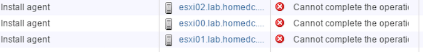
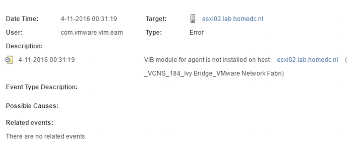

Management summary: Make sure your NSX Controller is connected a distributed vSwitch instead of the standard vSwitch During the install process of NSX, my environment refused to install the NSX agents on the host. When you prepare the host clusters for network virtualization a collection of VIBs are installed on each ESXi Node of the selected cluster. This process installs the functionality such as Distributed Routing, Distributed Firewalls and the user world agent that allows the distributed vSwitch to evolve into a NSX Virtual Switch. Unfortunately, this process didn't go as smooth as the other processes such as installing the NSX Manager and deploying the NSX Controller. Each time I selected Install at Host Preparation, (Within vCenter, select Networking & Security > Installation > Host Preparation. Select the cluster and click the Install link) the process returned an error "Host Not Ready".The recent task view showed that the task cannot be completed  Events shows the following entry:  Not very helpful in order to troubleshoot the error. I followed the [KB article 2075600](https://kb.vmware.com/kb/2075600) (Installation Status appears as Not Ready in NSX (2075600), and made sure [time](http://frankdenneman.nl/2016/06/03/home-lab-fundamentals-time-sync/) and [DNS](http://frankdenneman.nl/2016/06/13/home-lab-fundamentals-dns-reverse-lookup-zones/) were set up correctly. But unfortunately, it didn't solve the problem. Until I started to dissect the process of what Install at the Host Preparation actually does and how the components connect to each other. This made me review the settings of the NSX Manager and discovered I selected the port group designated for my management VMs on the standard switch instead of the distributed switch. It makes sense to connect it to a Distributed Switch, maybe this is the reason why many write-ups on how to install NSX assume this is basically knowledge and fail to list it as a requirement. The UI allows you to select a standard vSwitch Port Group or a Distributed Port Group. Don't make the same mistake I made and make sure you select the appropriate Distributed Port Group. 
