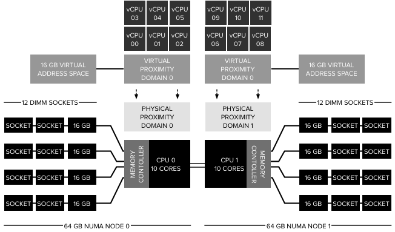
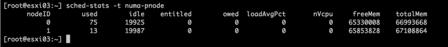
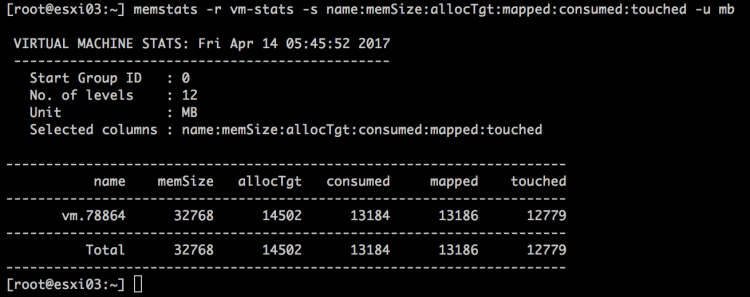
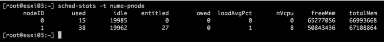
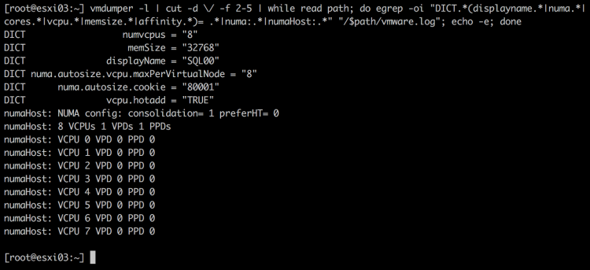
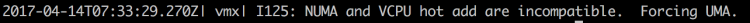
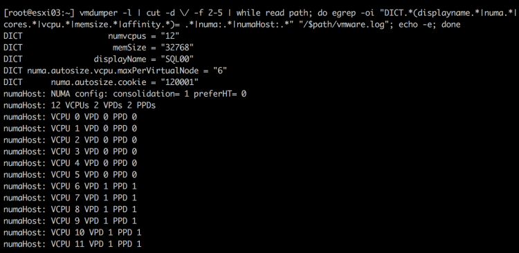
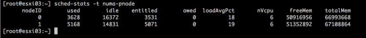

On a regular basis, I receive the question if CPU Hot-add impacts CPU performance of the VM. It depends on the vCPU configuration of the VM. CPU Hot-Add is not compatible with vNUMA, if hot-add is enabled the virtual NUMA topology is not exposed to the guest OS and this may impact application performance. Please note that vNUMA topology is only exposed when the vCPU count of the VM exceeds the core count, thus if the ESXi host contains two CPU packages with 10 cores, the vNUMA topology is presented to the VM if the vCPU count equals 11 or more.

**vNUMA in a Nutshell** The benefit of a wide-VM is that the guest OS is informed about the physical grouping of the vCPUs. In the example of a 12 vCPU VM on a dual-10 core system, the NUMA scheduler creates 2 virtual proximity domains (VPD) better know as NUMA-clients and distributes the 12 vCPUs equally across them. As a result, a load-balancing group is created containing 6 vCPUs that are scheduled on a physical CPU package. A load-balancing group is internally referred to as a physical proximity domain (PPD). Please note that the PPD does not determine the scheduling of vCPU on a specific HT or full core, a PPD can be seen as a vCPU to CPU affinity group From a memory perspective, the guest OS is presented with a vNUMA node sized, separated address space. These address spaces are local to the subset of the vCPUs. As a result, a 12 vCPU 32 GB VM gets to detect a system with two NUMA nodes. Each NUMA node contains 6 CPUs and has a local address space of 16 GB. Contrary to popular belief vNUMA does not expose the full CPU and memory architecture, a better way to describe it that vNUMA shows a tailor-made world to the VM.

 But what happens when the VM is configured with less vCPUs than the core count of the physical CPU package and CPU Hot-Add is enabled? Will there be performance impact? And the answer is no. The VPD configured for the VM fits inside a NUMA node, and thus the CPU scheduler and the NUMA scheduler optimizes memory operations. It’s all about memory locality. Let’s make use of some application workload test to determine the behavior of the VMkernel CPU scheduling.

For this test, I’ve installed DVD Store 3.0 and ran some test loads on the MS-SQL server. To determine the baseline, I’ve logged in the ESXi host via an SSH session and executed the command: `sched-stats -t numa-pnode`. This command shows the CPU and memory configuration of each NUMA node in the system. This screenshot shows that the system is only running the ESXi operating system. Hardly any memory is consumed. TotalMem indicates the total amount of physical memory in the NUMA node in kb. FreeMem indicates the amount of free physical memory in the NUMA node in kb.

 An 8 vCPU 32 GB VM is created with CPU hot add disabled. NUMA scheduler has selected NUMA node 1 for initial placement and the system consumes ~13759 MB (67108864-53019184=14089680/1024).

 The command `memstats -r vm-stats -s name:memSize:allocTgt:mapped:consumed:touched -u mb` allows us to verify the VM memory consumption of the VM.

 The numbers are a close match, please note that VM-stats does not include overhead memory and that the VMkernel can consume some additional overhead in the same NUMA node for other processes. When hot-add is enabled (power down VM is necessary to enable this feature), nothing really changes. The memory for this VM is still allocated from a single NUMA node.

 To get a better understanding of the CPU scheduling constructs at play here, the following command provides detailed insight of all the NUMA related settings of the VM. (Command courtesy of Valentin Bondzio)

`vmdumper -l | cut -d \/ -f 2-5 | while read path; do egrep -oi "DICT.*(displayname.*|numa.*|cores.*|vcpu.*|memsize.*|affinity.*)= .*|numa:.*|numaHost:.*" "/$path/vmware.log"; echo -e; done`

 It shows hot-add is enabled and the VM is configured with a single VPD that is scheduled on a single PPD. In normal language, the vCPUs of the VM are contained with a single physical NUMA node. It’s the responsibility of the NUMA scheduler that physical local memory is consumed. To verify if the VM is consuming local memory, Esxtop can be used (memory, f, NUMA stats). However `sched-stats -t numa-clients` provides me also a lot of insight

 As a result, you can conclude that enabling hot-add on a NUMA system does not lead to performance degradation as long as the vCPU count does not exceed the core count of the CPU package. That means that hot-add can be enabled on VMs, but the instruction must be clear that adding vCPUs can happen up and to the threshold of the physical core count. After that point, the VM becomes a wide-VM and vNUMA comes into play. And in the case of CPU hot-add, its sidelined.

What’s the impact of disregarding the physical NUMA topology? The key lies within the message that’s entered in the VMware.log of the VM after boot.

 The VMkernel is forced into using UMA, Unified Memory Access on a NUMA architecture. As a result, memory is interleaved between the two physical NUMA nodes. In essence, it’s load-balancing memory across two nodes, while ignoring the vCPU location. Let’s explore this behavior a bit more. Christmas is coming early for this VM and it gets another 4 vCPUs. Hot-add is disabled again and thus vNUMA is full in play. The Vmdumper command reveals the following:

 The vCPUs are split up in two virtual nodes (VPD0 & VPD1), each containing 6 vCPUs. After running the DVD Store query the following memory allocation happened:

 The guest OS (Windows 2012 R2) consumed some memory from node 1, SQL consumed all of its memory from node 0. For people intimate with SQL resource management this might be strange behavior and this is true. To display memory management at the VMkernel layer I had to restrict SQL to only run on a subset of CPUs. I’ve allowed SQL to run on the first 4 vCPUs. All these were mapped to CPUs located in NUMA node 0. The NUMA scheduler ensured these CPUs consumed local memory. After powering down and enabling Hot-add the same test was run again. No NUMA architecture is exposed to the guest OS and therefore a single memory address space is used by Windows. The memory scheduler follows the rules of UMA and interleaves memory between the two physical nodes. And as the output shows, memory is consumed from both NUMA nodes in a very balanced manner. The problem is, the executing vCPUs are all located in NUMA node 0, therefore they have to fetch a lot of memory from remote, creating an inconsistent – less – performing application.

 **Conclusion** Hot-add great feature for when you stay within the confines of the CPU package but expect performance degradation, or at least inconsistent performance when going beyond the CPU core count. This content will appear in the upcoming vSphere 6.5 Host Resources Deep Dive book I'm writing with [Niels Hagoort](https://twitter.com/nhagoort) (expected May time-frame). For updates about the book, please follow us on twitter [@hostdeepdive](https://twitter.com/hostdeepdive) or like our page on [Facebook](https://www.facebook.com/HostDeepDive/)
