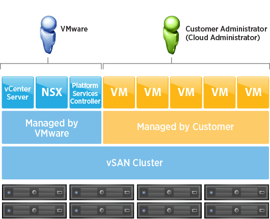
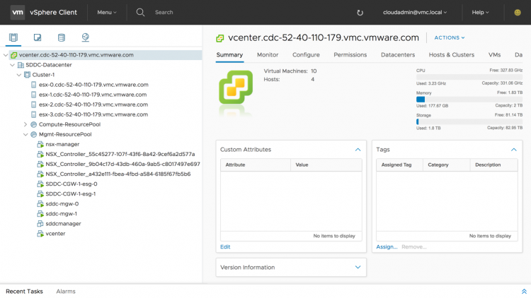
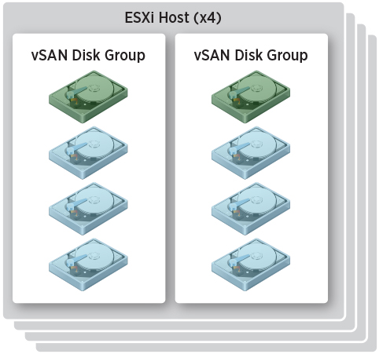
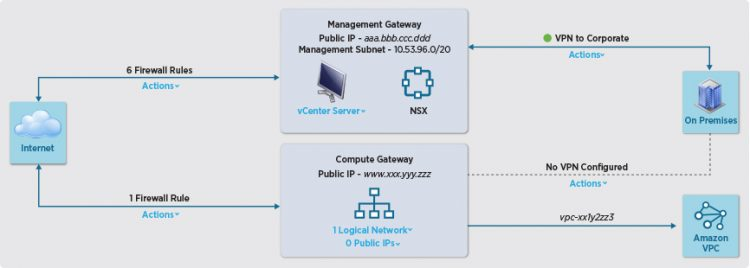

_**Please note that this information can be outdated due to the ongoing changes of this cloud service. Please consult the [https://cloud.vmware.com/vmc-aws/roadmap](https://cloud.vmware.com/vmc-aws/roadmap) for recent information about the latest release**_

Yesterday we launched the VMware Cloud on AWS service. VMware Cloud on AWS allows you to run your applications across private, public, and hybrid cloud environments based on VMware vSphere, with optimized access to AWS services. The Cloud SDDC consists of vSphere, NSX and vSAN technology to provide you a familiar environment which can be managed an operated with your current tool and skill set. By leveraging bare-metal AWS infrastructure the Cloud SDDC can scale in an unprecedented way.

VMware Cloud on AWS is a service and that means that we will not using product versions when we refer to the service. Instead we will be calling the first release the initial availability of the service. Any release after is referred to as future release. VMware Cloud on AWS is operated by VMware. In short that means that VMware is responsible for providing infrastructure resources, the customer is responsible for consuming the resources. This article explores the resource capacity of the Cloud SDDC at initial availability.

**Compute in VMware Cloud on AWS** At initial availability, the VMware Cloud on AWS base cluster configuration contains four hosts. Each host is configured with 512GB of memory and contains dual CPUs. These CPUs are custom-built Intel Xeon Processor E5-2686 v4 CPU. Each CPU contains 18 cores running at 2.3GHz, resulting in a physical cluster core count of 144. Please note, that VMware Cloud on AWS uses a single, fixed host configuration; the option to add components to the host configuration is not offered at this time. However, the scale-out model enables expansion to up to 16 hosts, resulting in 576 CPU cores and 8TB of memory.

vSphere DRS and vSphere HA are enabled and are configured to provide the best availability and resource utilization. vSphere DRS is full automated and the migration threshold is set to the default vSphere DRS level to avoid excessive vSphere vMotion operations. High availability of cluster resources is provided by vSphere HA and Auto remediation hardware.

vSphere High Availability is used to guarantee enough resources for restarting VMs during an ESXi host failure. The ESXi hosts are monitored and in the event of a failure, the VMs on a failed host are restarted on alternative ESXi hosts in the cluster. To maximize productivity while minimizing overhead, the vSphere HA settings of the cluster is configured to tolerate the equivalent of one ESXi host failure (25% percentage-based admission control policy). The host isolation response is set to power off and restart the VMs.  Host failures remediation is the responsibility of VMware. If a host fails permanently, VMware replaces this ESXi host without user intervention. Automatic remediation of failed hardware eliminates the impact of long-term resource reduction of a permanent host failure. The Cloud SDDC is configured with two DRS resource pools. One resource pool contains the management VMs to operate the Cloud SDDC, while the other top-level resource pool is created to manage customer workloads. Customers have the option to create child resource pools.

 **Storage in VMware Cloud on AWS** The SDDC cluster includes a vSAN all-flash array and each host provides a total of 10TB of raw capacity for VMs to consume. A default Cloud SDDC cluster provides 40TB of raw capacity. The capacity consumption of the VM depends on the configured storage policy. By default, a RAID-1 Fault Tolerance Method is applied, but customers can create storage profiles that provide less overhead, such as RAID-5 or RAID-6 Failure Tolerance Method. Please note that for using RAID-6 Failure Tolerance Method a minimum of 6 hosts are required inside the Cloud SDDC cluster.

Each ESXi host contains 8 NVMe devices. These 8 devices are distributed across two vSAN disk groups. Within a disk group, the write-caching tier leverages one NVMe device with 1.7TB of storage; the storage capacity tier leverages the other three NVMe devices with a combined 5.1TB of storage.  **Storage Encryption** Datastore-level encryption with vSAN encryption, or VM-level encryption with vSphere VM encryption, is not available at initial availability of VMware Cloud on AWS. To provide data security, all local storage NVMe devices are encrypted at the firmware level by AWS. The encryption keys are managed by AWS and are not exposed to or controlled by VMware or VMware Cloud on AWS customers.

**Cloud SDDC Configuration** At initial availability, the Cloud SDDC is restricted to a single AWS region and availability zone (AZ). Failed hardware can be automatically detected, and automated remediation enables failed host to be automatically replaced by other ESXi hosts. If necessary the VSAN datastore is automatically rebuilt without user intervention.

In future VMware Cloud on AWS releases, through the partnership of VMware and AWS, multi-AZ availability will be possible for the first time ever, by stretching the cluster across two AZs in the same region. With this groundbreaking offering, refactoring of traditional applications will no longer be required to obtain high availability on the AWS infrastructure. Instead, synchronous write replication will be leveraged across AZs, resulting in a recovery point objective (RPO) of zero and a recovery time objective (RTO) that depends on the vSphere HA restart.

 **Networking in VMware Cloud on AWS** VMware Cloud on AWS is built around NSX. It’s optimized to provide VM networking in the Cloud SDDC, while abstracting the Amazon Virtual Private Cloud (VPC) networks. It enables ease of management by providing logical networks to VMs and automatically connecting new hosts to logical and VMkernel networks as clusters are scaled out. At initial availability, users connect to VMware Cloud on AWS via a layer 3 VPN connection. Future releases of VMware Cloud on AWS, however, will support AWS Direct Connect and allow cross-cloud vSphere vMotion operations.

An IPsec layer 3 VPN is set up to securely connect the on-premises vCenter Server instance with the management components running on the in-cloud SDDC cluster. A separate IPsec layer 3 VPN is set up to create connectivity between the on-premises workloads and the VMs running inside the in-cloud SDDC cluster. NSX is used for all networking and security and is decoupled from Amazon VPC networking. The compute gateway and DLR are pre-configured as part of the prescriptive network topology and cannot be changed by the customer. Customers provide only their own subnets and IP ranges.

 **VMware Cloud on AWS ready for your workload** VMware Cloud on AWS provides you cloud resources that can be consumed by using your current skill set and tool set. Each cloud SDDC provides state-of-the-art resources that can run the most demanding applications of today. The best enterprise software combined with the best cloud operator in the world allows you to run and scale your data center in an unprecedented way. For more information, go to https://[cloud.vmware.com/vmc-aws/resources](https://cloud.vmware.com/vmc-aws/resources)
