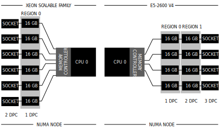

The Intel Xeon Scalable Family introduces a new platform (Purley). The most prominent change regarding system design is the memory subsystem. **More Memory Bandwidth and Consistency in Speed** The new memory subsystem supports the same number of DIMMs per CPU as the previous models. However, it's wider and less deep. What I mean by that is that the last platform (Grantley) supported up to three DIMMs per channel (DPC) and made use of four channels. In total, the Grantley platform supported up to twelve DIMMs per CPU. Purley increases the number of channels from four to six but reduces the numbers of supported DIMMs per channel from three to two. Although this sounds like a potato, potato; tomato, tomato discussion it provides a significant increase in bandwidth while ensuring consistency in speed during a scaling up exercise. Let's take a closer look. **DIMMs per Memory Channel** Depending on the DIMM slot configuration of the server board, multiple DIMMs are supported per channel. The E5-2600 V-series supports up to 3 DIMMs per channel (3 DPC). Using more DIMMs per channel provides the largest capacity, but unfortunately, it impacts the operational speed of memory.  A DIMM groups memory chips into ranks. DIMMs come in three rank configurations; single-rank, dual-rank or quad-rank configuration, ranks are denoted as (xR). With the addition of each rank, the electrical load on the channel increases. And as more ranks are used in a memory channel, memory speed drops restricting the use of additional memory. Therefore in certain configurations, DIMMs will run slower than their listed maximum speeds. This reduction in speed occurs when 3 DIMMs per channel is used.

| RDIMM | 1 DPC | 2 DPC | 3 DPC | LRDIMM | 1 DPC | 2 DPC | 3 DPC | Source |
| --- | --- | --- | --- | --- | --- | --- | --- | --- |
| Cisco | 2400 MHz | 2400 MHz | 1866 MHz |  | 2400 MHz | 2400 MHz | 2133 MHz | [Cisco PDF](http://www.cisco.com/c/dam/en/us/products/collateral/servers-unified-computing/ucs-b-series-blade-servers/b200m4-specsheet.pdf) |
| Dell | 2400 MHz | 2400 MHz | 1866 MHz |  | 2400 MHz | 2400 MHz | 2133 MHz | [Dell.com](http://www.dell.com/learn/us/en/2684/campaigns/memory-speeds-and-population) |
| Fujitsu | 2400 MHz | 2400 MHz | 1866 MHz |  | 2400 MHz | 2400 MHz | 1866 MHz | [Fujitsu PDF](https://sp.ts.fujitsu.com/dmsp/Publications/public/wp-broadwell-ep-memory-performance-ww-en.pdf) |
| HP | 2400 MHz | 2400 MHz | 1866 MHz |  | 2400 MHz | 2400 MHz | 2400 MHz\* | [HP PDF](http://www8.hp.com/h20195/v2/GetPDF.aspx/c04375623.pdf) |
| Performance Drop | 0 | 0 | 28% |  | 0 | 0 | 12%/28% |  |

\* HP claims no reduction of speed due to proprietary memory technology. I have not tested this. **Moving to 2 DIMMs per Channel Configuration** The Purley platform avoids this pitfall by reducing the supported number of DIMMs per channel. It supports up to 2 DIMMs per channel, maintaining the same performance regardless the number of DIMMs per channel. However, reducing the number of DIMMs supported per channel severely impacts the total supported memory capacity per CPU. Intel solves this by adding more channels to the memory controller. For some organizations, this change can result in dropping the requirement of obtaining LRDIMMs. Some organizations avoid the steep performance reduction by purchasing the (more) expensive LRDIMMs, 2 DPC configurations will not affect the performance characteristics of the memory modules. **Six Memory Channel Support** The Purley platform supports up to six channels per CPU. As a result, the bandwidth increases and the support for high capacity memory systems remains. By default, the new Xeon CPU supports up to 768 GB. Please [review part 1](http://frankdenneman.nl/2017/09/26/vsphere-focused-guide-intel-xeon-scalable-family/) of this series in which covers the high memory capacity optimization option (M-suffix).  If all six channels are populated with DIMMs, the CPU interleaves memory access across the multiple memory channels. When creating a 1 DIMM per channel (1 DPC) configuration, the CPU forms one region (Region 0) and interleaves the memory access. Theoretically, this multiplies the data rate by exactly the number of channels present. A 2666 MT/s DIMM has a theoretical peak transfer rate of 21,300 MB/s. If populating all six DIMM slots, the memory controller accesses each module sequentially. Instead of writing all the data to a single DIMM, the data is written across the modules in one region in an alternating pattern, leveraging each channel bandwidth separately. That means that the memory controllers of a single Xeon CPU have access to a combined bandwidth of 127,800 MB/s. In theory, that means that a dual Xeon system has access to 256 GB per second (21,300 MB/s x 6 channels x 2 sockets). In theory! This all depends on the type of workload and the compute power that drives the workload. The Xeon's cores have direct access to the six channels in the CPU package. One thread can never obtain 256 GB due to the interconnect and the raw power it can produce to feed the channels. Anandtech has an [excellent write-up](https://www.anandtech.com/show/11544/intel-skylake-ep-vs-amd-epyc-7000-cpu-battle-of-the-decade/12) about this behavior. **Memory Configuration** As a result of an increase of channels and the design consideration of populating every DIMM slot to create a 1 DPC or 2 DPC configuration, a new vSphere system will likely have a different memory capacity configuration than your previous systems (Inform your standards commission). Please note that the table lists the memory configuration of a single NUMA node.

| 6 x DIMM | 16 GB | 32 GB | 64 GB | 128 GB |
| --- | --- | --- | --- | --- |
| 1 DPC | 96 GB | 192 GB | 384 GB | 768 GB |
| 2 DPC | 192 GB | 384 GB | 768 GB | 1536 GB \* |

\* M-suffix Xeon CPU required Please note that the table lists the memory configuration of a single NUMA node. Dual CPU systems is the most common configuration for vSphere servers. That means that you can expect the major system integrators such as DELL and HP to offer the following configurations:

| Dual CPU Socket | 16 GB | 32 GB | 64 GB | 128 GB |
| --- | --- | --- | --- | --- |
| 1 DPC | 192 GB | 384 GB | 768 GB | 1536 GB |  |
| 2 DPC | 384 GB | 768 GB | 1536 GB | 3072 GB \* |

For completeness sake, the next table shows the configuration of a v4 system with a maximum of 2-DPC. Very familiar configuration numbers, I guess we just need to get used to the new configuration standards such as 384, 768 and 1536 GB per system.

| Dual CPU Socket v4 | 16 GB | 32 GB | 64 GB | 128 GB |
| --- | --- | --- | --- | --- |
| 1 DPC | 128 GB | 256 GB | 512 GB | 1024 GB |  |
| 2 DPC | 256 GB | 512 GB | 1024 GB | 2048 GB |

\* M-suffix Xeon CPU required. vSphere 6.5 supports up to 12 TB per host. As a result, the entire range of Intel Xeon Scalable CPU with the extended memory feature is fully supported (8 CPUs x 1536 GB). Interesting data point, the [vSphere 6.5 Configurations Maximum Guide](https://www.vmware.com/pdf/vsphere6/r65/vsphere-65-configuration-maximums.pdf) started to list a maximum number of NUMA nodes per system. This limit is set to 16. The Intel Scalable Xeon supports sub-NUMA clustering (similar to Cluster-on-Die functionality), splitting up the CPU package into two NUMA nodes. As a result, vSphere 6.5 would support a system equipped with 8 Intel Xeon Platinum 8176M Processors each fully loaded with 1.5 TB of memory and configured with sub-NUMA clustering. This setup would create one system, offering 16 NUMA nodes each fitted with 768 GB of local memory. **Take Caution of 8 DIMM System Board Designs** The introduction of Purley forces system integrators to redesign the system boards to support the new functionality. To support the full possibilities of the memory subsystem, system boards should be equipped with either 6 or 12 DIMM sockets. Some entry-level systems are designed with 8 DIMM slots. The Intel Xeon is designed to use the six channels when creating a region, this results in an unbalanced region design of 6+2. Region 0 consists of 6 DIMM slots, offering a theoretical peak transfer rate of 127,800 MB/s (when using 2666 GT/s), while region 1 offers 42,600 MB/s. This will result in inconsistent performance, something to definitely to avoid. Thus it's recommended to equip these systems with the six-channel configuration in mind, order these systems and only populate the first six DIMM slots per CPU. **Interconnect** The performance of a dual CPU system can be impacted by the interconnect between the CPU packages if you span VMs across the NUMA nodes (Wide-VMs). Purley introduces a new interconnect called the UltraPath Interconnect (UPI) and replaces the QuickPath Interconnect. The next article in this series provides an in-depth look at the UPI.
