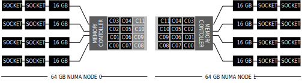
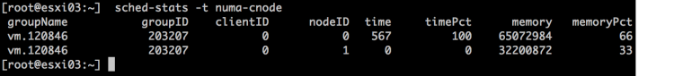
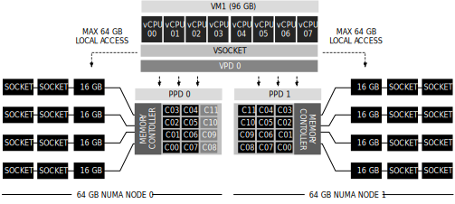

This week I had the pleasure to talk to a customer about NUMA use-cases and a very interesting config came up. They have a VM with a particular memory configuration that exceeds the ESXi host NUMA node memory configuration. This scenario is covered in the [vSphere 6.5 Host Resources Deep Dive](https://www.amazon.com/gp/product/1540873064/ref=as_li_tl?ie=UTF8&camp=1789&creative=9325&creativeASIN=1540873064&linkCode=as2&tag=frankdennem0f-20&linkId=5afdf9e22610abeca733b5bd747d04d0), excerpt below.

**Memory Configuration** The scenario described happens in multi-socket systems that are used to host monster-VMs. Extreme memory footprint VMs are getting more common by the day. The system is equipped with two CPU packages. Each CPU package contains twelve cores. The system has a memory configuration of 128 GB in total. The NUMA nodes are symmetrically configured and contain 64 GB of memory each.  However, if the VM requires 96 GB of memory, a maximum of 64 GB can be obtained from a single NUMA node. This means that 32 GB of memory could become remote if the vCPUs of that VM can fit inside one NUMA node. In this case, the VM is configured with 8 vCPUs.  The VM fits from a vCPU perspective inside one NUMA node, and therefore the NUMA scheduler configures for this VM a single virtual proximity domain (VPD) and a single a load-balancing group which is internally referred to as a physical proximity domain (PPD).

**Example Workload** Running a SQL DB on this machine resulted in the following local and remote memory consumption. The VM consumes nearly 64 GB on its local NUMA node (clientID shows the location of the vCPUs) while it consumes 31 GB of remote memory.

 In this scenario, it could be beneficial to the performance of the VM to rely on the NUMA optimizations that exist in the guest OS and application. The VM advanced setting numa.consolidate = FALSE instructs the NUMA scheduler to distribute the VM configuration across as many NUMA nodes as possible.

 In this scenario, the NUMA scheduler creates 2 load-balancing domains (PPDs) and allows for a more symmetrical configuration of 4 vCPUs per node.

 Please note that a single VPD (VPD0) is created and as a result, the guest OS and the application only detect a single NUMA node. Local and remote memory optimizations are (only) applied by the NUMA scheduler in the hypervisor.

Whether or not the application can benefit from this configuration depends on its design. If it's a multi-threaded application, the NUMA scheduler can allocate memory closes to the CPU operation. However, if the VM is running a single-threaded application, you still might end up with a lot of remote memory access, as the physical NUMA node hosting the vCPU is unable to provide the memory demand by itself.

Test the behavior of your application before making the change to create a baseline. As always, use advanced settings only if necessary!
