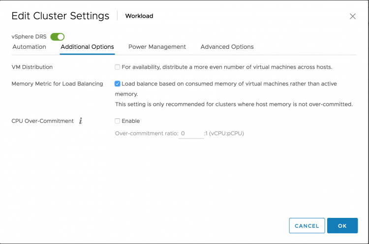
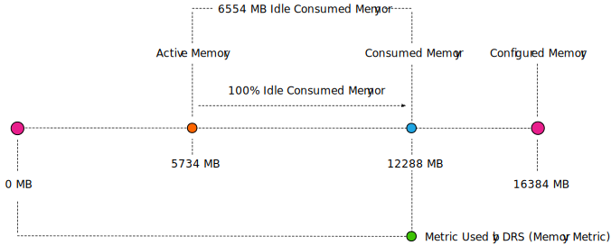
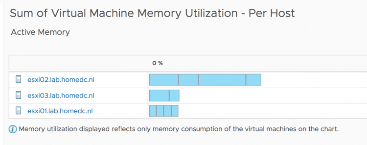

DRS is over a decade old and is still going strong. DRS is aligned with the premise of virtualization, resource sharing and overcommitment of resources. DRS goal is to provide compute resources to the active workload to improve workload consolidation on a minimal compute footprint. However, virtualization surpassed the original principle of workload consolidation to provide unprecedented workload mobility and availability. With this change of focus, many customers do not overcommit on memory. A lot of customers design their clusters to contain (just) enough memory capacity to ensure all running virtual machines have their memory backed by physical memory. In this scenario, DRS behavior should be adjusted as it traditionally focusses on active memory use. vSphere 6.5 provides this option in the DRS cluster settings. By ticking the box **"Memory Metric for Load Balancing"** DRS uses the VM consumed memory for load-balancing operations.  Please note that DRS is focussed on consumed memory, not configured memory! DRS always keeps a close eye on what is happening rather than accepting static configuration. Let's take a closer look at DRS input metrics of active and consumed memory. **Out-of-the-box DRS Behavior** During load balancing operation, DRS calculates the active memory demand of the virtual machines in the cluster. The active memory represents the working set of the virtual machine, which signifies the number of active pages in RAM. By using the working-set estimation, the memory scheduler determines which of the allocated memory pages are actively used by the virtual machine and which allocated pages are idle. To accommodate a sudden rapid increase of the working set, 25% of idle consumed memory is allowed. Memory demand also includes the virtual machine’s memory overhead. Let’s use a 16 GB virtual machine as an example of how DRS calculates the memory demand. The guest OS running in this virtual machine has touched 75% of its memory size since it was booted, but only 35% of its memory size is active. This means that the virtual machine has consumed 12288 MB and 5734 MB of this is used as active memory.  As mentioned, DRS accommodate a percentage of the idle consumed memory to be ready for a sudden increase in memory use. To calculate the idle consumed memory, the active memory 5734 MB is subtracted from the consumed memory, 12288 MB, resulting in a total 6554 MB idle consumed memory. By default, DRS includes 25% of the idle consumed memory, i.e. 6554 \* 25% = +/- 1639 MB.  The virtual machine has a memory overhead of 90 MB. The memory demand DRS uses in its load balancing calculation is as follows: 5734 MB + 1639 MB + 90 MB = 7463 MB. As a result, DRS selects a host that has 7463 MB available for this machine if it needs to move this virtual machine to improve the load balance of the cluster. **Memory Metric for Load Balancing Enabled** When enabling the option "Memory Metric for Load Balancing" DRS takes into account the consumed memory + the memory overhead for load balancing operations. In essence, DRS uses the metric Active + 100% IdleConsumedMemory.  vSphere 6.5 update 1d UI client allows you to get better visibility in the memory usage of the virtual machines in the cluster. The memory utilization view can be toggled between active memory and consumed memory.  Recently, [Adam Eckerle on Twitter](https://twitter.com/eck79) published a [great article](https://blogs.vmware.com/vsphere/2018/01/vcenter-server-6-5-update-1d-includes-third-update-html5-vsphere-client.html) that outlines all the improves of vSphere 6.5 Update 1d. Go check it out. Animated Gif courtesy of Adam. When reviewing the cluster it shows that the cluster is pretty much balanced.  When looking at the default view of the sum of Virtual Machine memory utilization (active memory). It shows that ESXi host ESXi02 is busier than the others.  However since the active memory of each host is less than 20% and each virtual machine is receiving the memory they are entitled to, DRS will not move virtual machines around. Remember, DRS is designed to create as little overhead as possible. Moving one virtual machine to another host to make the active usage more balanced, is just a waste of compute cycles and network bandwidth. The virtual machines receive what they want to receive now, so why take the risk of moving VMs? But a different view of the current situation is when you toggle the graph to use consumed memory.  Now we see a bigger difference in consumed memory utilization. Much more than 20% between ESXi02 and the other two hosts. By default DRS in vSphere 6.5 tries to clear a utilization difference of 20% between hosts. This is called Pair-Wise Balancing. However, since DRS is focused on Active memory usage, Pair-Wise Balancing won't be activated with regards to the 20% difference in consumed memory utilization. After enabling the option "Memory Metric for Load Balancing" DRS rebalances the cluster with the optimal number of migrations (as few as possible) to reduce overhead and risk.  **Active versus Consumed Memory Bias** If you design your cluster with no memory overcommitment as guiding principle, I recommend to test out the vSphere 6.5 DRS option "Memory Metric for Load Balancing". You might want to switch DRS to manual mode, to verify the recommendations first.
