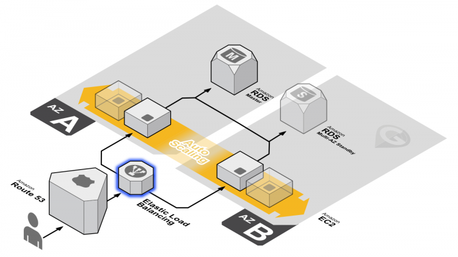
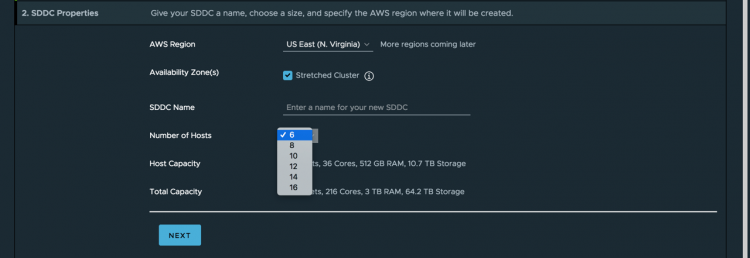

This week [Emad](https://twitter.com/emad_younis) published an excellent article about the [stretched cluster functionality of](http://emadyounis.com/vmware-cloud-on-aws/stretched-clusters-overview/) [VMware Cloud on AWS](https://cloud.vmware.com/vmc-aws). To sum up, you can now deploy a single vSphere cluster across two [AWS availability zones](https://docs.aws.amazon.com/AWSEC2/latest/UserGuide/using-regions-availability-zones.html).  **A trip to Memory Lane** I think the ability to stretch a vSphere cluster across two availability zones is a really big thing. Go back to the days where we had to refactor the application to make it highly available. To reduce application downtime, you typically used clustering software such as Microsoft cluster or Veritas clustering services. But not all applications were fit for this solution. When we introduced VMware High Availability back in 2006, we brought a big change to the industry. From that point on you could provide crash-consistent failover ability to all your workloads. No need to refactor any application, no need to build outlandish hardware solutions. Just enable a few tickboxes at the infrastructure layer, and every workload running inside a VM is protected. And to this day, HA remains the most popular functionality of vSphere. **Amazon Web Services Resiliency Strategy** Amazon urges you to design your application to be resilient to infrastructure outages. Amazon AWS is hosted in multiple locations worldwide. These locations are composed of regions and Availability Zones. Each region is a separate geographic area that has multiple, isolated locations known as Availability Zones. AWS provides the ability to place instances and data in multiple locations. And you can take advantage of the safety and reliability of geographic redundancy by spanning your Auto Scaling group across multiple Availability Zones within a region and then attach a load balancer to distribute incoming traffic across those Availability Zones. Incoming traffic is distributed equally across all Availability Zones enabled for your load balancer.  And this works very well if you are refactoring your application or if you are building a complete new cloud-native stack. The challenge we face today is that not all applications lend to getting refactored, or some applications do not require the journey from monolithic to full-FAAS. **Hybrid-Cloud Experience** With stretched clusters in [VMware Cloud on AWS](https://cloud.vmware.com/vmc-aws), we introduce the same ease of infrastructure resiliency to workloads that run on AWS infrastructure. Merely expand you vSphere cluster to [6 hosts and select multi-az deployment](http://emadyounis.com/vmware-cloud-on-aws/stretched-clusters-overview/).  After that, the workload in the Cloud SDDC is protected for AZ outages. If something happens, HA detects the failed VMs and restarts them on different physical servers in the remaining AZ without manual human involvement. The ability to stretch your vSphere cluster across AZs allows you to easily provide resiliency to your workload within the AWS infrastructure without the Herculean effort of refactoring all your applications.
