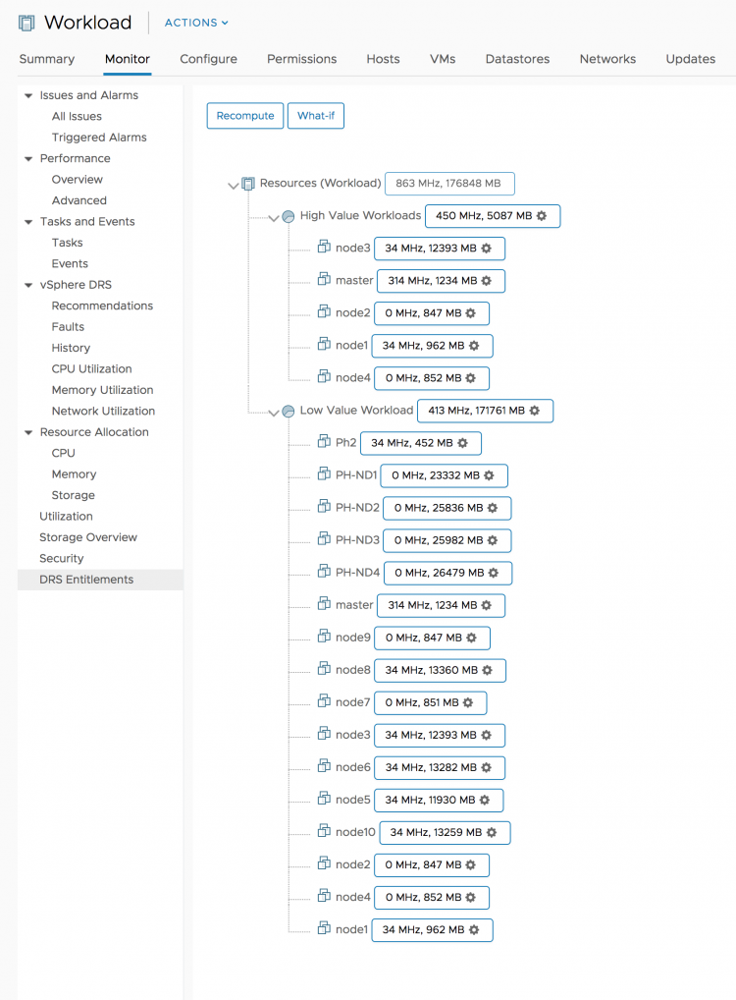
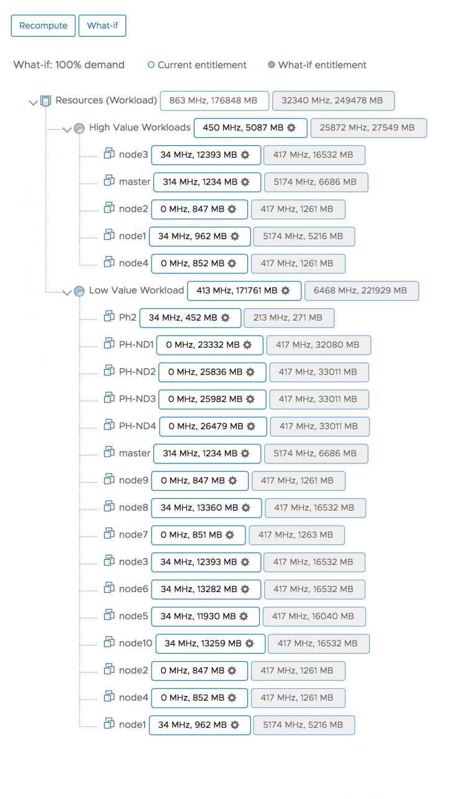
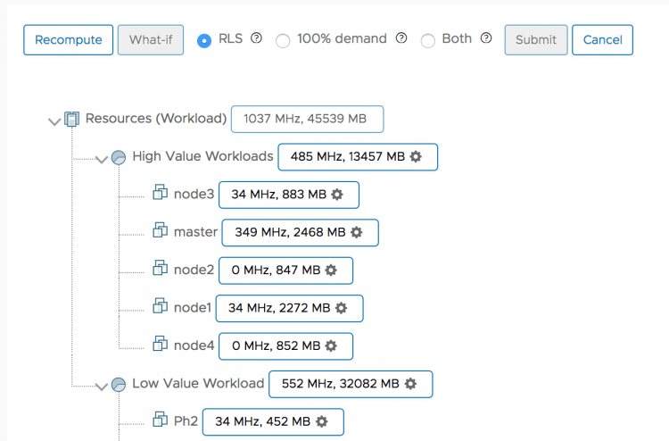
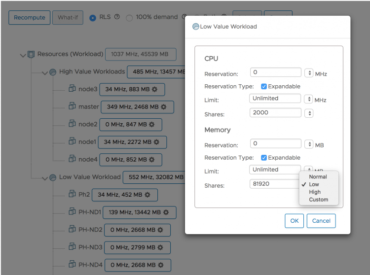
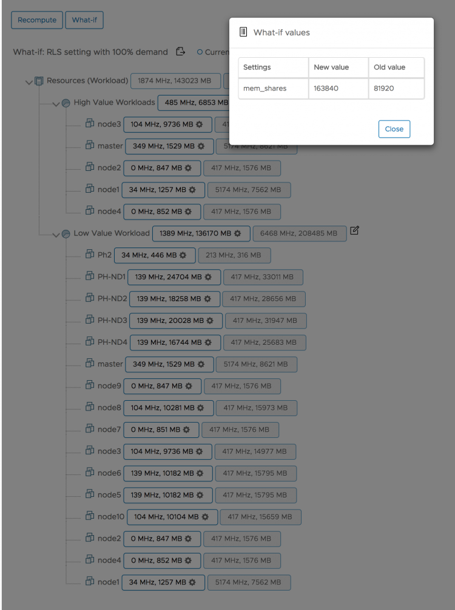
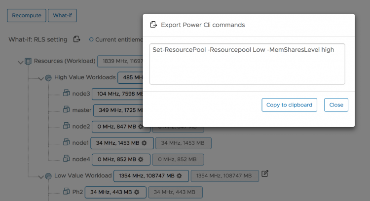

I’m proud to announce the latest fling; [DRS entitlement](https://labs.vmware.com/flings/drs-entitlement-viewer). This fling is built by the performance team and it provides insight to the demand and entitlement of the virtual machines and resource pools within a vSphere cluster.      By default, it shows the active CPU and memory consumption, which by itself helps to understand the dynamics within the cluster. Especially when you are using resource pools with different levels of share values. In this example, I have two resource pools, one containing the high-value workloads for the organization, and one resource pool containing virtual machines that are used for test and dev operations. The high-value workloads should receive the resources they require all the time. The What-If functionality allows you to simulate a few different scenarios. A 100% demand option and a simulation of resource allocation settings. The screenshot below shows the what-if entitlement. What if these workloads generate 100% of activity, what resources do these workloads require if they go to the max?  This allows you to set the appropriate resource allocations settings such as reservations and limits on the resource pools or maybe even on particular virtual machines. Another option is to specify particular Reservation, Limits, and Shares (RLS) settings to an object. Select the RLS option and select the object you want to use in the simulation.  In this example, I selected the Low Value Workload resource pool and changed the share value setting of the resource pool.      You can verify the new setting before running the analysis. Please note, that this is an analysis, it does not affect the resource allocation of active workload whatsoever. You can simulate different settings and understand the outcome.      Once the correct setting is determined you can apply the setting on the object manually, or you can use the PowerCLI setting and export the PowerCLI one-liner to programmatically change the RLS settings.      Follow the instruction on the [flings website](https://labs.vmware.com/flings/drs-entitlement-viewer) to install it on your vCenter. I would like to thank [Sai Inabattini](https://twitter.com/inabattinis) and [Adarsh Jagadeeshwaran](https://twitter.com/adarshtweet) for creating this fling and for listening to my input! RUN DRS!
