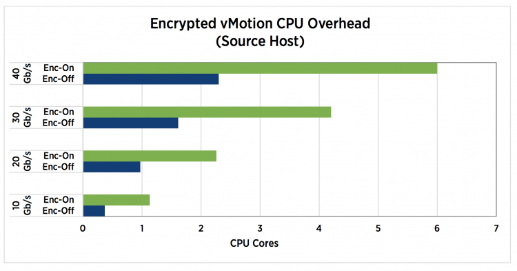
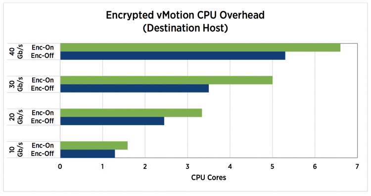

vSphere 6.5 introduced encrypted vMotion and encrypts vMotion traffic if the destination and source host are capable of supporting encrypted vMotion. If true, vMotion traffic consumes more CPU cycles on both the source and destination host. This article zooms in on the impact of CPU consumption of encrypted vMotion on the vSphere cluster and how DRS leverages this new(ish) technology.

## CPU Consumption of vMotion Process

ESXi reserves CPU resources on both the destination and the source host to ensure vMotion can consume the available bandwidth. ESXi only takes the number of vMotion NICs, and their respective speed into account, the number of vMotion operations does not affect the total of CPU resources reserved! 10% of a CPU core for a 1 GbE NIC, 100% of a CPU core for a 10 GbE NIC. vMotion is configured with a minimum reservation of 30%. Therefore, if you have 1 GbE NIC configured for vMotion, it reserves at least 30% of a single core.

## Encrypted vMotion

As mentioned, vSphere 6.5 introduced encrypted vMotion and by doing so it also introduced a new stream channel architecture. When an encrypted vMotion process is started, 3 stream channels are created. Prepare, Encrypt and Transmit. The encryption and decryption process consumes CPU cycles and to reduce the overhead as much as possible, the encrypted vMotion process uses the AES-NI Instruction set of the physical CPU. AES-NI stands for Advanced Encryption Standard- New Instruction and was introduced in the Intel Westmere-EP generation (2010) and AMD Bulldozer (2011). It’s safe to say that most data centers run on AES-NI equipped CPUs. However, if the source or destination host is not equipped with AES-NI, vMotion automatically reverts to unencrypted if the default setting is selected. Although the encrypted vMotion leverages special CPU hardware instructions set to offload overhead, it does increase the CPU utilization. The technical paper “[VMware vSphere Encrypted vMotion Architecture, Performance, and Best Practices](https://www.vmware.com/content/dam/digitalmarketing/vmware/en/pdf/techpaper/performance/encrypted-vmotion-vsphere65-perf.pdf)” published by VMware list the overhead on the source and destination host. \[caption id="attachment\_7302" align="aligncenter" width="676"\] Encrypted vMotion CPU Overhead on the Source Host\[/caption\] \[caption id="attachment\_7303" align="aligncenter" width="676"\] Encrypted vMotion CPU Overhead on the Destination Host\[/caption\] Encrypted vMotion is a per-VM setting, by default, every VM is configured with Encrypted vMotion set to Opportunistic. The three settings are: \[caption id="attachment\_7304" align="aligncenter" width="676"\] VM Options Encrypted vMotion\[/caption\]

| Setting | Behavior |
| --- | --- |
| Disabled | Does not use encrypted vMotion |
| Opportunistic | Use encrypted vMotion if the source and destination host supports it. Only vSphere 6.5 and later use encrypted vMotion |
| Required | Only allow encrypted vMotion. If the source and destination host does not support encrypted vMotion, migration with vMotion is not allowed. |

Please be aware that encrypted vMotion settings are transparent to DRS. DRS generates a load balancing migration, and when the vMotion process starts, the vMotion process verifies the requirements. Due to the transparency, DRS does not take encrypted vMotion settings and host compatibility into account when generating a recommendation. If you select required, because of security standards, it is important to understand if you are running a heterogeneous cluster with various vSphere versions. Is every host in your cluster 6.5 otherwise you are impacting the ability of DRS to load-balance optimally. Or are different types of CPU generations inside the cluster, do they support AES-NI? Please make sure the BIOS version supports AES-NI and make sure AES-NI is enabled in the BIOS! Also, verify if the applied Enhanced vMotion Compatibility (EVC) baseline exposes AES-NI.

## CPU Headroom

It is important to keep some unreserved and unallocated CPU resources available for the vMotion process, to avoid creating gridlock. DRS needs some resources to run its threads, and vMotion requires resources to move VMs to lesser utilized ESXi host.  Know that encrypted vMotion taxes the system more,  in oversaturated clusters, it might be interesting to understand whether your security officer state encrypted vMotion as a requirement.
