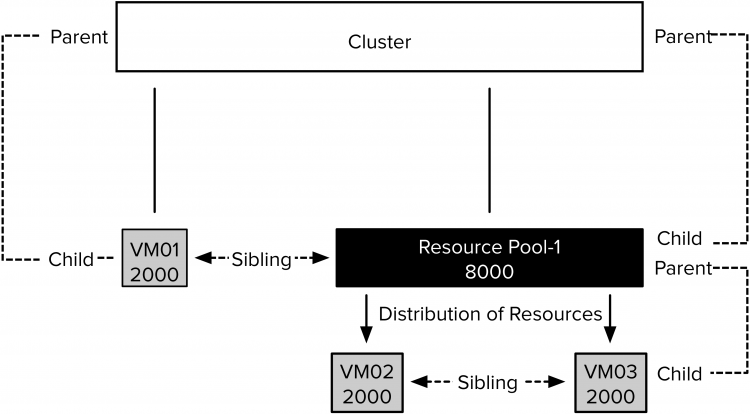
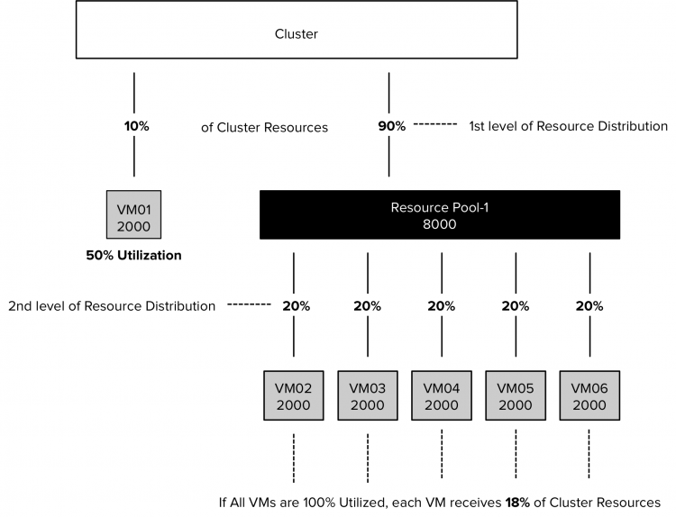
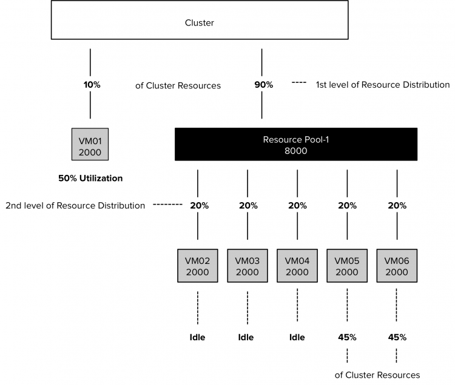

One of the most powerful constructs in the Software Defined Data Center is the resource pool. The resource pool allows you to abstract and isolate cluster compute resources. Unfortunately, it’s mostly misunderstood and it received a bad rep in the past that it cannot get rid off. One of the challenges of resource pools is to fully commit to resource pools. Placing virtual machines next to resource pools can have an impact of resource distribution. This article zooms in on sibling rivalry. But before this adventure begins, I would like to stress that the examples provided in the article are a worst-case scenario. In this scenario, all VMs are 100% active. An uncommon situation, but it helps to easily explain the resource distribution. Later in the article, I use a few examples, in which some VMs are active and some are idle. And as you will see, resource pools aren’t that bad after all. **Resource Pool Size** Because resource pool shares are relative to other resource pools or virtual machines with the same parent resource pool, it is important to understand how vCenter sizes resource pools. The values of CPU and memory shares applied to resource pools are similar to virtual machines. By default, a resource pool is sized like a virtual machine with 4 vCPUs and 16GB of RAM. Depending on the selected share level, a predefined number of shares are issued. Similar to VMs, four share levels can be selected. There are three predefined settings: High, Normal or Low, which specify share values with a 4:2:1 ratio, and the Custom setting, which can be used to specify a different relative relationship.

| Share Level | Shares of CPU | Shares of Memory |
| --- | --- | --- |
| Low | 2000 | 81920 |
| Normal | 4000 | 163 840 |
| High | 8000 | 327 680 |

Caution must be taken when placing VMs at the same hierarchical level as resource pools, as VMs can end up with a higher priority than intended. For example, in vSphere 6.7, the largest virtual machine can be equipped with 128 vCPUs and 6 TB of memory. A 128vCPU and 6TB VM owns 256 000 (128 x 2000) CPU shares and 122 560 000 (6 128 000 x 20) memory shares. Comparing these two results in a CPU ratio is 32:1 and memory 374:1. The previous is an extreme example, but the reality is that 16GB and 4 vCPU VM is not uncommon anymore. Placing such a VM next to a resource pool results in unfair sibling rivalry. **The Family Tree of Resource Consumers** As shares determine the priority of the resource pool or virtual machine relative to its siblings, it is important to determine which objects compete for priority.  In the scenario depicted above, multiple sibling levels are present. VM01 and Resource Pool-1 are child objects of the cluster and therefore are on the same sibling level. VM02 and VM03 are child objects of Resource Pool-1. VM02 and VM03 are siblings, and both compete for resources provided by Resource Pool-1. DRS compares their share values to each other. The share values of VM01 and the other two VMs cannot be compared with each other because they each have different parents and thus do not experience sibling rivalry. Shares indicate the priority at that particular hierarchical level, but the relative priority of the parent at its level determines the availability of the total amount of resources. VM01 is a 2-vCPU 8GB virtual machine. The share value of Resource Pool-1 is set to high. As a result, the resource pool owns 8000 shares of CPU. The share value of VM01 is set to Normal and thus it owns 2000 CPU shares. Contention occurs, and the cluster distributes its resources between Resource Pool-1 and VM01. If both VM02 and VM03 are 100% utilized, Resource Pool-1 receives 80% of the cluster resources based on its share value.  Resource Pool-1 divides its resources between VM02 and VM03. Both child-objects own an equal number of shares and therefore receive each 50% of the resources of Resource Pool-1  This 50% of Resource Pool-1 resources equals to 40% of the cluster resources. As for now, both VM02 and VM03 are able to receive more resources than VM-1. However, three additional VMs are placed inside Resource Pool-1. The new VMs own each 2000 CPU shares, increasing the total number of outstanding shares to 10.000.  The distribution at the first level remains the same during contention. The cluster distributes its resources amongst its child-object, VM01 and Resource Pool-1; 20% to VM01 and 80% to Resource Pool-1. Please note this only occurs when all objects are generating 100% utilized. If VM01 was generating 50% of its load and the VMs in Resource Pool-1 are 100% utilized, the cluster would flow the unused resources to the resource pool to satisfy the demand of its child objects. The dynamic entitlement is adjusted to the actual demand. The VMs inside RP-1 are equally active, as a result of the reduced activity of VM01, they each receive 2% more resources.  VM02, VM03, and VM04 start to idle. The Resource Pool shifts the entitlement and allocates the cluster resources to the VMs that are active, VM05 and VM06. They each get 50% of 80% of the cluster resources due to their sibling rivalry.  **Share Levels are Pre-sets, not Classes** A VM that is placed inside the resource pool, or created in a resource pool, does not inherit the share level of the resource pool. When creating a VM or a resource pool, vCenter assigns the Normal share level by default, independent of the share level of its parent. Think of share levels as presets of share values. Configure a resource pool or virtual machine with the share-level set to high, and it gets 2000 CPU shares per vCPU. A VM configured with the share level set to low gets 500 CPU shares. If the VM has 4 vCPUs, the VM owns the same number of shares than the 1 vCPU with a share value set to high. Both compete with each other based on share amounts, not based on share level values. **Next Article** This article is a primer for a question about which direction we should take with Resource Pools. This week I shall post a follow up article that zooms in on the possible changes of shares behavior of resource pool in the near future. Stay tuned.
