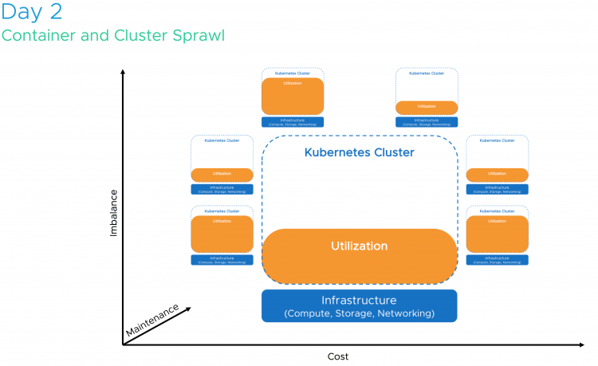
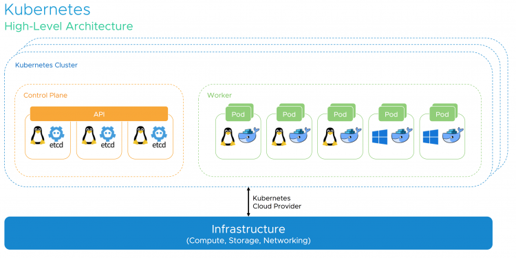
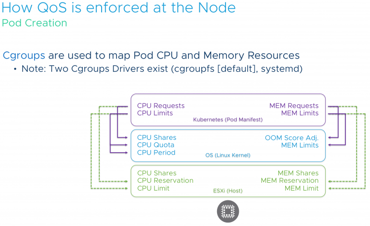

Kubernetes is hot! It is one of the most talked about technologies of this year. For some, it's the next platform, for others it's just another tech making its way in the datacenter. Will it replace virtual machines, will it get displace vSphere? Some ask, why run Kubernetes on top of vSphere when you can run it on bare metal? We rather not go back to 2005 and deal with a sprawl of bare-metal servers, we believe Kubernetes and vSphere are better together! In the session **"CNA1553BU - Deep Dive: The value of Running Kubernetes on vSphere"** [Michael Gasch](https://twitter.com/embano1) and I review the behavior of Kubernetes resource management, optimization, and availability for container orchestration. Kubernetes is a system optimized for cloud-native workloads where failure and disruption is anticipated, but how about the infrastructure that is required to run these cloud-native apps? How about Kubernetes ability to economically and optimally consume the available resources?  We will answer these questions and reveal why vSphere is such a good match with its extensive features such as high availability, NUMA optimization, and distributed resource scheduler. In this session, we explore the critical elements of a container and demonstrate that Kubernetes does not run in thin air. Running Linux on bare-metal or inside a VM determines your scalability, your recoverability, and your portability. If you spin up a Kubernetes cluster at Amazon or Google, they will deploy it for you in virtual machines, if these cloud-native giants use VMs, why would you use bare-metal?  Adding vSphere to the picture, Kubernetes gains several advantages for both, cloud-native and traditional workloads. vSphere also plays a critical role in keeping the Kubernetes control plane components highly-available in case of planned and unplanned downtime. We are going to detail recommended DRS and HA settings and many other best practices for Kubernetes on vSphere based on real-world customer scenarios. Of course, an outlook on upcoming improvements for the Kubernetes on vSphere integration should not be missing in a deep dive session! Last but not least, you'll definitely learn how to respond to common objections to win back your end-user. Still not convinced? Let's dive into the behavior of Linux CPU scheduling versus ESXi CPU and NUMA scheduling and help you understand how to size and deploy your Kubernetes cluster on vSphere correctly.  Developers shouldn't need to worry about all these settings and the underlying layers. They just want to deploy the application, but it's our job to cater to the needs of the application and make sure the application runs consistently and constantly. This applies to compute, but also to storage.7 out of 10 applications that run on kubernetes are stateful, so it makes sense to incorporate persistent storage in your kubernetes design.  Some applications are able to provide certain services like replication themselves, thus it makes no sense to "replicate" that service at the infrastructure layer. vSAN and its storage policies allow the admin to provide storage services that are tailor-made to the application stack. [Cormac Hogan](https://twitter.com/CormacJHogan) and [Christos Karamanolis](https://twitter.com/XtosK) talk about why vSAN is the ultimate choice for running next-gen apps. Visit their session **"HCI1338BU-HCI: The Ideal Operational Environment for Cloud-Native Applications"** to hear about real-world use-cases and learn what you need to do when dealing with these next-gen apps. Please note that if you attempt adding these sessions to your schedule, you might get a warning that you are on the waiting list. As we understood it, all sessions are booked in small rooms and depending on the waiting list they are moved to bigger rooms. Thus sign up for these sessions even if they state waiting list only. It will be sorted out during the upcoming weeks.  Hope to see you in our session!
