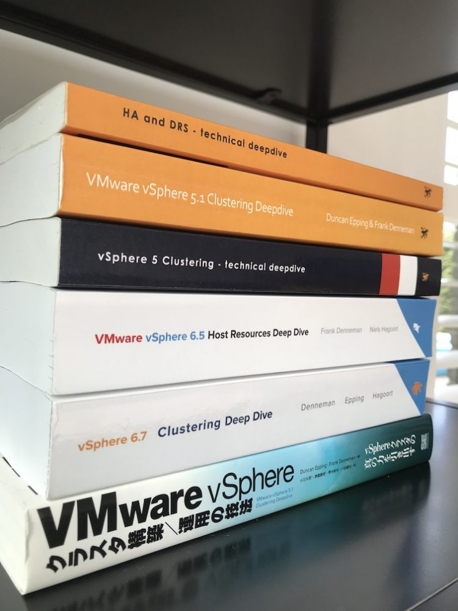

The new version of the vSphere clustering deep dive is [available on Amazon](https://amzn.to/2K4WiAj). The [vSphere 6.7 Clustering Deep Dive](https://amzn.to/2K4WiAj) is the fourth edition of the best selling series. Over 50.000 clustering deep dive books have been distributed, and I hope this version will find its way on your desk.  The new version of the clustering deep dive covers HA, DRS, Storage DRS, Storage I/O Control and Network I/O Control. In the last part of the book, we bring all the theory together and apply it to create and describe a stretched cluster configuration. Now, why am I using the title **vSphere 6.x Deep Dive Resource Kit**? Well, it's because we believe that when you pair this with the [vSphere 6.5 Host Resource Deep Dive book](https://www.amazon.com/gp/product/1540873064/ref=as_li_tl?ie=UTF8&camp=1789&creative=9325&creativeASIN=1540873064&linkCode=as2&tag=frankdennem0f-20&linkId=5afdf9e22610abeca733b5bd747d04d0), you get this bundle that allows you to understand the core of your virtual infrastructure.  **Changing the Game** When [Duncan](https://twitter.com/duncanyb) and I set out to write the 4.1 HA and DRS deep dive, we wanted to change the content of technical books. Instead of having a collection of screenshots paired with the text, next, next finish, we wanted to provide a thorough explanation of what happens under the cover. When you push this button, this happens in the code. By uncovering the inside, we arm the administrator and architect with the knowledge to create or troubleshoot any architecture anywhere.  When combining these books together, it creates a real end-to-end guide for your architecture. For example, in the DRS section, we explain how the cluster determines the resource entitlement of the VMs in a resource pool. In the vSphere 6.5 Host resource deep dive, we describe the inner workings of the memory and CPU scheduler and how they allocate the physical resources based on the resource entitlement of the VM. **Back Side of the Book** When releasing the host resource deep dive, we came up with a cool little logo of a divers helmet. If you want to get deep, you need more than a snorkel. One divers helmet to explore the host, but in the cluster deep dive, we cover multiple hosts, grouped in a cluster. What do you need when you need a lot of people to explore the deep? You need a submarine! ;) It might even end up on some T-shirt.  **New Name on the Cover** As you might have noticed, a new name appears on the cover. We asked [Niels Hagoort](https://twitter.com/nhagoort) to help us to cover the quality of service aspect of the book. Niels dove into the deeps of Storage I/O Control and Network I/O Control and created an excellent addition to the book.  **Foreword** And last but not least, the foreword. In the previous books, industry luminaries generously provided us with amazing forewords. This time we looked at the community. We asked [Chris Wahl](https://twitter.com/chriswahl) to write the introduction. Chris has been an early supporter of the book series, and he has helped the community in many ways. We asked him to provide us with his point of view. I hope you enjoy [the book](https://amzn.to/2K4WiAj) as much as we enjoyed writing it.
