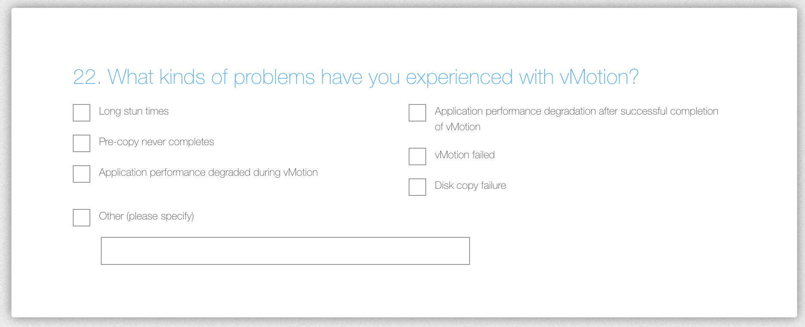

The vMotion product team is looking for input on how to improve vMotion.  vMotion has proven to be a paradigm shift of datacenter management. Workload mobility is a must-have requirement in today's datacenter operational model. vMotion handles the majority of workload flawlessly. However, there are some corner cases that introduce some challenges. The vMotion product team is interested in these corner cases, to improve the vMotion architecture bringing workload mobility to all workloads everywhere.

It would be very helpful if you can provide us with some more information to make vMotion even better. Thanks!

Take the survey [here](https://www.surveymonkey.com/r/98SG5ZX)
