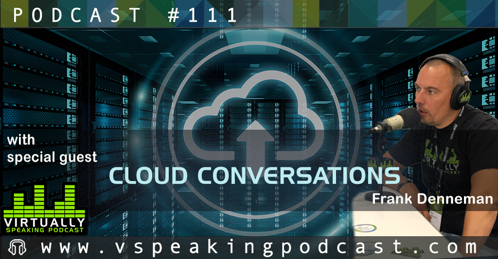

Last week I had the pleasure of connecting again with my friends and colleagues Pete Flecha a.k.a [PedroArrow](https://twitter.com/vPedroArrow) and eternal sunshine [John Nicholson](https://twitter.com/Lost_Signal). During the podcast, we discussed the road to Hybrid cloud, cloud mobility, multi-cloud operations, and the necessity of replatforming apps or not. It's always fun hanging out with these guys especially when talking about cool things. Hope you enjoy the show as much as I did.

