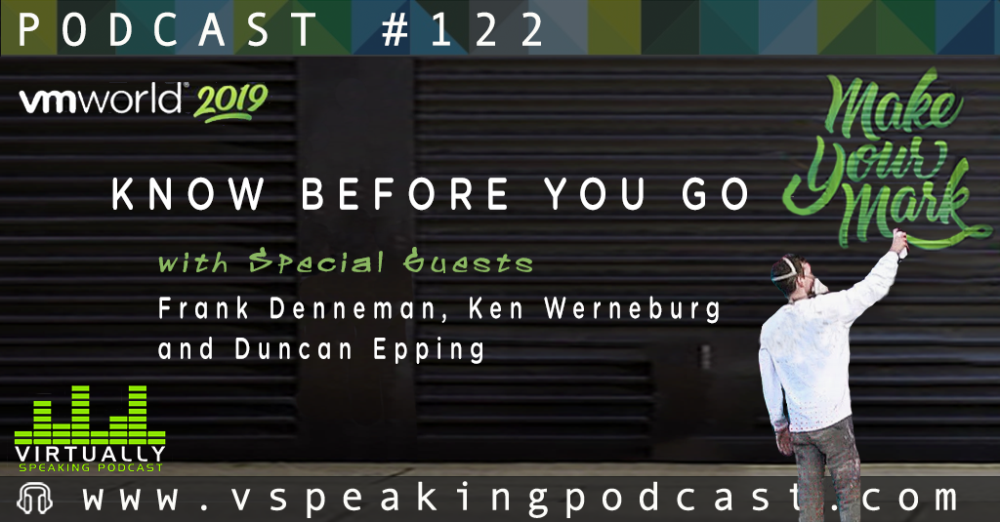

Last week I had the pleasure of connecting again with my friends and colleagues [Pete Flecha](https://twitter.com/vPedroArrow), [Duncan Epping](https://twitter.com/DuncanYB) and amateur back up dancer to Pat Benatar, Mr. [Ken Werneburg](https://twitter.com/vmKen). During the [podcast](https://www.vspeakingpodcast.com/), we discussed the upcoming VMworld. As it is returning to San Francisco, it might be interesting to revisit your conference strategy.

Although [Moscone Center](https://goo.gl/maps/dVCbTa8Pg6NMrtZ5A) has been rebuilt and expanded, I believe we are still using all three buildings; North, South, and West (Located at Howard and 3rd). So take at least a jacket with you, SF Summers can be treacherous

For more tips about what to wear, what to bring, and which sessions to attend, listen to the episode below or search for it on [Spotify](https://open.spotify.com/show/3IoMDYvubwjQg8RMvUeHcY?si=neN5CV6GSeS6Q9HNmIjvZA). I hope you enjoy the show as much as I did.

