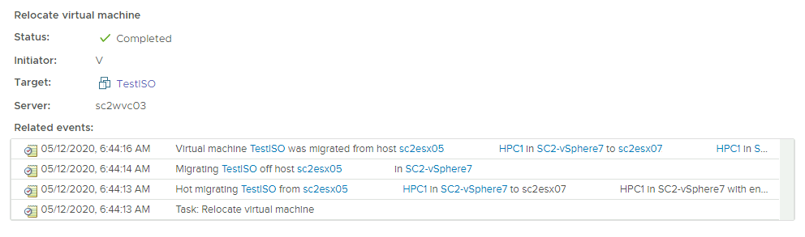

A lot of cool new features fly under the radar during a major release announcement. Even the new DRS algorithm didn't get much air time. One thing that I discovered this week, is that vSphere 7 allows for vMotion with an attached remote device attached.

When using the VM Remote Console, you can attach ISOs stored on your local machine to the VM. An incredibly useful tool that allows you to quickly configure a VM.

The feature avoids the hassle of uploading an ISO to a shared datastore, but unfortunately, it does disable vMotion for that particular machine.

Even worse, this prohibits DRS to migrate it for load-balancing reasons, but maybe even more annoying, it will fail maintenance mode. We've all been there, putting a host into maintenance mode, to notice ten minutes later that the host isn't placed in MM-mode. Once you exit MM to figure out what's going on DRS seems to be on steroids and piles on every moveable VM it can find onto that host again.

With vSphere 7, this enhancement makes that problem a thing of the past. vMotions will work, and that means so does DRS and Maintenance Mode.

When a VM is vMotioned with a remote device attached, the session ends as the connection is closed. In vSphere 7, when a vMotion is initiated, the VMX process sends a disconnect command with a session cookie to the source ESXi host. The device is marked as remote and once the vMotion process is complete, the remote device is connected through VMRC again. Any buffered accesses to the device are completed.

Please note that the feature "vSphere vMotion with attached remote devices" is a vSphere 7 feature only and that means that it only works when migrating between vSphere 7 hosts.

It has the look and feel of a small function upgrade, but I'm sure it will reduce a lot of frustration during maintenance windows.
