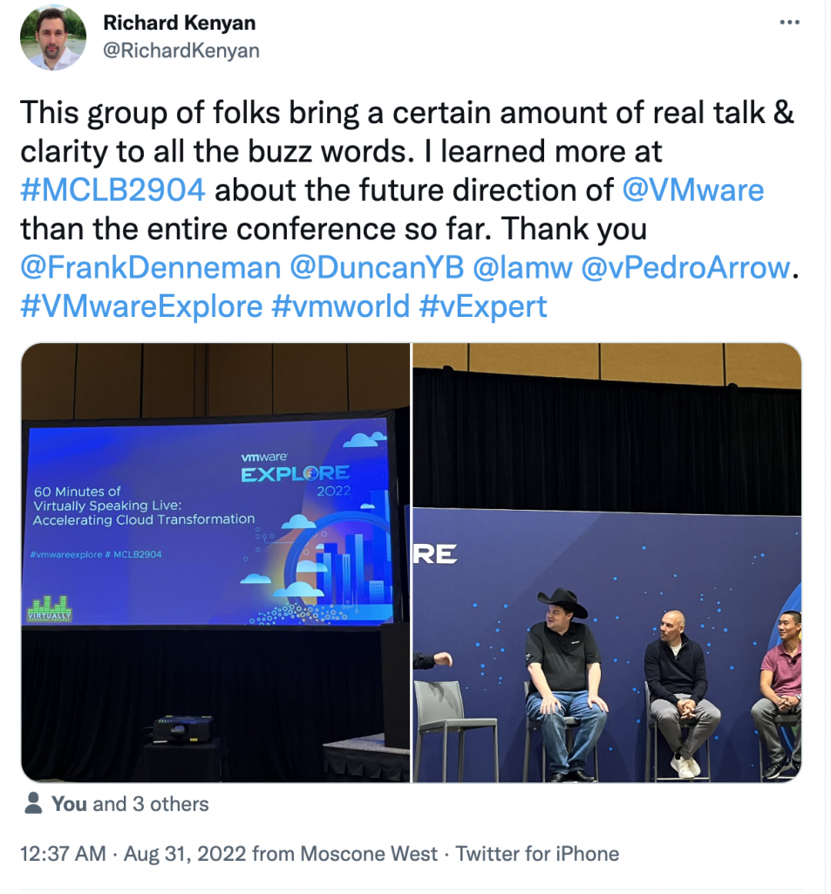

This week Duncan and I attended VMware Explore to co-present the session "60 Minutes of Virtually Speaking Live: Accelerating Cloud Transformation." with William Lam and our buddies of the Virtually Speaking Podcast, Pete Flecha and John Nicholson.  The recordings should be made available soon or sign up for the session in Barcelona.

During the week, we caught up with many people and captured soundbites of people such as Kit Colbert, Chris Wolf, Stephen Foskett, Sazalla Reddy, and a few more. You can listen to this special VMware Explore episode on Spotify ([spoti.fi/3cITI7p](https://t.co/A7CN2zvvl2)), Apple ([apple.co/3q35dJJ](https://t.co/xxAoxJVgz3)) or our website: [unexploredterritory.tech/episodes/](https://t.co/hePAMr5mOg)
