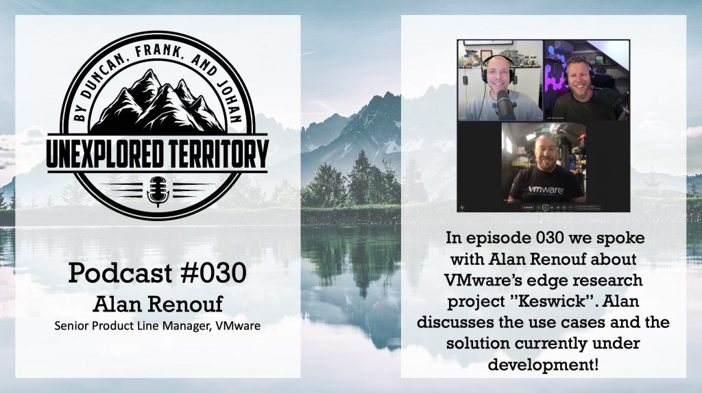

While preparing the podcast, I knew this episode would be good. Edge technology immensely excites me, and the way the project team strays away from the proverbial hammer and looks at ways to incorporate different principles like Gitops management concepts is inspiring. To top it off, you have Alan Renouf to talk about it, a long-time colleague and friend, but unfortunately, Covid prohibited me from partaking in this discussion. But, of course, Duncan and Johan had an excellent conversation with Alan. Please check it out on [Spotify](https://t.co/51D1zRhiSk), [Apple](https://t.co/PowHOOtHGQ), or via our [website](https://t.co/PElL87iKal). Enjoy!

