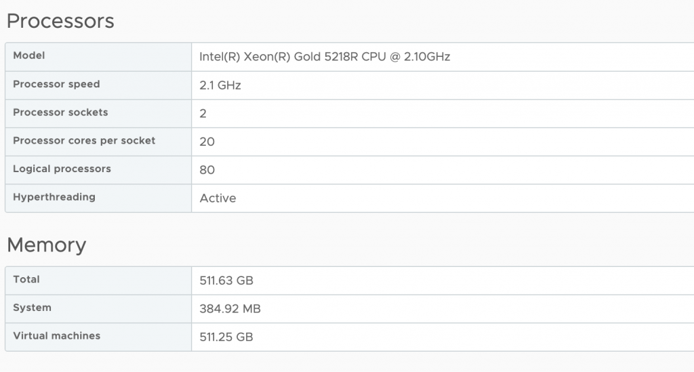
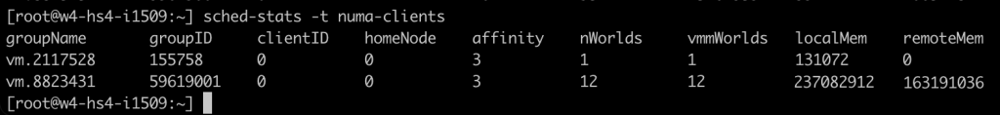
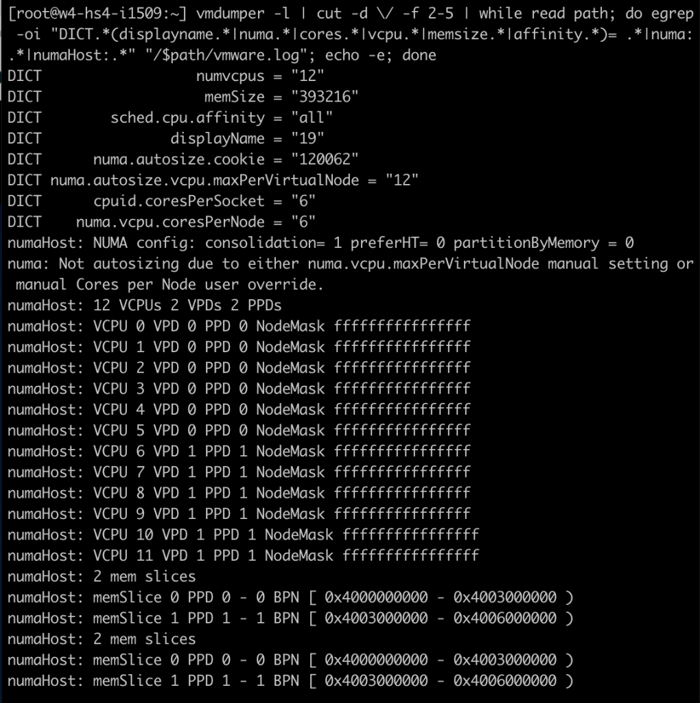

By default, vSphere manages the vCPU configuration and vNUMA topology automatically. vSphere attempts to keep the VM within a NUMA node until the vCPU count of that VM exceeds the number of physical cores inside a single CPU socket of that particular host. For example, my lab has dual-socket ESXi host configurations, and each host has 20 processor cores per socket. As a result, vSphere creates a VM with a vCPU topology with a unified memory address (UMA) up to the vCPU count of 20. Once I assign 21 vCPU, it creates a vNUMA topology with two virtual NUMA nodes and exposes this to the guest OS for further memory optimization.

You might have noticed that vNUMA topology sizing is structured around vCPU and physical core count. But what happens when the virtual machine configuration fits inside the NUMA node with its vCPU configuration, i.e., has less vCPU than the CPU has physical cores? But the VM requires more memory than the NUMA node can provide. I.e., the VM configuration exceeds the local memory configuration of the NUMA node.

As a test, I've created a VM with 12 vCPUs and 384GB. The vCPU configuration fits a single NUMA node (12<20), but the memory configuration of 384GB exceeds the 256GB of each NUMA node.

By default, vSphere creates the vCPU topology and exposes a unified memory address to the guest OS. For scheduling purposes, it creates two separate scheduling constructs to allocate the physical memory from both NUMA nodes but just doesn't exposes that information to the guest OS. Inconsistent performance results from this situation, as the guest OS just starts to allocate the memory from the beginning of the memory range to the end without knowing anything about the physical origins. As a test, an application is running that allocates 380GB. As all the vCPU run in a single NUMA node, the memory scheduler will do its best and allocate the memory as close to the vCPUs as possible. As a result, the memory scheduler can allocate 226 GB locally (237081912 KB by vm.8823431) while having to allocate the rest from the remote NUMA node (155 GB).

Latency on an Intel for local NUMA nodes hovers around 73ns for a Xeon v4 and 89ns for a Skylake generation. At the same time, remote memory is about 130ns for a v4 and 139ns for a Skylake, AMD Epyc local is 129ns, and remote memory is 205ns. On Intel, that is a performance impact of 73% v4 and 56% on Skylake. On AMD, having to fetch remote memory will slow it down by 56%. That means, in this case, the application fetches 31% of its memory with a 73% latency penalty.

Another problem with this setup is that this VM is now quite an unbalanced noisy neighbor. There is little to do about monster VMs in your system, but this VM has an unbalanced memory footprint. It eats up most of the memory of NUMA node 0. I would rather see a more balanced footprint to utilize other cores on the NUMA node and enjoy local memory access. In this scenario, new virtual machines are forced to retrieve their memory from the other NUMA node if they are scheduled alongside this VM from a vCPU perspective.

To solve this problem, we used to set the advanced setting "numa.consolidate = FALSE" in vSphere 7 and older versions. vSphere 8 provides the option to configure the vCPU topology and, specifically, the vNUMA topology from the UI that solves the aforementioned problem. In the VM options of the VM configuration vSphere 8 includes the option CPU Topology.

By default, the Cores per Socket and NUMA Nodes settings are “assigned at power on,” which is the recommended setting for most workloads. In our case, we want to change it, and first, we have to change the Cores per Socket settings before we can adjust the NUMA Nodes setting. It's best to distribute the vCPUs equally across the physical NUMA nodes so that each group of vCPU can allocate an equal amount of memory capacity. The VM configuration is set to 6 cores per socket in our test case, creating two vSockets.

The next step is to configure the virtual NUMA nodes. Aligning this with the underlying physical configuration helps to get the best predictable and consistent performance behavior for the virtual machine. In our case, the VM is configured with two NUMA nodes.

After the virtual machine is powered-on, I opened up a SSH session to the ESXi host and ran the following command: "vmdumper -l | cut -d \\/ -f 2-5 | while read path; do egrep -oi "DICT._(displayname._|numa._|cores._|vcpu._|memsize._|affinity._)= ._|numa:._|numaHost:._" "/$path/vmware.log"; echo -e; done"

That provided me with the following output; notice the following lines:  
cpuid.coresPerSocket = "6"  
numa.vcpu.coresPerNode = "6"  
numaHost 12 VCPUs 2 VPDs 2 PPDs

It shows that the VM is configured with 12 vCPUs, 6 cores per socket, 6 vCPUs per NUMA node. At the ESXi scheduling level, the NUMA scheduler creates two scheduling constructs. A virtual proximity domain (VPD) is a construct used to expose a CPU topology to the guest OS. You can see that it has created two VPDs for this VM. VPD 0 contains VCPU 0 to VCPU 5, and VPD 1 contains VCPU 6 to VCPU 11. A PPD is a physical proximity domain and is used by the NUMA scheduler to assign a PPD to a physical NUMA node.

To check if everything has worked, I looked at the task manager of windows and enabled the NUMA view, which now shows two NUMA nodes.

Running the memory test again on the virtual machine shows a different behavior at the ESXi level. Memory consumption is far more balanced. The VMs NUMA client on NUMA node 0 is consuming 192 GB (201326592 KB), while the NUMA client of the VM on NUMA node 1 is consuming 189 GB (198604800 KB).

The vSphere 8 vCPU topology is a very nice method of helping manage VM configurations that are special cases. Instead of having to set advanced settings, a straightforward UI that can be easily understood by any team member that wasn't involved with configuring the VM is a big step forward. But I like to stress once more that the default setting is the best for most virtual machines. Do not use this setting in your standard configuration for your virtual machine real estate. Keep it set to default and enjoy our 20 years of NUMA engineering. We got your back most of the time. And for some of the outliers, we now have this brilliant UI.
