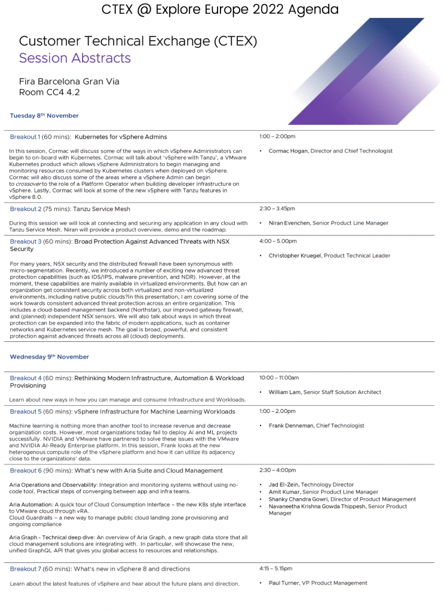

Next week during VMware Explore, VMware is also organizing the Customer Technical Exchange. I'm presenting the session "vSphere Infrastructure for Machine Learning workloads". I will discuss how vSphere act as a self-service platform for data science teams to easily and quickly deploy ML platforms with acceleration resources. I

CTEX is happening at the Fira Barcelona Gran Via in room CC4 4.2. This is an NDA event. Therefore, you will need to register vi

Next week during VMware Explore, the VMware Office of the CTO is organizing the Customer Technical Exchange. I'm presenting the session "vSphere Infrastructure for Machine Learning workloads". I will discuss how vSphere act as a self-service platform for data science teams to easily and quickly deploy ML platforms with acceleration resources. I

CTEX is happening on the 8th and 9th of November at the Fira Barcelona Gran Via in room CC4 4.2. This is an NDA event. Therefore, you will need to register via 

[https://via.vmw.com/CTEXExploreEurope2022-Register.](https://via.vmw.com/CTEXExploreEurope2022-Register.)

