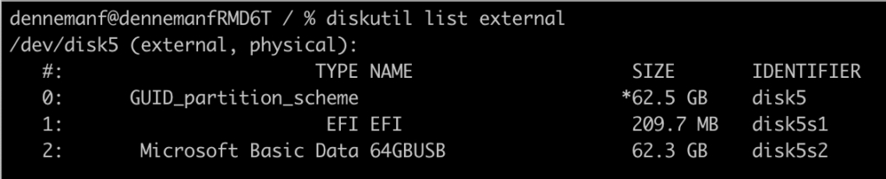
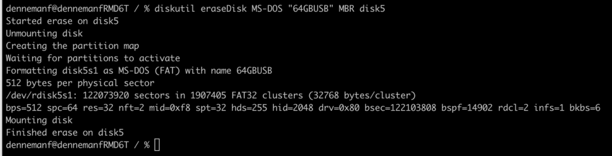
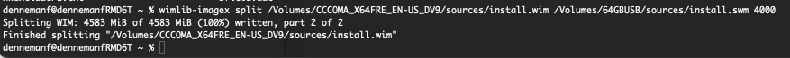

I need to install Windows 11 on a gaming PC, but I only have a MacBook in my house, as this is my primary machine for work. To make things worse, trying to do this on macOS Monterey is extra difficult due to the heightened security levels that withhold you from running unsigned software. I.e., most free tooling software. However, most tooling is provided by macOS itself. You have to remember the correct steps. And because this is not a process I often do, I decided to document it for easy retrieval, which might help others facing the same challenge.

As I mentioned, most of the tools are installed on macOS. The only missing one is the [open-source Windows Imaging Library (wimlib)](https://wimlib.net/). This tool helps you to split a particular file (install.wim) as it is too large for the filesystem we use on the USB drive. To install wimlib, you need to have Homebrew installed. [Homebrew](https://brew.sh/) is a package manager for macOS. Some already have it installed, and some don't, so I will include the install command for Homebrew.

**Install Homebrew**

Open a terminal window and run the following command:

```
/bin/bash -c "$(curl -fsSL https://raw.githubusercontent.com/Homebrew/install/HEAD/install.sh)"
```

This can be a lengthy process. My recent model Macbook Pro took about 6 minutes to complete.

To **Install wimlib**, run the following command:

```
brew install wimlib
```

Insert a USB key that is large enough to contain Windows 11. I use a 64GB USB drive that can also store extra drivers. Newer motherboards are typically equipped with these Intel 2.5 GbE NICs, and Windows 11 do not have the driver built-in. If you want to store these drivers on the USB drive as well to be able to continue the Windows install process.

To **discover** which **disk identifier** macOS assigned to the USB driver, run the following command:

```
diskutil list external
```



The option "external" only displays mounted volumes. This helps you to spot your USB drive easily. In my case, macOS assigned the identifier "disk5" to it. Note the disk name. We need that for our erasedisk command.

**Erase the USB Drive**

The next command is going to erase the USB drive using MS-DOS format. Use a Master Boot Record scheme (MBR) as this is necessary to find all the files during the installation of Windows 11. We need to retain the disk's name and use the identifier. The name is 64GBUSB, and the identifier is disk5

```
diskutil eraseDisk MS-DOS "64GBUSB" MBR disk5
```



**Mount Windows 11 ISO**

The next step is to mount the Windows 11 ISO, you can use finder for that and click on the file, but as we are doing everything in the terminal, the command you can use to mount the iso is:

```
hdiutil mount Win11_22H2_English_x64v1.iso
```

I've executed this command in the directory in which the ISO file was stored. You can execute this command anywhere but ensure to include the full path to the Windows 11 ISO file.

The main challenge of creating the Windows 11 bootable USB drive is the install size.wim file in combination with the MS-DOS format of the drive itself. The install.wim file is larger than 4GB and thus incompatible with the file system. To solve that, you can compress or split the file using wimlib. The Windows installation process knows how to deal with split files; thus, this is the preferred method, as compressing files impacts the duration of the installation process.

**Copy files Windows ISO to USB Drive**

The first step is to copy over all the files of the Windows 11 ISO file that we just mounted EXCEPT the install.wim. The easiest way is using the following rsync command:

```
rsync -avh --progress --exclude=sources/install.wim /Volumes/CCCOMA_X64FRE_EN-US_DV9/ /Volumes/64GBUSB
```


The progress option shows each file's copy progress; the first volume is the source (the windows ISO), and the second volume directory is the destination (the USB drive). The exclude option tells rsync to ignore install.vim during the copy process.

**Split Install.wim**

The last step is to split the install.wim into two parts and place it into the sources folder onto the USB drive. To do so, execute the following command:

```
wimlib-imagex split /Volumes/CCCOMA_X64FRE_EN-US_DV9/sources/install.wim /Volumes/64GBUSB/sources/install.swm 4000
```

The key element of this command is the option "4000" this tells the command to split the file into chunks with a maximum size of 4000 MB. The MS-DOS (fat32) maximum file size is 4096MB. You can decide to lower the number if you're comfortable, but keep it a little bit under the max.



Once this process is complete, you're done. You can safely unmount the USB drive and use it to install Windows 11.

```
diskutil unmount /dev/disk5
```
