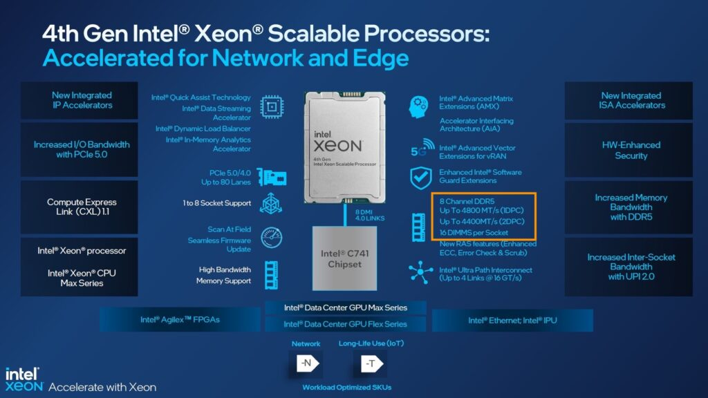
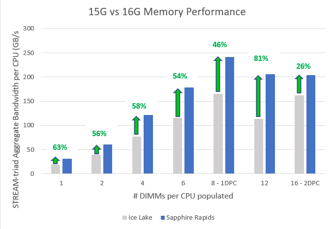

The 4th generation of the Intel Xeon Scalable Processors (codenamed Sapphire Rapids) was released early this year, and I've been trying to wrap my head around what's new, what's good, and what's challenging. Besides those new hardware native accelerators, which a later blog post covers, I noticed the return of different memory speeds when using multiple DIMMs per channel.

Before the Scalable Processor Architecture in 2017, you faced the devil's triangle when configuring memory capacity, cheap, high capacity, fast, pick two. The Xeons offered four memory channels per CPU package, and each memory channel could support up to three DIMMs. The memory speed decreased when equipped with three DIMMs per channel (3 DPC).

Skylake, the first Scalable Processor generation, introduced six channels; each supporting a maximum of two DIMMs, with no performance degradation between 1 DPC or 2 DPC configurations. However, most server vendors introduced a new challenge by only selling servers with 8 DIMM slots instead of 12, and thus unbalanced memory configurations were introduced when all DIMM slots were populated. Unbalanced memory configuration negatively impacts performance. [Dell](https://dl.dell.com/manuals/all-products/esuprt_software/esuprt_it_ops_datcentr_mgmt/high-computing-solution-resources_white-papers89_en-us.pdf) and [others](https://www.xbyte.com/blog/optimized-memory-performance/) have reported drops in memory bandwidth between 35% to 65%.

The 3rd generation of the Scalable Processor Architecture introduced eight channels of DDR4 per CPU. To solve the server vendors' unbalanced memory configuration problem and provide parity to the AMD EPYC memory configuration. It also meant we were back to the "natural" order of base 10 memory capacity configuration, 256, 512, 1024,2048. Many servers weren't following the optimal 6-channel configuration of 384, 768, and 1536; for some admins, it felt unnatural.

And this brings me to the 4th generation, the Sapphire Rapids. It provides eight channels of DDR5 per CPU with a maximum memory speed of 4800 MHz. Compared to the 3rd generation, it results in up to 50% more aggregated bandwidth as the Ice Lake generation supports eight channels using DDR4 3200 MHz. But the behavior between the 3rd and the 4th generation differ when pushing them to their max capacity.

With Sapphire Rapids, each CPU has eight memory controllers, providing high-speed throughput and allowing advanced sub-NUMA clustering configurations similar to the AMD EPYC of four clusters within a single CPU (An upcoming blog post covers this topic in-depth). These features sound very promising. However, Intel reintroduced different memory speeds when loading the memory channel with multiple DIMMs.

Sapphire Roads supports multiple memory speeds. The bronze and silver families support a maximum memory speed of 4000 MHz. The Gold family is all over the place, supporting a maximum of 4000, 4400, and 4800 MHz. The Platinum family supports up to 4800 MHz. However, this is in a 1 DPC configuration. 4400 MHz in a 2 DPC configuration.

The massive step up from 3200 MHz to 4800 MHz is slightly reduced when loading the server with more than eight DIMMs per CPU. When comparing theoretical bandwidth speeds, 1 DPC and 2 DPC, bandwidth performance looks as follows:

DDR4 3200 MHZ provides a theoretical bandwidth of 25.6 GB/s. DDR5 4800 MHz provides a theoretical bandwidth of 38.2 GB/s, while 4400 MHz DDR5 memory provides a theoretical bandwidth of 35.2 GB/s.

| Xeon Architecture | 1 DPC | GB/s | 8 Ch | +% | 2 DPC | GB/s | 16 Ch | +% |
| --- | --- | --- | --- | --- | --- | --- | --- | --- |
| 3rd Gen Xeon | 3200 MHz | 23.4 | 204.8 GB/s |  | 3200 MHz | 25.6 | 409.6 GB/s |  |
| 4th Gen Xeon | 4800 MHz | 38.4 | 307.2 GB/s | 50% | 4400 MHz | 35.2 | 563.2 GB/s | 37.5% |

Dell [published a report](https://infohub.delltechnologies.com/p/memory-bandwidth-for-next-gen-poweredge-servers-significantly-improved-with-sapphire-rapids-architecture/#:~:text=Sapphire%20Rapids%20CPU%20architecture,-4th%20Generation%20Intel&text=Compared%20to%20prior%2Dgen%203rd,s%20on%20Ice%20Lake%20Processors\).) of performance study measuring memory bandwidth using the STREAM Triad benchmark. The study compared the performance of the 3rd and 4th generation Xeons and shows "real" bandwidth numbers. Sapphire Rapids improves memory bandwidth by 46% in a 1 DPC configuration, "but only" 26% in a 2 DPC configuration. Although STREAM is a synthetic benchmark, it does give us a better idea of what bandwidth to expect in real life.

I hope this information helps to guide you when configuring the memory configuration of your next vSphere ESXi host platform. Selecting the right DIMM capacity can quickly get 20% better memory performance.
