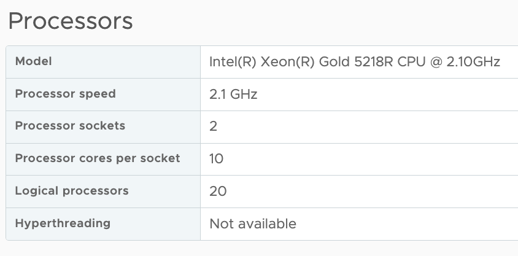
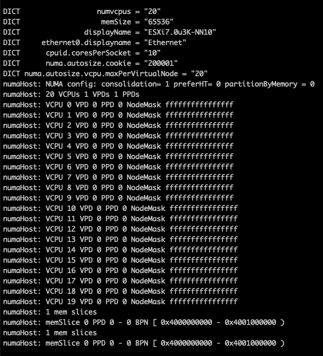
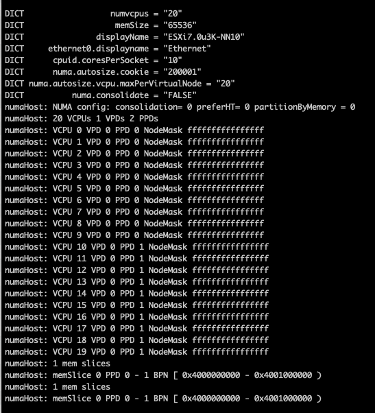
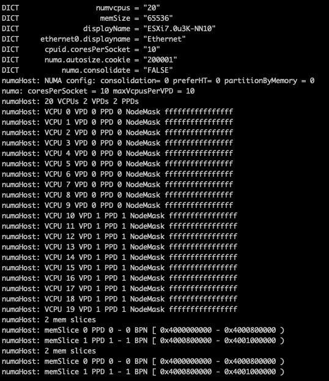
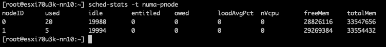

To troubleshoot a particular NUMA client behavior in a heterogeneous multi-cloud environment, I needed to set up an ESXi 7.0 environment. Currently, my lab is running ESXi 8.0, so I've turned to William Lams' excellent repository of nested ESXi virtual appliances and downloaded a copy of the 7.0 u3k version.

My physical ESXi hosts are equipped with Intel Xeon Gold 5218R CPUs, containing 20 cores per socket. The smallest ESXi host contains ten cores per socket in the environment I need to simulate. Therefore, I created a virtual ESXi host with 20 vCPUs and ensured that there were two virtual sockets (10 cores per socket)

Once everything was set up and the ESXi host was operational, I checked to see if I could deploy a 16 vCPU VM to simulate particular NUMA client configuration behavior and verify the CPU environment.  
The first command I use is to check the "physical" NUMA node configuration "`sched-stats -t numa-node`". But this command does not give me any output, which should not happen.

Let's investigate, let's start off by querying the CPUinfo of the VMkernel Sys Info Shell (vsish): `vsish -e get /hardware/cpu/cpuInfo`

The ESXi host contains two CPU packages. The VM configuration Cores per Socket has provided the correct information to the ESXi kernel. The same info can be seen in the UI at Host Configuration, Hardware, Overview, and Processor.

However, it doesn't indicate the number of NUMA nodes supported by the ESXi kernel. You would expect that two CPU packages would correspond to at least two NUMA nodes. The command  
`vsish -e dir /hardware/cpuTopology/numa/nodes` shows the number of NUMA nodes that the ESXi kernel detects

It only detects 1 NUMA node as the virtual NUMA client configuration has been decoupled from the Cores Per Socket configuration since ESXi 6.5. As a result, the VM is presented by the physical ESXi host as a single virtual NUMA node, and the virtual ESXi host picks this up. Logging in to the physical host, we can validate the nested ESXi VM configuration and run the following command.

`vmdumper -l | cut -d \/ -f 2-5 | while read path; do egrep -oi "DICT._(displayname._|numa._|cores._|vcpu._|memsize._|affinity._)= ._|numa:._|numaHost:._" "/$path/vmware.log"; echo -e; done`

The screen dump shows that the VM is configured with one Virtual Proximity Domain (VPD) and one Physical Proximity Domain (PPD). The VPD is the NUMA client element that is exposed to the VM as the virtual NUMA topology, and the screenshot shows that all the vCPUs (0-19) are part of a single NUMA client. The NUMA scheduler uses the PPD to group and place the vCPUs on a specific NUMA domain (CPU package).

By default, the NUMA scheduler consolidates vCPUs of a single VM into a single NUMA client up to the same number of physical cores in a CPU package. In this example, that is 20. As my physical ESXi host contains 20 CPU cores per CPU package, all the vCPUs in my nested ESXi virtual appliance are placed in a single NUMA client and scheduled on a single physical NUMA node as this will provide the best possible performance for the VM, regardless of the Cores per Socket setting.

The VM advanced configuration parameter `numa.consolidate = "false`" forces the NUMA scheduler to evenly distribute the vCPU across the available physical NUMA nodes.

After running the vmdumper instruction once more, you see that the NUMA configuration has changed. The vCPUs are now evenly distributed across two PPDs, but only one VPD exists. This is done on purpose, as we typically do not want to change the CPU configuration for the guest OS and application, as that can interfere with previously made optimizations.

You can do two things to change the configuration of the VPD, use the VM advanced configuration parameter `numa.vcpu.maxPerVirtualNode` and set it to `10`. Or remove the `numa.autosize.vcpu.maxPerVirtualNode` = "20" from the VMX file.

I prefer removing the `numa.autosize.vcpu.maxPerVirtualNode` setting, as this automatically follows the PPD configuration, it avoids mismatches between `numa.vcpu.maxPerVirtualNode` and the automatic `numa.consolidate = "false"` configuration. Plus, it's one less advanced setting in the VMX, but that's just splitting hairs. After powering up the nested ESXi virtual appliance, you can verify the NUMA configuration once more in the physical ESXi host:

The vsish command `vsish -e dir /hardware/cpuTopology/numa/nodes` shows ESXi detects two NUMA nodes

and `sched-stats -t numa-pnode` now returns the information you expect to see

Please note that if the vCPU count of the nested ESXi virtual appliance exceeds the CPU core count of the CPU package, the NUMA scheduler automatically creates multiple NUMA clients.
