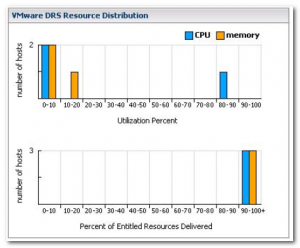
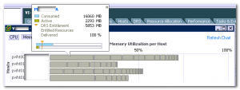

A customer of mine wanted more information about the new DRS Resource Distribution Chart in vCenter 4.0, so I thought after writing the text for the customer, why not share this? The DRS Resource Distribution Chart was overhauled in vCenter 4.0 and is quite an improvement over the resource distribution chart featured in vCenter 2.5. Not only does it use a better format, the new charts produce more in-depth information. <!--more-->**Resource entitlement** Before we dive into the old and the new chart, clarification of the term “resource entitlement” can be helpful. The charts show the resource entitlement of virtual machines running inside the cluster, but what are resource entitlements and what are they used for? To quote Minwen a VMware R&D engineer

> Based on various stats and some estimation techniques, DRS determines each VM’s \*demand\* for CPU & memory resources. It then computes each VM’s cpu & mem \*entitlement\* (how many resources it should get) based on resource settings (shares, limits, reservations) and the degree of resource contention there is. If there are enough resources in the cluster to satisfy every VM’s demand (and assuming no limits), then entitlement is equal to demand, meaning every VM gets as much CPU & memory as it wants.

**The old chart** Let’s begin with the vCenter 2.5 chart and take a look how the old chart showed the info. I always disliked the way the old chart displayed the number of hosts. The chart used in this example belongs to a cluster with 3 hosts. At the top of the Y-axis a number 2 is shown and in the middle of the Y axis a horizontal line is displayed. This horizontal line in this example depicts 50% of two hosts, in other words: one host. The chart shows multiple bars, the leftmost bars represent the resource utilization of 2 hosts, which means that two hosts have a CPU and memory utilization between 0 and 10 percent. The orange bar in the 20-30 column stretches to the horizontal line on the Y-axis and that means that the memory of the third host is utilized between 20 and 30 percent, in this example the same third host has a CPU utilization of 90-100 percent. If the cluster is balanced, all orange or blue bars are closed to each other, the closer the blue and orange bars are to each other, the more balanced the cluster is. The bottom chart “percent of entitled resources delivered” uses a different scale in this example. Because all three hosts deliver 90-100 percent of the memory resources the top of the Y axis represents 3 hosts. 2 hosts deliver 90-100 percent of the CPU resources and the bar stretches to 66% of the Y axis. Because of the current statistics, the horizontal bar in the middle of the Y-axis cannot be translated into one host. The Y-axis has a dynamic nature due to the relation of the scale to the load; this behavior does not contribute to legibility of the charts.  **DRS Resource Distribution chart 2.0** The chart in vCenter 2.5 showed the CPU and Memory utilization of the host inside the cluster, load distribution across host and if the delivery of the resource entitlement of the virtual machines. The current chart used in vCenter 4 shows seven levels of information: Cluster info: • Relative balance of hosts X • Approximate spare capacity left in the cluster Host info: • Resource usage for each host X • Relative resource consumption of each VM on each host X VM info: • Resource usage for each VM X • Host assignment for each VM X • Percent resource entitlement for each VM X VMware chose not to combine the CPU and Memory into one chart, but used a toggle view. Let’s take a look at the new view:  For this example I used the CPU chart, because of the pretty colors. You can choose between % or MHz view. I used the % view in all the examples for no specific reasons, it can be easily be substituted with the MHz view, both views are equally informative. The new chart displays the host on the Y-axis and bar along the X-axis shows the CPU (or memory) utilization. The Y-axis lists the hosts of the cluster with its hostname. This way the resource usage of a specific host and the relative balance between hosts inside the cluster is instantly recognizable. In this example all the hosts are utilized below the 25%, it shows that we have an enormous amount of spare CPU capacity left in the cluster. The horizontal bar behind the hostname shows the current resource usage of the host and is subdivided by the resource utilization of each virtual machine on that host. Each block in the bar stands for a specific virtual machine, the size of the block represent the relative resource consumption of the virtual machine on the host. When hovering over a block, the statistics of that specific virtual machine running on the host is displayed.  The info block shows the consumed resources, the active resources and the resource entitlement of the virtual machine. **Color vs Gray scale** The CPU view uses a color scheme. At the bottom of the chart view a gradient bar displays the percentage of the entitle resources delivered. The VM block color corresponds to the amount of entitled resources that are delivered by the host to the virtual machine. The memory view uses a gray scale; actually it uses just one tone, just gray. :)   
  
  
  
  
  
I don’t have an authoritative answer why the memory chart view doesn’t use a color gradient, but I have an educated guess. I already sent the product manager of DRS some questions; hopefully I can soon update this article with a definitive answer. Stay tuned!
