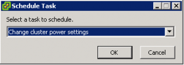

vSphere 4.1 introduces a lot of new features and enhancements of the existing features, one of the hidden gems I believe is the DPM enable and disable scheduled tasks. The DPM “Change cluster power settings” schedule task allows the administrator to enable or disable DPM via an automated task. If the admin selects the option DPM off, vCenter will disable all DPM features on the selected cluster and all hosts in standby mode will be powered on automatically when the scheduled task runs. This option removes one of the biggest obstacles of implementing DPM. One of the main concerns administrators have, is the incurred (periodic) latency when enabling DPM. If DPM place an ESX host in standby mode, it can take up to five minutes before DPM decides to power up the ESX host again. During this (short) period of time, the environment experiences latency or performance loss, usually this latency occurs in the morning. It’s common for DPM to place ESX hosts in standby mode during the night due to the decreased workloads, when the employees arrive in the morning the workload increases and DPM needs to power on additional ESX hosts. The period between 7:30 and 10:00 is recognized as one of the busiest periods of the day and during that period the IT department wants their computing power lock, stock and ready to go. This scheduled task will give the administrators the ability to disable DPM before the workforce arrive. Because the ESX hosts remain powered-on until the administrator or a DPM scheduled task enables DPM again, another schedule can be created to enable DPM after the periods of high workload demand ends. To create a scheduled task to disable DPM, open vCenter, go to Home>Management>Scheduled Tasks (CTRL-Shift-T) and select the task “Change cluster power settings”.  Select the default power management for the cluster , _On_ or _Off_ and configure the task.  For example, by scheduling a DPM disable task on every weekday at 7:00, the administrator is ensured that all ESX hosts are powered on before 8 o’clock every weekday in advance of the morning peak, rather than have to wait for DPM to react to the workload increase. By scheduling the DPM disable task more than one hour in advance of the morning peak, DRS will have the time to rebalance the virtual machine across all active hosts inside the cluster and Transparent Page Sharing process can collapse the memory pages shared by the virtual machines on the ESX hosts. By powering up all ESX hosts early, the ESX cluster will be ready to accommodate load increases.
