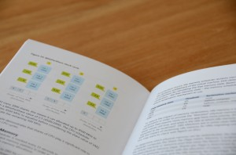
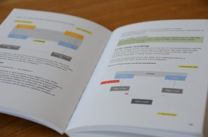
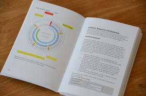

I just received the second proof copy of the new book and I'm really (really) stoked about the book. The full color print is awesome and truly adds that special feeling to the book. I'm so excited how the diagrams turned out, that I must share some pictures of the inside of the book.     (For the CSI-fan's, yes I have blurred some text fields as they contain NDA material) Besides the diagrams, the whole interior is redesigned. The spread is reviewed, inner and outer margins are adjusted and we even taken the gutter space into account, providing a better and nicer reading experience. We decided that we are going to offer the book in Full color format and a (full-color) ebook. After seeing the full-color version, we believe publishing a black and white version will not do the content any justice.And due to time constraints we cannot invest time in offering a black and white version of the book. We are still finalizing the book but we hope to provide the possibility of pre-ordering near the publish date. Stay tuned for more information!
