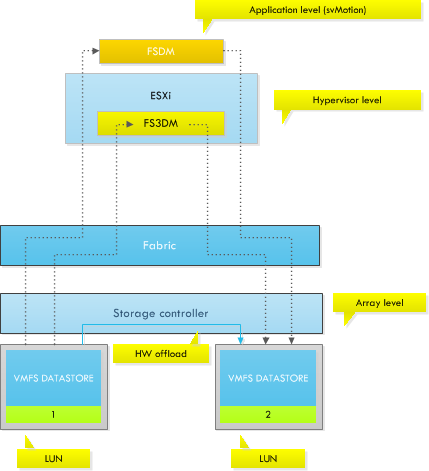

Among many new cool features introduced by vSphere 5 is the new VMFS file system for block storage. Although vSphere 5 can use VMFS-3, VMFS-5 is the native VMFS level of vSphere 5 and it is recommended to migrate to the new VMFS level as soon as possible. [Jason Boche](http://www.boche.net/blog/index.php/2011/07/21/vmfs-5-vmfs-3-whats-the-deal/) wrote about the difference between VMFS-3 and VMFS-5. vSphere 5 offers a pain free upgrade path from VMFS-3 to VMFS-5. The upgrade is an online and non-disruptive operation which allows the resident virtual machines to continue to run on the datastore. But upgraded VMFS datastores may have impact on SDRS operations, specifically virtual machine migrations. When upgrading a VMFS datastore from VMFS-3 to VMFS-5, the current VMFS-3 block size will be maintained and this block size may be larger than the VMFS-5 block size as VMFS-5 uses unified 1MB block size. For more information about the difference between native VMFS-5 datatstores and upgraded VMFS-5 datastore please read: [Cormac's article about the new storage features](http://blogs.vmware.com/vsphere/2011/07/new-vsphere-50-storage-features-part-1-vmfs-5.html) Although the upgraded VMFS file system leaves the block size unmodified, it removes the maximum file size related to a specific block size, so why exactly would you care about having a non-unified block size in your SDRS datastore cluster? In essence, mixing different block sizes in a datastore cluster may lead to a loss in efficiency and an increase in the lead time of a storage vMotion process. As you may remember, Duncan wrote an [excellent post](http://www.yellow-bricks.com/2011/02/18/blocksize-impact/) about the impact of different block sizes and the selection of datamovers. To make an excerpt, vSphere 5 offers three datamovers: • fsdm • fs3dm • fs3dm – hardware offload The following diagram depicts the datamover placement in the stack. Basically, the longer path the IO has to travel to be handled by a datamover, the slower the process.  In the most optimal scenario, you want to leverage the VAAI capabilities of your storage array. vSphere 5 is able to leverage the capabilities of the array allowing hardware offload of the IO copy. Most IOs will remain within the storage controller and do not travel up the fabric to the ESXi host. But unfortunately not every array is VAAI capable. If the attached array is not VAAI capable or enabled, vSphere will leverage the FS3DM datamover. FS3DM was introduced in vSphere 4.1 and contained some substantial optimizations so that data does not travel through all stacks. However if a different block size is used, ESXi reverts to FSDM, commonly known as the legacy datamover. To illustrate the difference in Storage vMotion lead time, read the following article (once again) by Duncan: [Storage vMotion performance difference](http://www.yellow-bricks.com/2011/02/24/storage-vmotion-performance-difference/). This article contains the result of a test in which a virtual machine was migrated between two different types of disks configured with deviating block sizes and at a different stage a similar block size. To emphasize; the results illustrates the lead time of the FS3DM datamover and the FSDM datamover. The results below are copied from the Yellow-Bricks.com article:

| From(MB) | To | Duration in Minutes |
| --- | --- | --- |
| FC datastore 1MB blocksize | FATA datastore 4MB blocksize | 08:01 |
| FATA datastore 4MB blocksize | FC datastore 1MB blocksize | 12:49 |
| FC datastore 4MB blocksize | FATA datastore 4MB blocksize | 02:36 |
| FATA datastore 4MB blocksize | FC datastore 4MB blocksize | 02:24 |

As the results in the table show, using a different blocksize lead to an increase in Storage vMotion lead time. Using different block sizes in your SDRS datastore cluster will decrease the efficiency of Storage DRS. Therefore it's recommended designing for performance and efficiency when planning to migrate to a storage DRS cluster. Plan ahead and invest some time the migration path. If the VMFS-3 datastore is formatted with a larger blocksize than 1 MB, it may be better to empty the VMFS datastore and reformat the LUN with a fresh coat of VMFS-5 file system. The effort and time put into the migration will have a positive effect on the performance of the daily operations of Storage DRS.
